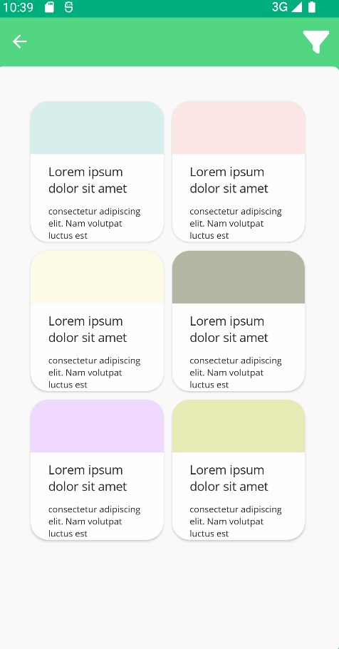

# Uranium UI Kit
Uranium is a Free & Open-Source UI Kit for .NET MAUI. It provides a set of controls and utilities to build modern applications. It is built on top of the .NET MAUI infrastructure and provides a set of controls and layouts to build modern UIs. It also provides infrastructure for building custom controls and themes on it.

- Visit [Documentation](https://enisn-projects.io/docs/en/uranium/latest)

 ## Getting Started
Visit documentation for onboarding.

- [Getting Started](https://enisn-projects.io/docs/en/uranium/latest/Getting-Started)

## Features

- **Theming**: Allows you build themes and customize existing themes easily.
  - [Material Theme](https://enisn-projects.io/docs/en/uranium/latest/themes/material/Index)

- Font Icons
  - [FontAwesome](https://enisn-projects.io/docs/en/uranium/latest/theming/Icons#fontawesome)
  - [Material](https://enisn-projects.io/docs/en/uranium/latest/theming/Icons#material-icons)

- Pre-Built Components
- Startup Templates

| - | - |
| --- | --- |
|  |  | 
|  |  |
| - | - |

## Roadmap

- [x] Backdrop
- [x] BottomSheet
- [x] Icons
  - [x] FontAwesome
  - [x] Material Icons
- [x] DataGrid
- [x] SelectableText
- [ ] SegmentedControl
- [ ] Slider (Header, with dots)
- [ ] Chips (multiple selection)
- [ ] CheckBox (customize inputkit's one)
- [ ] RadioButton (customize inputkit's one)
- [ ] AdvancedEntry (customize inputkit's one)
- [ ] Cards (Head, Body, Footer) 
- [ ] TreeView
- [ ] TabView (with Custom DataTemplate)
- [ ] CalendarView

- [ ] SelectionView 
- [ ] BadgeView
- [ ] RateView
- [ ] StatefulButton ( SaveButton )
- [ ] ColorPicker
- [ ] Slider (RangeSlider)
- [ ] Banners 
- [ ] OTP Pin Entry
