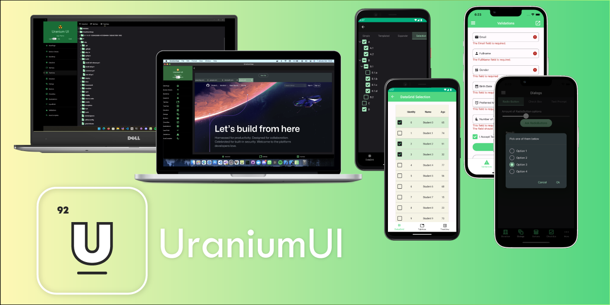

    
    <h1 align="center">Uranium UI Kit</h1>

   
   
   
   
   

Uranium is a Free & Open-Source UI Kit for .NET MAUI. It provides a set of controls and utilities to build modern applications. It is built on top of the .NET MAUI infrastructure and provides a set of controls and layouts to build modern UIs. It also provides infrastructure for building custom controls and themes on it.

- Visit [Documentation](https://enisn-projects.io/docs/en/uranium/latest)

 ## Getting Started 🚀
Visit documentation for onboarding.

- [Getting Started](https://enisn-projects.io/docs/en/uranium/latest/Getting-Started)
- [Live Demo on Android Emulator](https://appetize.io/embed/6rii3gn7ovqjjd5ynkracdjruq?device=pixel4&osVersion=11.0&scale=75)

## Features ✨

- Startup [Templates](https://enisn-projects.io/docs/en/uranium/latest/Getting-Started#new-projects)
- Pre-built layouts and flexible controls.
- Dark/light mode support.
- All MAUI Platforms are supported.
- Infrastructure for building custom controls.
- [Color System](https://enisn-projects.io/docs/en/uranium/latest/theming/ColorSystem) with easy to customize.
- Extensible styling.
- Dialogs
  - [Mopups](https://enisn-projects.io/docs/en/uranium/latest/dialogs/Index#mopups)
  - [CommunityToolkit](https://enisn-projects.io/docs/en/uranium/latest/dialogs/Index#communitytoolkit) 
- Validation Support.
  - [Data Annotations](https://enisn-projects.io/docs/en/uranium/latest/validations/DataAnnotations)
  - [InputKit](https://enisn-projects.io/docs/en/inputkit/latest/components/controls/FormView#validations)
- Font icon support.
  - [FontAwesome](https://enisn-projects.io/docs/en/uranium/latest/theming/Icons#fontawesome)
  - [Material](https://enisn-projects.io/docs/en/uranium/latest/theming/Icons#material-icons)
- Theming
  - [Material Theme](https://enisn-projects.io/docs/en/uranium/latest/themes/material/Index)

---

## Contributing 🧑‍💻
We welcome contributions and suggestions. Please read our [contributing guide](CONTRIBUTING.md).

> You may consider checking out the issues with [good first issue](https://github.com/enisn/UraniumUI/issues?q=is%3Aopen+is%3Aissue+label%3A%22good+first+issue%22) label to make your first contribution.

## Roadmap 🛣️

See [milestones](https://github.com/enisn/UraniumUI/milestones) section in the repository.

## License 📝
This project is licensed under the Apache License License - see the [LICENSE](LICENSE) file for details.

## Backers 💚

| Special thanks to project supporters 🎉 | - |
| --- | :---: |
| [gpproton](https://github.com/gpproton) | ☕/m |
| [tjlangenkamp](https://github.com/tjlangenkamp) | ☕️☕️☕️☕️☕️ |
| [Hottemax](https://github.com/Hottemax) | ☕️☕️☕️ |
| _Anonymous_ | ☕️☕️☕️ |
| [kmaclagan-pcl](https://www.buymeacoffee.com/enisn) | ☕️ |
| [@Geramy](https://github.com/Geramy) | ☕️ |
| [Malko_Josue](https://twitter.com/Malko_Josue) | ☕ |

> Donations are spent to infrastructural costs such as documentation website etc.

## Support 🙏

If you like this project and want to support it, you can <a href="https://www.buymeacoffee.com/enisn">BuyMeACoffee</a>. Your coffee will keep me awake while developing this project. ☕

 

***

## Activity

  

