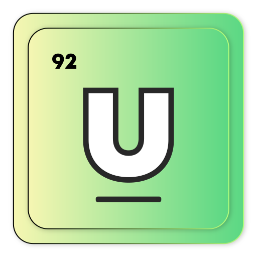
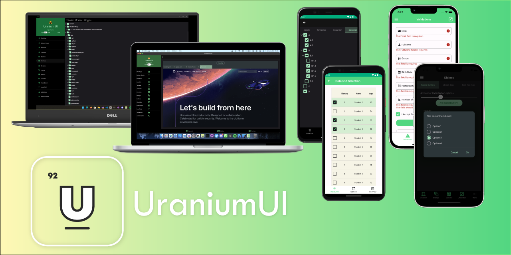

    
    <h1 align="center">Uranium UI Kit</h1>

   
   
   
   
   
   

Uranium is a Free & Open-Source UI Kit for .NET MAUI. It provides a set of controls and utilities to build modern applications. It is built on top of the .NET MAUI infrastructure and provides a set of controls and layouts to build modern UIs. It also provides infrastructure for building custom controls and themes on it.

- Visit [Documentation](https://uraniumui.gh.enisn-projects.io/en/Getting-Started.html)

- Join the [Discord Community](https://discord.gg/nN7Yvch73v)

 ## Getting Started 🚀
Visit the documentation for onboarding.

- [Getting Started](https://uraniumui.gh.enisn-projects.io/en/Getting-Started.html)

Or watch the video:

## Features ✨

- Startup [Templates](https://enisn-projects.io/docs/en/uranium/latest/Getting-Started#new-projects)
- Multiple target frameworks: `.NET 10` _(LTS)_ and `.NET 9`
  - _Use UraniumUI **v2.6 - v2.12** for `.NET8`_
  - _Use UraniumUI **v2.5** for `.NET6` and `.NET7`._
- Pre-built layouts and flexible controls.
- Dark/light mode support.
- MAUI platform support for `net9.0-*` and `net10.0-*` targets.
  - `Android`
  - `iOS`
  - `MacCatalyst`
  - `Windows`
  - `Tizen` _(limited support / optional setup)_
- Infrastructure for building custom controls.
  - [Plainer](https://github.com/enisn/Xamarin.Forms.Plainer)
  - [InputField](https://enisn-projects.io/docs/en/uranium/latest/themes/material/components/InputField)
- [Color System](https://enisn-projects.io/docs/en/uranium/latest/theming/ColorSystem) with easy customization.
- Accessibility
    - _(All controls support [keyboard accessibility](https://learn.microsoft.com/en-us/windows/apps/design/accessibility/keyboard-accessibility), unlike drawn controls)_
- Extensible styling.
- [Blur effects](https://enisn-projects.io/docs/en/uranium/latest/Blurs) with `UraniumUI.Blurs`.
- Dialogs
  - [Mopups](https://enisn-projects.io/docs/en/uranium/latest/dialogs/Index#mopups)
  - [CommunityToolkit](https://enisn-projects.io/docs/en/uranium/latest/dialogs/Index#communitytoolkit) 
- Validation Support.
  - [Data Annotations](https://enisn-projects.io/docs/en/uranium/latest/validations/DataAnnotations)
  - [InputKit](https://enisn-projects.io/docs/en/inputkit/latest/components/controls/FormView#validations)
- Font icon support.
  - [FontAwesome](https://enisn-projects.io/docs/en/uranium/latest/theming/Icons#fontawesome)
  - [Material](https://enisn-projects.io/docs/en/uranium/latest/theming/Icons#material-icons)
  - [Material Symbols](https://enisn-projects.io/docs/en/uranium/latest/theming/Icons#material-symbols)
  - [Fluent](https://enisn-projects.io/docs/en/uranium/latest/theming/Icons#segoe-fluent-icons)
- Theming
  - [Material Theme](https://enisn-projects.io/docs/en/uranium/latest/themes/material/Index)

---

## Contributing 🧑‍💻
We welcome contributions and suggestions. Please read our [contributing guide](CONTRIBUTING.md).

> You may consider checking out the issues with [good first issue](https://github.com/enisn/UraniumUI/issues?q=is%3Aopen+is%3Aissue+label%3A%22good+first+issue%22) label to make your first contribution.

## Roadmap 🛣️

See [milestones](https://github.com/enisn/UraniumUI/milestones) section in the repository.

## License 📝
This project is licensed under the Apache License License - see the [LICENSE](LICENSE) file for details.

## Backers 💚

| Special thanks to project supporters 🎉 |
| --- |
| [YvanBrunel](https://twitter.com/YvanBrunel) | <!-- 12☕️ --> 
| [Hottemax](https://github.com/Hottemax) |  <!-- 6☕️ -->
| [tjlangenkamp](https://github.com/tjlangenkamp) | <!-- 5☕️ -->
| [C00lzer0](https://github.com/C00lzer0) |  <!-- 3☕️ -->
| Eric | <!-- 3 ☕-->
| Volker Busch | <!-- 3 ☕-->
| [gpproton](https://github.com/gpproton) |  <!-- 1☕️ -->
| [kmaclagan-pcl](https://www.buymeacoffee.com/enisn) |  <!-- 1☕️ -->
| [@Geramy](https://github.com/Geramy) |  <!-- 1☕️ -->
| [Malko_Josue](https://twitter.com/Malko_Josue) |  <!-- 1☕️ -->
| [Nawa](https://github.com/Nawapoln) | <!-- 1☕ -->
| [JohnStabler](https://github.com/JohnStabler) | <!-- GitHub Sponsor -->
| [jfversluis](https://github.com/jfversluis) | <!-- GitHub Sponsor -->
| [Lucasbk123](https://github.com/Lucasbk123) | <!-- GitHub Sponsor -->
| [laszlodaniel](https://github.com/laszlodaniel) | <!-- GitHub Sponsor -->
| [codychaplin](https://github.com/codychaplin) | <!-- GitHub Sponsor -->
| Juliette Dianne Moss | <!-- patreon -->
| Simon Brettschneider |    <!-- 1☕️ -->
| JohnCKoenig | <!-- 1☕ -->
| 7 M O X D | <!-- 5☕ -->
| _Anonymous people 6☕️_ |  <!-- 4☕️ -->

> Donations are spent to infrastructural costs such as documentation website etc.

## Support 🙏

If you like this project and want to support it, you can <a href="https://www.buymeacoffee.com/enisn">BuyMeACoffee</a>. Your coffee will keep me awake while developing this project. ☕

 

***

## Activity

  

