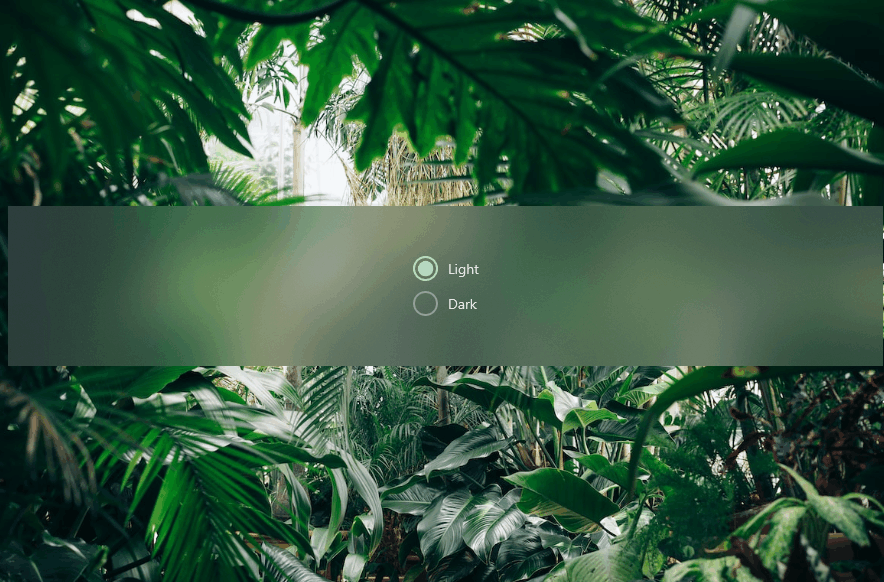
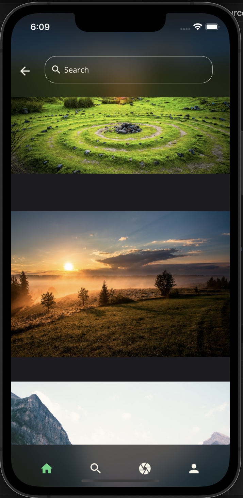
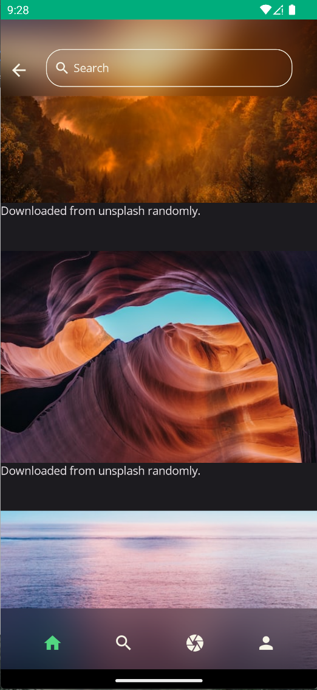
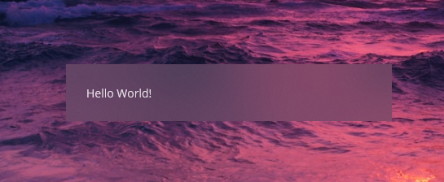
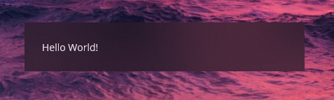
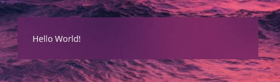
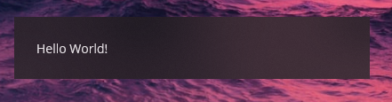

# Blurs
UraniumUI supports blur effects on MAUI. You can use it on any control by using `BlurEffect`.

## Showcase



| Windows | iOS | Android |
| --- | --- | --- | 
|  |  |  |

## Getting Started

### Setting-up
Blur effect isn't part of UraniumUI by default. It's included in a separated assembly which is `UraniumUI.Blurs`. You have to add that package to your application first.

- Install [UraniumUI.Blurs](https://www.nuget.org/packages/UraniumUI) package to your project.
    ```bash
    dotnet add package UraniumUI.Blurs
    ```

- After installing that assembly, you should add `UseUraniumUIBlurs()` method to your application builder in **Program.cs**.
    ```csharp
    builder
        .UseMauiApp<App>()
        .UseUraniumUI()
        .UseUraniumUIBlurs() // 👈 Here it is
        .ConfigureFonts(fonts =>
        {
            fonts.AddFont("OpenSans-Regular.ttf", "OpenSansRegular");
            fonts.AddFont("OpenSans-Semibold.ttf", "OpenSansSemibold");
        })
        //...
    ```

### Usage

BlurEffect is defined in `UraniumUI.Blurs` namespace. But its assembly exports that namespace by default. So you can use same xml namespace with UraniumUI.

```xml
xmlns:uranium="http://schemas.enisn-projects.io/dotnet/maui/uraniumui"
```

BlurEffect is a `Effect` which means you can use it on any control. It's recommended to use it on a `Layout` such as `StackLayout`, `Grid`, `AbsoluteLayout`, `FlexLayout`, etc. to avoid overlapping issues.


```xml
<StackLayout>
    <StackLayout.Effects>
        <uranium:BlurEffect />
    </StackLayout.Effects>
    <!-- Your content goes here -->
</StackLayout>
```



## Properties

- Mode: `BlurMode` (Default: `BlurMode.Light`) - Defines the blur mode. It can be `Light` or `Dark`.


    ```xml
    <StackLayout>
        <StackLayout.Effects>
            <uranium:BlurEffect />
        </StackLayout.Effects Mode="Dark">
        <!-- Your content goes here -->
    </StackLayout>
    ```

    

- Accent: `Color` - Defines the tint color of the blur effect.


    ```xml
    <StackLayout>
        <StackLayout.Effects>
            <uranium:BlurEffect />
        </StackLayout.Effects AccentColor="Purple">
        <!-- Your content goes here -->
    </StackLayout>
    ```

    

- AccentOpacity: `float` (Default: `0.2`) - Defines the opacity of the tint color.

    ```xml
    <StackLayout>
        <StackLayout.Effects>
            <uranium:BlurEffect />
        </StackLayout.Effects Mode="Dark" AccentOpacity="0.8">
        <!-- Your content goes here -->
    </StackLayout>
    ```
    
    