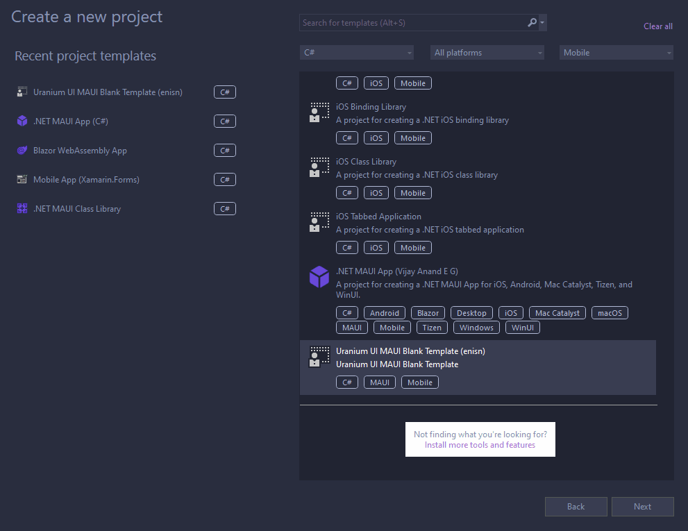

# Getting Started
Uranium UI is a UI framework for .NET MAUI. It is built on top of the .NET MAUI infrastructure and provides a set of controls and layouts to build modern UIs. It also provides infrastructure for building custom controls and themes on it.

There are 2 ways to get started with Uranium UI:
- Existing Projects
- New projects

## New Projects

Uranium UI provides a project template to start a new project with Uranium UI. You can customize the startup project with parameters like icon library, theme, and more.

- Install latest templates from NuGet: 
    ```bash
    dotnet new -i UraniumUI.Templates
    ```

- Create a new project: 
  ```bash
  dotnet new uraniumui -n MyProject
  ```

### Visual Studio
Also, templates has `ide.host.json` implementation that allows to create a new project from Visual Studio.



### Parameters

- `icons`: Defines icon library to use. Default is `MaterialIcons`. Available values are `FontAwesome`, `MaterialIcons`, and `None`.

    Example: `dotnet new uraniumui -n MyProject -icons FontAwesome`

## Existing Projects
- Install the [UraniumUI.Material](https://www.nuget.org/packages/UraniumUI.Material/) NuGet package to your MAUI application.
    ```bash
    dotnet add package UraniumUI.Material
    ```

    > Uranium UI doesn't include any theme by default. Pick one of the themes and install it. Since there is only one theme for now, you can install [UraniumUI.Material](https://www.nuget.org/packages/UraniumUI.Material/) directly instead of installing both **UraniumUI** and **UraniumUI.Material**.


- Go to `MauiProgram.cs` and add UraniumUI Handlers

    ```csharp
    .ConfigureMauiHandlers(handlers =>
    {
        handlers.AddUraniumUIHandlers(); // 👈 This line should be added.
    });
    ```


- Go to `App.xaml` and add `ColorResource` & `StyleResource` of **Material**
    - Define following xml namespace: `xmlns:material="http://schemas.enisn-projects.io/dotnet/maui/uraniumui/material`
    - Then define `ColorResource` and `StyleResource` into **MergedDictionaries**
        ```xml
        <?xml version = "1.0" encoding = "UTF-8" ?>
        <Application xmlns="http://schemas.microsoft.com/dotnet/2021/maui"
                    xmlns:x="http://schemas.microsoft.com/winfx/2009/xaml"
                    xmlns:local="clr-namespace:App1"
                    xmlns:material="http://schemas.enisn-projects.io/dotnet/maui/uraniumui/material"
                    x:Class="App1.App">
            <Application.Resources>
                <ResourceDictionary>
                    <ResourceDictionary.MergedDictionaries>
                        <ResourceDictionary Source="Resources/Styles/Colors.xaml" /> 
                        <!-- 👇 Define right after your local Colors.xaml. -->
                        <material:ColorResource />

                        <ResourceDictionary Source="Resources/Styles/Styles.xaml" />
                        <!-- 👇 Define right after your local Styles.xaml -->
                        <material:StyleResource />
                        
                    </ResourceDictionary.MergedDictionaries>
                </ResourceDictionary>
            </Application.Resources>
        </Application>
        ```

- (Optional) Installing a font icon library is recommended. Choose one of the icons and install it.
  -  [FontAwesome](theming/Icons.md#fontawesome)
  -  [Material](theming/Icons.md#material-icons)

## Themes available
 - [Material Theme](themes/material/Index.md)
