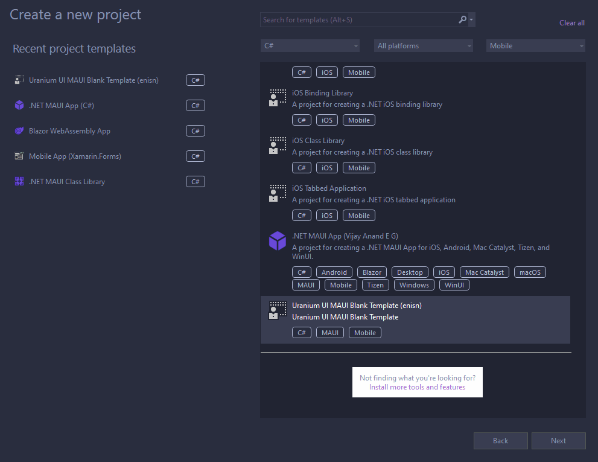

# Getting Started
Uranium UI is a UI framework for .NET MAUI. It is built on top of the .NET MAUI infrastructure and provides a set of controls and layouts to build modern UIs. It also provides infrastructure for building custom controls and themes on it.

There are 2 ways to get started with Uranium UI:
- Existing Projects
- New projects

## New Projects

Uranium UI provides a project template to start a new project with Uranium UI. You can customize the startup project with parameters like icon library, theme, and more.

- Install latest templates from NuGet: 
    ```bash
    dotnet new install UraniumUI.Templates
    ```

- Create a new project: 
  ```bash
  dotnet new uraniumui-app -n MyProject
  ```

- Or create the blank starter:
  ```bash
  dotnet new uraniumui-blank-app -n MyProject
  ```

### Visual Studio
Also, templates has `ide.host.json` implementation that allows to create a new project from Visual Studio.



### Parameters

- `Icons`: Defines the icon package configured by the template. Default is `MaterialSymbols` (Material Symbols). Available values are `FontAwesome`, `MaterialSymbols`, `FluentIcons`, and `None`.

    Example: `dotnet new uraniumui-app -n MyProject --Icons FluentIcons`

- `Dialogs`: Configures dialog integration. Available values are `Mopups`, `CommunityToolkit`, and `None`.

    Example: `dotnet new uraniumui-app -n MyProject --Dialogs CommunityToolkit`

- `Blurs`: Adds `UraniumUI.Blurs` setup to the starter project.

    Example: `dotnet new uraniumui-app -n MyProject --Blurs true`

## Existing Projects
- Install the [UraniumUI.Material](https://www.nuget.org/packages/UraniumUI.Material/) NuGet package to your MAUI application.
    ```bash
    dotnet add package UraniumUI.Material
    ```

    > Uranium UI doesn't include any theme by default. Pick one of the themes and install it. Since there is only one theme for now, you can install [UraniumUI.Material](https://www.nuget.org/packages/UraniumUI.Material/) directly instead of installing both **UraniumUI** and **UraniumUI.Material**.


- Go to `MauiProgram.cs` and add UraniumUI Handlers

    ```csharp
    .UseUraniumUI()
    .UseUraniumUIMaterial() // 👈 Don't forget these two lines.
    ```


- Go to `App.xaml` and add `ColorResource` & `StyleResource` of **Material**
    - Define following xml namespace: `xmlns:material="http://schemas.enisn-projects.io/dotnet/maui/uraniumui/material"`
    - Then define `ColorResource` and `StyleResource` into **MergedDictionaries**
        ```xml
        <ResourceDictionary.MergedDictionaries>
            <ResourceDictionary x:Name="appColors" Source="Resources/Styles/Colors.xaml" />
            <ResourceDictionary x:Name="appStyles" Source="Resources/Styles/Styles.xaml" />

            <material:StyleResource ColorsOverride="{x:Reference appColors}" BasedOn="{x:Reference appStyles}" />
        </ResourceDictionary.MergedDictionaries>
        ```
        > You can use your styles to override UraniumUI Material styles with following snippet. Check [Colors & Styles Docuementation](themes/material/ColorsAndStyles.md) for more detailed customization.
        > ```xml
        > <ResourceDictionary x:Name="appColors" Source="Resources/Styles/Colors.xaml" />
        >
        > <material:StyleResource ColorsOverride="{x:Reference appColors}">
        >     <material:StyleResource.Overrides>
        >        <ResourceDictionary x:Name="appStyles" Source="Resources/Styles/Styles.xaml" />
        >    </material:StyleResource.Overrides>
        > </material:StyleResource>
        > ```


- (Optional) Installing a font icon library is recommended. Material Symbols is the current recommended path.
  -  [Material Symbols](theming/Icons.md#material-symbols)
  -  [Segoe Fluent Icons](theming/Icons.md#segoe-fluent-icons)
  -  [FontAwesome](theming/Icons.md#fontawesome)

## Themes available
 - [Material Theme](themes/material/Index.md)
