# Dialogs
Dialogs are a great way to get the user to make a decision or enter some information. They are also a great way to display information to the user. A set of pre-built dialogs are provided by UraniumUI such as asking multiple or single selection, confirmation and text input. UraniumUI provides an abstraction layer for dialogs with `IDialogService`. UraniumUI has 2 different popups implementations which are [Community Toolkit](https://github.com/CommunityToolkit/Maui) and [Mopups](https://github.com/LuckyDucko/Mopups).

<center>

</center>

You should pick one of them and add it to your project. UraniumUI will use the popup implementation that you added to your project. If you don't add any popup implementation, UraniumUI will use Modal pages instead of popups.

Available packages
- `UraniumUI.Dialogs.CommunityToolkit`
- `UraniumUI.Dialogs.Mopups`


# [Default](#tab/default)

UraniumUI has a default dialog implementation. You can use it without adding any additional package. It uses built-in MAUI Navigation and pushes modal pages to the navigation stack to show dialogs like popups. 

> [!NOTE]
> It may conflict if your project has custom navigation that uses Modal Pages. In that case, you should use one of the popup implementations like **Mopups** or **Community Toolkit**.


# [Mopups](#tab/mopups)

1. Install [UraniumUI.Dialogs.Mopups](https://www.nuget.org/packages/UraniumUI.Dialogs.Mopups)

    ```bash
    dotnet add package UraniumUI.Dialogs.Mopups
    ```

2. Configure Mopups in `MauiProgram.cs`

    ```csharp
    builder
        .UseMauiApp<App>()
        .UseUraniumUI()
        .UseUraniumUIMaterial()
        .ConfigureMopups() // 👈 Add this line
        // ...
    ```

3. Add required services in `MauiProgram.cs`

    ```csharp
    builder.Services.AddMopupsDialogs();
    ```

# [CommunityToolkit](#tab/communitytoolkit)
1. Install [UraniumUI.Dialogs.CommunityToolkit](https://www.nuget.org/packages/UraniumUI.Dialogs.CommunityToolkit)

    ```bash
    dotnet add package UraniumUI.Dialogs.CommunityToolkit
    ```

2. Add required services in `MauiProgram.cs`

    ```csharp
    builder.Services.AddCommunityToolkitDialogs();
    ```

---


## Types
There are 6 types of dialogs in UraniumUI package. They are: 
- `CheckBox Prompt` - For multiple selection
- `RadioButton Prompt` - For single selection
- `Confirmation` - For yes/no decisions
- `Text Prompt` - For text input
- `Progress` - For showing progress
- `View` - For displaying custom views
- `Form` - For displaying form-based dialogs

## Usage Patterns

### Extension Methods
The simplest way to use dialogs is through extension methods:

```csharp
public partial class MainPage : ContentPage
{
    private async void ShowDialog_Clicked(object sender, EventArgs e)
    {
        var result = await this.DisplayCheckBoxPromptAsync(
            "Select Options",
            new[] { "Option 1", "Option 2", "Option 3" });
    }
}
```

### Dependency Injection
For better testability and maintainability, inject `IDialogService`:

```csharp
public partial class MainPage : ContentPage
{
    private readonly IDialogService _dialogService;

    public MainPage(IDialogService dialogService)
    {
        InitializeComponent();
        _dialogService = dialogService;
    }

    private async void ShowDialog_Clicked(object sender, EventArgs e)
    {
        var result = await _dialogService.DisplayCheckBoxPromptAsync(
            "Select Options",
            new[] { "Option 1", "Option 2", "Option 3" });
    }
}
```

> [!IMPORTANT]
> Injecting `IDialogService` is highly recommended. It'll make your code more testable and make the dialogs library easily swappable.

---

### RadioButton Prompt
RadioButton prompt can be used to get a single selection input from user. It returns the selected option. It can be used with strings or objects. If you use objects, you can use `DisplayMember` parameter to specify the property of the object to be displayed or your object should override `ToString()` method.


#### Usage
The easiest way to use RadioButton prompt is to pass a string array to it. It will return the selected option as a string.

```csharp
private async void Button_Clicked(object sender, EventArgs e)
{
    var result = await this.DisplayRadioButtonPromptAsync(
            "Pick some of them below",
            new [] {"Option 1", "Option 2", "Option 3"});
}
```

| Light | Dark |
| --- | --- |
| 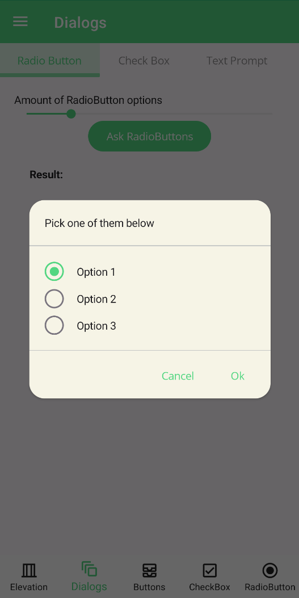 | 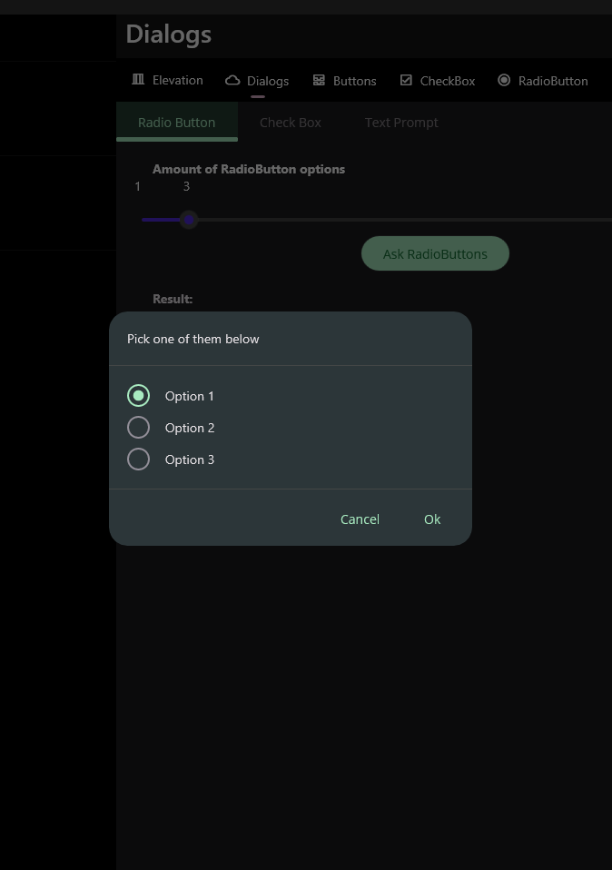 |


#### Parameters

`DisplayRadioButtonPromptAsync` method has 6 parameters. They are:

- `message`: Message of the dialog. It'll be rendered top of the dialog.
- `selectionSource`: Selection source of the dialog. It can be a string collection or an object collection. If you use objects, you can use `displayMember` parameter to specify the property of the object to be displayed or your object should override `ToString()` method.
- `selected`: Selected item of the dialog. It'll be automatically selected when dialog is shown.
- `accept`: Accept button text of the dialog. It'll be rendered as the accept button text.
- `cancel`: Cancel button text of the dialog. It'll be rendered as the cancel button text.
- `displayMember`: Display member of the object. It'll be used to specify the property of the object to be displayed or your object should override `ToString()` method.

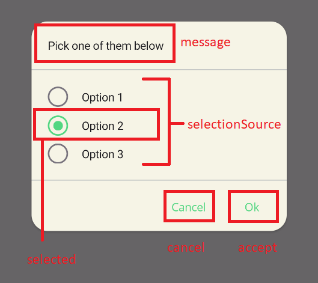

```csharp
private async void Button_Clicked(object sender, EventArgs e)
{
    var options = new List<MyOption>()
    {
        new MyOption() { Name = "Option 1", Description = "Description 1" },
        new MyOption() { Name = "Option 2", Description = "Description 2" },
        new MyOption() { Name = "Option 3", Description = "Description 3" },
    };
    var result = await this.DisplayRadioButtonPromptAsync(
            "Pick some of them below",
            options,
            options[1],
            "OK",
            "Cancel",
            "Name");

    await this.DisplayAlert("Result", result.Name, "OK");
}
```

---

### CheckBox Prompt
CheckBox prompt can be used to get a multiple selection input from user. It returns the selected options. It can be used with strings or objects. If you use objects, you can use `DisplayMember` parameter to specify the property of the object to be displayed or your object should override `ToString()` method.


| Light | Dark |
| --- | --- |
| 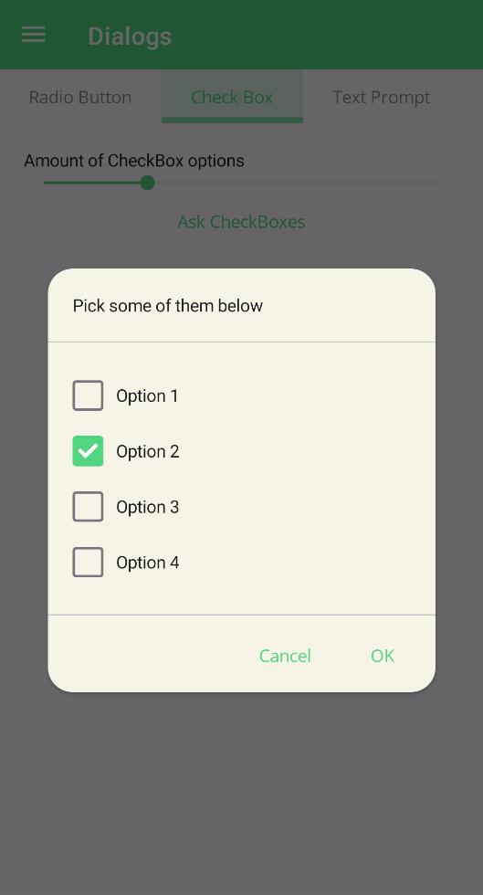 | 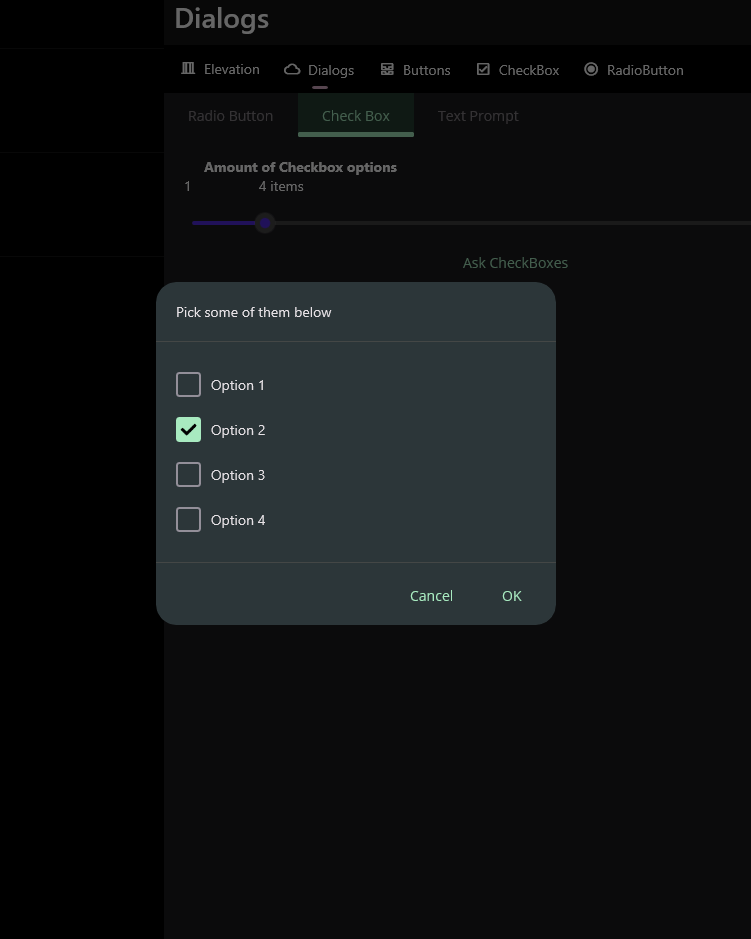 |

#### Usage
The easiest way to use CheckBox prompt is to pass a string array to it. It will return the selected options as a string array.

```csharp
private async void Button_Clicked(object sender, EventArgs e)
{
    var result = await this..DisplayCheckBoxPromptAsync(
            "Pick some of them below",
            new [] {"Option 1", "Option 2", "Option 3", "Option 4",});
}
```

#### Parameters

`DisplayCheckBoxPromptAsync` method has 6 parameters. They are:
- `message`: Message of the dialog. It'll be rendered top of the dialog.
- `selectionSource`: Selection source of the dialog. It can be a string collection or an object collection. If you use objects, you can use `displayMember` parameter to specify the property of the object to be displayed or your object should override `ToString()` method.
- `selectedItems`: Selected items of the dialog. They'll be automatically selected when dialog is shown.
- `accept`: Accept button text of the dialog. It'll be rendered as the accept button text.
- `cancel`: Cancel button text of the dialog. It'll be rendered as the cancel button text.
- `displayMember`: Display member of the object. It'll be used to specify the property of the object to be displayed or your object should override `ToString()` method.

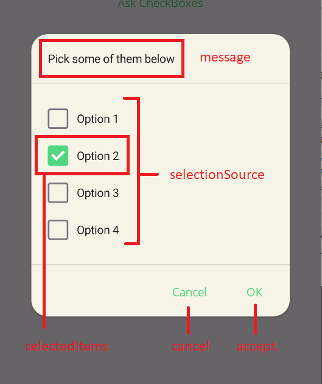

```csharp
private async void Button_Clicked(object sender, EventArgs e)
{
    var options = new List<MyOption>()
    {
        new MyOption() { Name = "Option 1", Description = "Description 1" },
        new MyOption() { Name = "Option 2", Description = "Description 2" },
        new MyOption() { Name = "Option 3", Description = "Description 3" },
        new MyOption() { Name = "Option 3", Description = "Description 4" },
    };

    var result = await this.DisplayCheckBoxPromptAsync(
            "Pick some of them below",
            options,
            new [] { options[1] },
            "OK",
            "Cancel",
            "Name");

    await this.DisplayAlert("Result", string.Join(", ", result.Select(x => x.Name)), "OK");
}
```

---

### Text Prompt
Text prompt can be used to get a text input from user. It returns the entered text. All parameters are same with MAUI default `DisplayPromptAsync` method.

| Light | Dark |
| --- | --- |
| 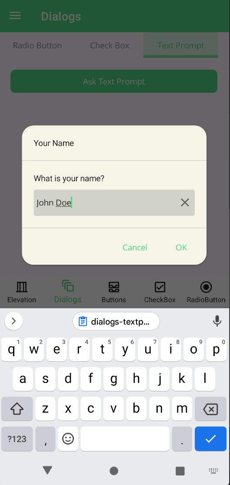 | 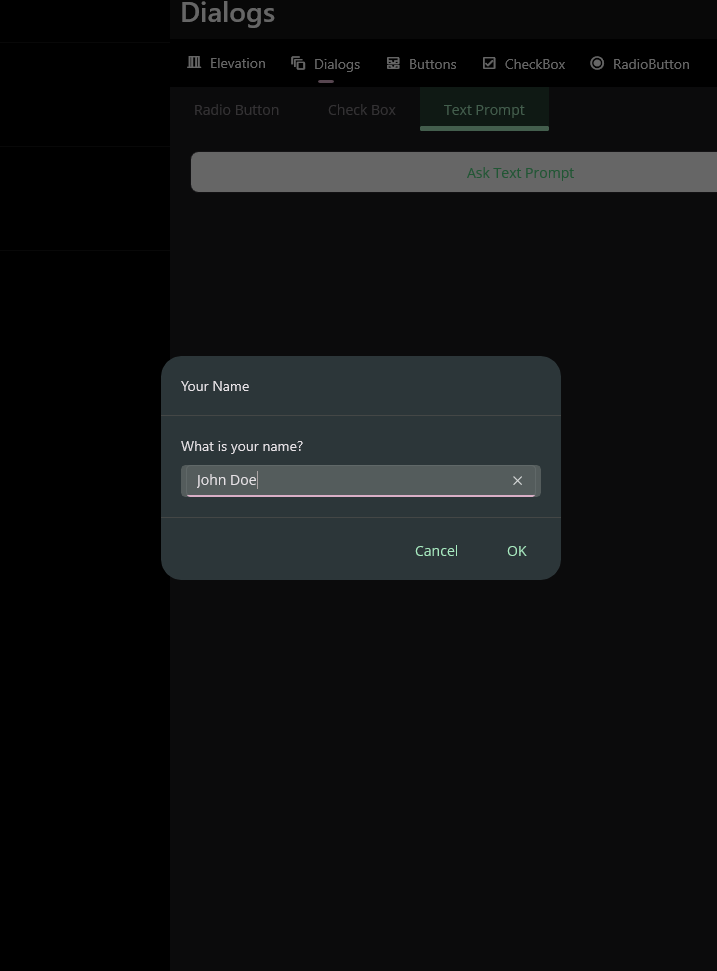 |

```csharp
private async void Button_Clicked(object sender, EventArgs e)
{
    var result = await this.DisplayTextPromptAsync("Your Name", "What is your name?", placeholder: "Uvuvwevwevwe...Osas");

    await DisplayAlert("Result:", result, "OK");
}
```

---

### Date Prompt

Date prompt can be used to select a nullable date with the custom `CalendarView`. It supports OK, Cancel, Clear, and Today actions. Tap the month/year header to jump by year, which is useful for birthdates and other historical dates.

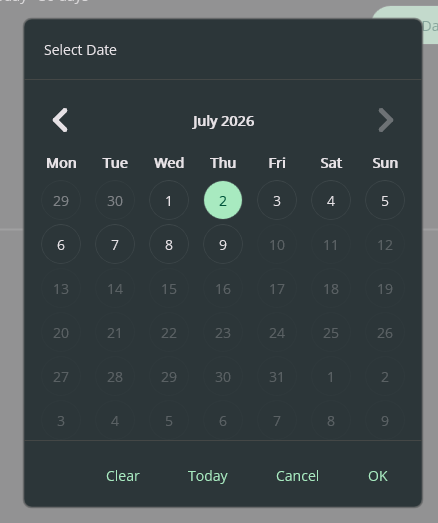

```csharp
private DateTime? selectedDate = DateTime.Today;

private async void Button_Clicked(object sender, EventArgs e)
{
    selectedDate = await this.DisplayDatePromptAsync(
        "Select Date",
        selectedDate,
        minimumDate: DateTime.Today.AddDays(-30),
        maximumDate: DateTime.Today.AddDays(30));

    await DisplayAlert("Result:", selectedDate?.ToString("d") ?? "null", "OK");
}
```

`DisplayDatePromptAsync` returns the selected date when OK is pressed. Clear closes the dialog and returns `null`. Cancel closes the dialog and returns the original `selectedDate`, so assigning the result back to the same variable does not mutate the caller state.

Manual verification steps for each dialog provider:

- Open the Dialogs demo page.
- Select each implementation from the Implementation selector.
- Open Date Prompt and verify OK returns the selected date.
- Select Clear and verify the result becomes `null`.
- Change the visible selection, select Cancel, and verify the previous result is preserved.
- Select Today and verify today is selected when it is within the min/max range.

---

### Progress

Progress dialog can be used to show a progress dialog to the user. There are 2 types of progress dialogs in UraniumUI. They are blocking and cancellable. Blocking progress dialog will block the UI until it's closed. Cancellable progress dialog will have a cancel button to allow user to cancel the operation. It returns an `IDisposable` and it'll be visible until you dispose it. You can use it with `using` statement to show a progress dialog.

```csharp
private async void Button_Clicked(object sender, EventArgs e)
{
    using (await DialogService.DisplayProgressAsync("Loading", "Work in progress, please wait..."))
    {
        // Indicate a long running operation
        await Task.Delay(5000);
    }
}
```

| Light | Dark |
| --- | --- |
| 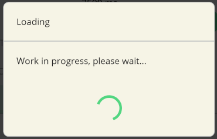 | 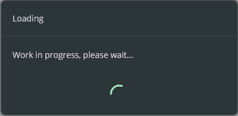 |


```csharp
private async void Button_Clicked(object sender, EventArgs e)
{
    using (await DialogService.DisplayCancellableProgressAsync("Loading", "Work in progress, please wait...", "Cancel"))
    {
        // Indicate a long running operation
        await Task.Delay(5000);
    }
}
```

| Light | Dark |
| --- | --- |
| 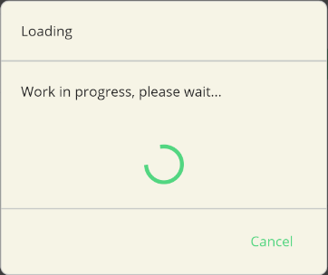 | 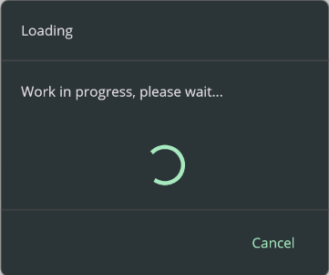 |

#### Handling Cancellation
You can handle the cancellation of the progress dialog by checking the `IsCancellationRequested` property of the `CancellationToken` parameter of the `DisplayCancellableProgressAsync` method.

- You can handle with registering an action to the `CancellationToken`.
    ```csharp
    private async void Button_Clicked(object sender, EventArgs e)
    {
        var cts = new CancellationTokenSource();
        cts.Token.Register(() =>
        {
            // Handle cancellation
            Console.WriteLine("Progress dialog cancelled");
        });

        using (var progress = await DialogService.DisplayCancellableProgressAsync(
            "Loading", "Work in progress, please wait...", "Cancel", cts))
        {
            // Indicate a long running operation
            await Task.Delay(5000);
        }
    }

- You can handle at the end of the operation by checking the `IsCancellationRequested` property of the `CancellationToken`.
    ```csharp
    private async void Button_Clicked(object sender, EventArgs e)
    {
        var cts = new CancellationTokenSource();

        using (var progress = await DialogService.DisplayCancellableProgressAsync(
            "Loading", "Work in progress, please wait...", "Cancel", cts))
        {
            // Indicate a long running operation
            await Task.Delay(5000);
        }

        if (cts.IsCancellationRequested)
        {
            // Handle cancellation
            Console.WriteLine("Progress dialog cancelled");
        }
        else
        {
            // Handle completion
            Console.WriteLine("Progress dialog completed");
        }
    }

- You can even cancel the long running Task operation when user cancels the operation:
    ```csharp
    private async void Button_Clicked(object sender, EventArgs e)
    {
        var cts = new CancellationTokenSource();

        using (var progress = await DialogService.DisplayCancellableProgressAsync(
            "Loading", "Work in progress, please wait...", "Cancel", cts))
        {
            try
            {
                // Indicate a long running operation
                await Task.Delay(5000, cts.Token);
            }
            catch (TaskCanceledException)
            {
                // Handle cancellation
                Console.WriteLine("Progress dialog cancelled");
            }
        }
    }
    ```

## Customization
UraniumUI dialogs can be customized in several ways:

### Dialog Options
You can customize the appearance and behavior of dialogs by configuring `DialogOptions`:

```csharp
builder.Services.Configure<DialogOptions>(options =>
{
    // Custom backdrop color
    options.GetBackdropColor = () => Colors.Black.WithAlpha(0.7f);
    
    // Custom header
    options.GetHeader = (title) => new Label 
    { 
        Text = title,
        FontSize = 24,
        Margin = new Thickness(20)
    };
    
    // Custom footer
    options.GetFooter = (buttons) => new StackLayout
    {
        Orientation = StackOrientation.Horizontal,
        Children = buttons.Select(b => new Button 
        { 
            Text = b.Key,
            Command = b.Value 
        }).ToList()
    };
    
    // Custom divider
    options.GetDivider = () => new BoxView 
    { 
        HeightRequest = 2,
        Color = Colors.Gray 
    };
    
    // Custom effects
    options.Effects = new List<Func<Effect>>
    {
        () => new ShadowEffect(),
        () => new RippleEffect()
    };
});
```

### Styling
Dialogs support Material Design styling through style classes:

- `SurfaceContainer` - Applies surface container styling
- `Rounded` - Applies rounded corners
- `Divider` - Styles the divider
- `Dialog.Button0` - Styles the first button
- `Dialog.Button1` - Styles the second button
- `TextButton` - Applies text button styling

You can override these styles in your application's resources:

```xaml
<ResourceDictionary>
    <Style TargetType="Button" Class="Dialog.Button0">
        <Setter Property="TextColor" Value="{StaticResource Primary}" />
        <Setter Property="FontAttributes" Value="Bold" />
    </Style>
    
    <Style TargetType="Button" Class="Dialog.Button1">
        <Setter Property="TextColor" Value="{StaticResource Error}" />
    </Style>
</ResourceDictionary>
```

---

## Service Registration
UraniumUI provides different ways to register and use dialog services:

### Default Implementation
The default implementation uses MAUI's built-in navigation system. No additional registration is required:

```csharp
builder.Services.AddUraniumUI();
```

### Mopups Implementation
To use Mopups as the dialog implementation:

```csharp
builder.Services.AddUraniumUI();
builder.Services.AddMopupsDialogs();
```

### Community Toolkit Implementation
To use Community Toolkit as the dialog implementation:

```csharp
builder.Services.AddUraniumUI();
builder.Services.AddCommunityToolkitDialogs();
```

### Custom Dialog Service
You can create a custom dialog service by implementing `IDialogService`:

```csharp
public class CustomDialogService : IDialogService
{
    // Implement interface methods
}

// Register in DI container
builder.Services.AddSingleton<IDialogService, CustomDialogService>();
```
