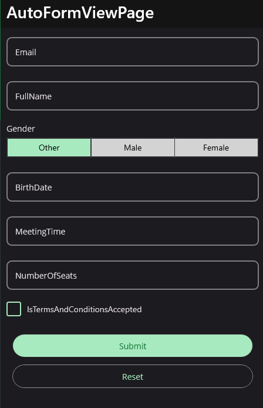
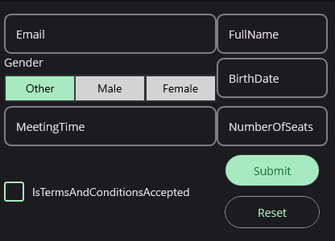
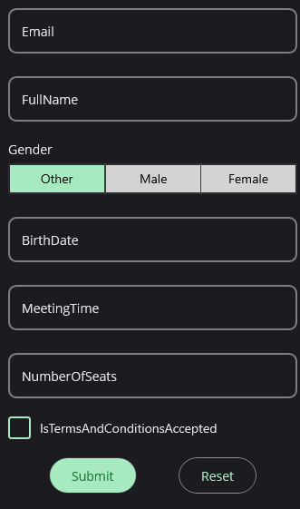
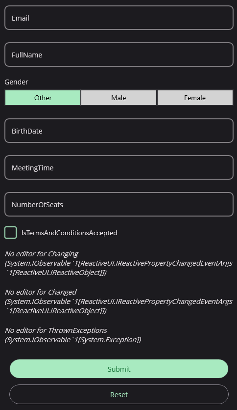
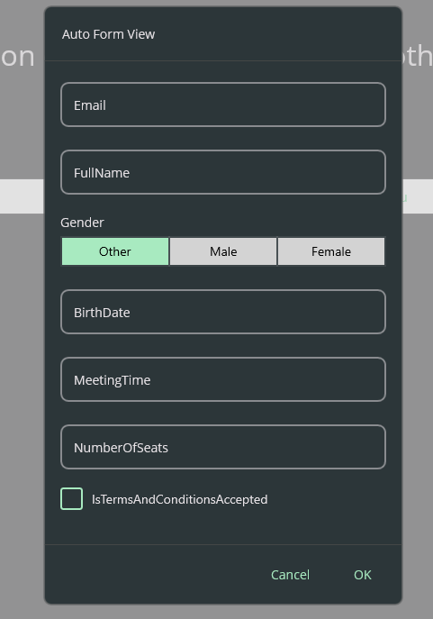

# AutoFormView

The `AutoFormView` is a view that automatically generates a form based on the properties of a model. It is a subclass of `FormView` and uses the same APIs.

## Usage

`AutoFormView` is defined in `UraniumUI.Controls` namespace. 

You can use it in XAML like this:

```xml
xmlns:uranium="http://schemas.enisn-projects.io/dotnet/maui/uraniumui"
```

Then you can use it like this:

```xml
<uranium:AutoFormView Source="{Binding .}" />
```

### Example

```csharp
public class AutoFormViewPageViewModel : ViewModelBase
{
    [Reactive] public string Email { get; set; }
    [Reactive] public string FullName { get; set; }
    [Reactive] public Gender Gender { get; set; }
    [Reactive] public DateTime? BirthDate { get; set; }
    [Reactive] public TimeSpan? MeetingTime { get; set; }
    [Reactive] public int? NumberOfSeats { get; set; }
    [Reactive] public bool IsTermsAndConditionsAccepted { get; set; }
}
```

```xml
<uranium:AutoFormView Source="{Binding .}" />
```



> [!NOTE]
> `[Reactive]` is not required by `AutoFormView`. It works with public properties from plain classes, ReactiveUI, or source generators such as MVVM Toolkit `[ObservableProperty]` as long as the generated property is public.


## Configuration

AutoFormView can be configured using the `AutoFormViewOptions` in the MauiProgram.cs file. Here is an example of how to configure the `AutoFormView`:

```csharp
builder.Services.Configure<AutoFormViewOptions>(options =>
{
    // configure options here
});
```

### AOT-safe property definitions

By default, `AutoFormView` discovers public properties from `Source` by reflection. For NativeAOT or trimming-sensitive apps, provide property metadata explicitly with `PropertyDefinitions` or `PropertyProvider`.

```csharp
using UraniumUI.Options;

public class RegisterViewModel
{
    public string Email { get; set; }
    public int? NumberOfSeats { get; set; }
    public bool AcceptTerms { get; set; }

    public IReadOnlyList<AutoFormProperty> FormProperties { get; } = new AutoFormProperty[]
    {
        new(nameof(Email), typeof(string), "Email"),
        new(nameof(NumberOfSeats), typeof(int?), "Number of seats", isNullable: true),
        new(nameof(AcceptTerms), typeof(bool), "I accept terms and conditions")
    };
}
```

```xml
<uranium:AutoFormView Source="{Binding .}"
                      PropertyDefinitions="{Binding FormProperties}" />
```

You can also provide metadata in code:

```csharp
formView.PropertyProvider = source => RegisterFormMetadata.Properties;
```

If neither `PropertyDefinitions` nor `PropertyProvider` is set, `AutoFormView` keeps the reflection-based behavior for compatibility.

### DataAnnotations
It's not supported DataAnnotations by default. You can add `UraniumUI.Validations.DataAnnotations` package to project and configure `AutoFormViewOptions` to use DataAnnotations.

```csharp
builder.Services.Configure<AutoFormViewOptions>(options =>
{
    options.ValidationFactory = DataAnnotationValidation.CreateValidations;
});
```

For AOT-safe descriptors, provide validation metadata through `PropertyValidationFactory`:

```csharp
builder.Services.Configure<AutoFormViewOptions>(options =>
{
    options.PropertyValidationFactory = property => property
        .GetCustomAttributes<ValidationAttribute>()
        .Select(attribute => new DataAnnotationValidation(attribute, property.GetDefaultDisplayName()));
});
```

### Async Form Validation

`AutoFormView` inherits from `uranium:FormView`, so it supports async form validation through `Validator` or `ValidationHandler`. It automatically uses `Source` as the validation model and assigns validation paths for generated editors.

```xml
<uranium:AutoFormView Source="{Binding .}"
                      Validator="{Binding .}" />
```

```csharp
using UraniumUI.Validations;

public class RegisterViewModel : IFormValidator
{
    public string UserName { get; set; }

    public async Task<FormValidationResult> ValidateAsync(FormValidationContext context)
    {
        if (await userService.UsernameExistsAsync(UserName))
        {
            return FormValidationResult.PropertyError(
                nameof(UserName),
                "The username has already been taken.");
        }

        return FormValidationResult.Success();
    }
}
```

For busy UI, place your own indicator in the form and mark it with `uranium:FormView.IsBusyIndicator="True"`. The form shows it while async validation is running.

> [!NOTE]
> Unlike manually created `uranium:FormView` fields, `AutoFormView` assigns `uranium:FormView.ValidationPath` automatically for generated editors. Property errors returned with `FormValidationResult.PropertyError(nameof(UserName), "...")` can therefore map to the generated field without extra XAML.

### EditorMapping
You can configure the `AutoFormView` to use a specific editor for a type. For descriptor-based metadata, configure `PropertyEditorMapping`.

```csharp
builder.Services.Configure<AutoFormViewOptions>(options =>
{
    options.PropertyEditorMapping[typeof(string)] = (property, propertyNameFactory, source) =>
    {
        var editor = new Entry();
        editor.Placeholder = propertyNameFactory(property);
        editor.SetBinding(Entry.TextProperty, new Binding(property.Name, source: source));
        return editor;
    };
});
```

> [!NOTE]  
> The following types are already mapped by default: `string`, `int`, `float`, `double`, `DateTime`, `TimeSpan`, `bool`, `Enum`, `Keyboard`.

`EditorMapping` is still available for existing `PropertyInfo`-based customizations when `AutoFormView` uses reflection-discovered properties.


### Property Name Mapping
You can configure custom display name using attribute `[Display]`

```csharp
public class AutoFormViewPageViewModel : ViewModelBase
{
    [Reactive]
    [Display("I Accept Terms & Conditions")]
    public bool IsTermsAndConditionsAccepted { get; set; }
}
```

But if you need more control you can configure the `PropertyNameFactory` property of `AutoFormViewOptions` to use a custom factory to get the property name. For example, you can implement a localization factory to get the property name from a resource file.

```csharp
builder.Services.Configure<AutoFormViewOptions>(options =>
{
    options.PropertyNameFactory = property =>
    {
        return Localize(property.Name);
    };
});
```

For descriptor-based property metadata, set `displayName` on `AutoFormProperty` or configure `PropertyDisplayNameFactory`.

## Customization

You can customize the `AutoFormView`.


## ItemsLayout
You can customize the `ItemsLayout` of the `AutoFormView` using the `ItemsLayout` property. For example, you can use a `GridLayout` to display the properties in a grid.

> **Note:** It's not the same as the `ItemsLayout` of the `CollectionView`. This is a **real** layout that will be used to place editors into children. Such as `StackLayout`, `Grid`, `FlexLayout`, etc.

```xml
<uranium:AutoFormView Source="{Binding .}">
    <uranium:AutoFormView.ItemsLayout>
        <uranium:GridLayout ColumnCount="2" RowCount="4" />
    </uranium:AutoFormView.ItemsLayout>
</uranium:AutoFormView>
```




## FooterLayout
You can customize the `FooterLayout` of the `AutoFormView` using the `FooterLayout` property. For example, you can use a `HorizontalStackLayout` to display the buttons in a horizontal stack.

```xml
<uranium:AutoFormView Source="{Binding .}" ShowMissingProperties="False">
    <uranium:AutoFormView.FooterLayout>
        <FlexLayout JustifyContent="SpaceEvenly" />
    </uranium:AutoFormView.FooterLayout>
</uranium:AutoFormView>
```



## ShowMissingProperties

You can configure the `AutoFormView` to show missing properties using the `ShowMissingProperties` property. For example, you can set the `ShowMissingProperties` to `true` to show all properties of the model.

```xml
<uranium:AutoFormView Source="{Binding .}" ShowMissingProperties="True" />
```




## Other Properties

- `ShowSubmitButton`: Indicates whether the submit button is visible. The default value is `true`.
- `ShowResetButton`: Indicates whether the reset button is visible. The default value is `true`.
- `SubmitButtonText`: The text of the submit button. The default value is `Submit`.
- `ResetButtonText`: The text of the reset button. The default value is `Reset`.


## Dialogs Support

You can use the `AutoFormView` with the [Dialogs](../dialogs/Index.md) feature. You can open a dialog to show the `AutoFormView` and get the result by using the `DisplayAutoFormViewAsync` method of `IDialogService`.


- Resolving  the ViewModel from the dependency injection:
```csharp
// ViewModel resolved from the DI
var result = await _dialogService.DisplayFormViewAsync<AutoFormViewPageViewModel>("Auto Form View");
if (result != null)
{
    // do something with the result
}
```

- Using an existing ViewModel directly:
```csharp
var myViewModel = new AutoFormViewPageViewModel();

var result = await _dialogService.DisplayFormViewAsync("Auto Form View", myViewModel);
if (result != null)
{
    // do something with the result
}
```


