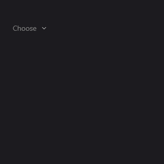
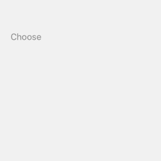

# Dropdown
The Dropdown component is a button that, when clicked, displays a list of options for the user to choose from. It's similar to Picker from MAUI but with a different user experience. The Dropdown component is a good choice when you have a small number of options to choose from.

## Usage

`Dropdown` is defined in the `UraniumUI.Controls` namespace.

You can access it in XAML with default UraniumUI namespace like this:

```xml
xmlns:uranium="http://schemas.enisn-projects.io/dotnet/maui/uraniumui"
```

Then you can use it like this:

```xml
<uranium:Dropdown ItemsSource="{Binding Items}" SelectedItem="{Binding SelectedItem}" Placeholder="Choose" />
```

| Windows | Android | iOS & Mac |
| --- | --- | --- |
|  |  |  |

## Properties

| Property | Description |
| --- | --- |
| `ItemsSource` | The collection of items to display in the dropdown. |
| `SelectedItem` | The selected item in the dropdown. |
| `Placeholder` | The text to display when no item is selected. |
| `PlaceholderColor` | The color of the placeholder text. |
| `TextColor` | The color of the text in the dropdown. |
| `HorizontalTextAlignment` | The horizontal alignment of the text in the dropdown. |
