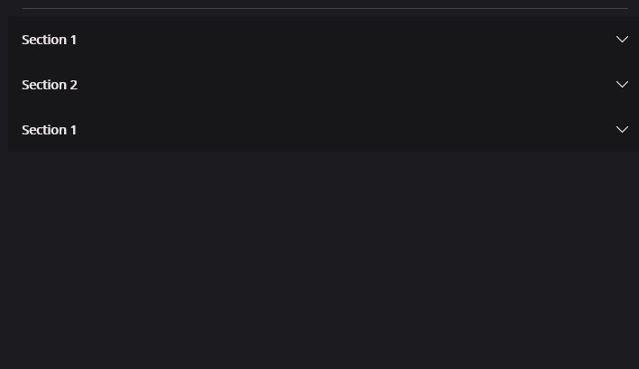

# ExpanderView

ExpanderView is a view that can be expanded or collapsed. It is useful for showing and hiding content. Common use case is building accordion sections. 



## Usage
It is defined in `UraniumUI.Views` namespace. You can use it in XAML like this:

```xml
xmlns:uranium="http://schemas.enisn-projects.io/dotnet/maui/uraniumui"
```

Then you can use it with `uranium:ExpanderView` tag.

```xml
<uranium:ExpanderView>
    <uranium:ExpanderView.Header>
        <Label Text="Section 1" />
    </uranium:ExpanderView.Header>

    <Label Margin="10" Text="This is the ExpanderView's body. It is hidden by default until user clicks/taps the header. The body automatically is shown when user interacts, no custom implementation required. It's animated by default." />
</uranium:ExpanderView>
```

## Customizations

You can customize the `ExpanderView` by using the style properties. You can use the following example to create your own style:

```xml
<Style TargetType="Layout" Class="ExpanderView.Header" ApplyToDerivedTypes="True">
    <Setter Property="BackgroundColor" Value="Orange" />
</Style>

<Style TargetType="ContentView" Class="ExpanderView.Content">
    <Setter Property="BackgroundColor" Value="DarkOrange" />
</Style>

<Style TargetType="Path" Class="ExpanderView.Arrow">
    <Setter Property="Fill" Value="Black" />
</Style>
```

