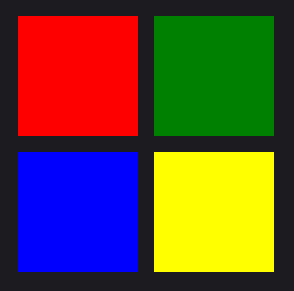
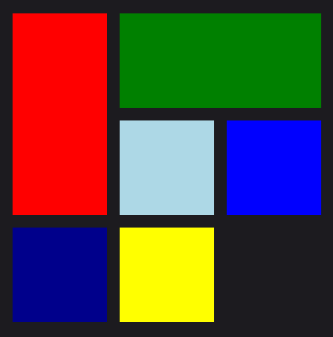

# GridLayout

The `GridLayout` is a layout that arranges its children in a grid. It is similar to the MAUI Grid, but it manages the layout of its children automatically. The `GridLayout` is a good choice when you want to create a grid of items that can be manages dynamically without defaling with **Grid.Row** and **Grid.Column** properties for each item. Each item you place inside GridLayout will be automatically placed in the next cell of the grid. 


 ## Usage

It is defined in `UraniumUI.Layouts` namespace. You can use it in XAML like this:

```xml
xmlns:uranium="http://schemas.enisn-projects.io/dotnet/maui/uraniumui"
```

Then you can use it with `uranium:GridLayout` tag.

```xml
<uranium:GridLayout>
    <BoxView Color="Blue" />
    <BoxView Color="Green" />
    <BoxView Color="Yellow" />
    <BoxView Color="Red" />
</uranium:GridLayout>
```

The above code will create a grid with 2 columns and 2 rows. The first BoxView will be placed in the first cell, the second BoxView will be placed in the second cell, the third BoxView will be placed in the third cell, and the fourth BoxView will be placed in the fourth cell.


## Properties

- **ColumnCount**: The number of columns in the grid. Default value is 2.
- **RowCount**: The number of rows in the grid. Default value is 2.
- **RowSpacing**: The spacing between rows. Default value is 0.
- **ColumnSpacing**: The spacing between columns. Default value is 0.
- **RowGridLength**: The height of each row. Default value is Auto.
- **ColumnGridLength**: The width of each column. Default value is Auto.


```xml
<uranium:GridLayout Margin="20"
        RowCount="2"
        ColumnCount="2" 
        ColumnSpacing="16" 
        RowSpacing="16"
        ColumnGridLength="120"
        RowGridLength="120">
    <BoxView Color="Red" />
    <BoxView Color="Green" />
    <BoxView Color="Blue" />
    <BoxView Color="Yellow" />
</uranium:GridLayout>
```




## Span

You can use the **Grid.RowSpan** and **Grid.ColumnSpan** properties to span an item across multiple rows or columns. 

```xml
<uranium:GridLayout Margin="20"
        RowCount="3"
        ColumnCount="3" 
        ColumnSpacing="16" 
        RowSpacing="16"
        ColumnGridLength="120"
        RowGridLength="120">
    <BoxView Color="Red" Grid.RowSpan="2" />
    <BoxView Color="Green" Grid.ColumnSpan="2" />
    <BoxView Color="LightBlue" />
    <BoxView Color="Blue" />
    <BoxView Color="DarkBlue" />
    <BoxView Color="Yellow" />
</uranium:GridLayout>
```

