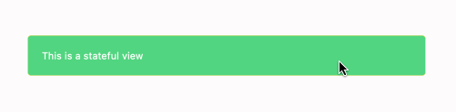

# StatefulContentView
StatefulContentView is a typical ContentView that has `Normal`, `Pressed`, `PointerOver` states. It is used to display a button, a checkbox, a radio button, etc. It's a useful when you want to create a custom button or a clickable area.

## Usage

StatefulContentView is defined in `UraniumUI.Views` namespace. You can use it in XAML like this:

```xml
xmlns:uranium="http://schemas.enisn-projects.io/dotnet/maui/uraniumui"
```

Then you can use it with `uranium:StatefulContentView` tag.

```xml
<uranium:StatefulContentView LongPressCommand="{Binding DoSomethingCommand}">
    <Border Padding="20" BackgroundColor="{StaticResource Primary}" Stroke="{StaticResource Tertiary}" StrokeShape="{RoundRectangle CornerRadius=5}">
        <Label Text="This is a stateful view" TextColor="{StaticResource OnPrimary}" />
    </Border>
</uranium:StatefulContentView>
```

| Windows (Dark) | MAC Catalyst (Light) |
| --- | --- |
|  |  |

> Hover over the view to see the `PointerOver` state. A mouse should be connected to see this state on mobile platforms.

## Commands

- `PressedCommand` : A command that is executed when the view is pressed.
- `HoverCommand` : A command that is executed when the view is hovered.
- `HoverExitCommand` : A command that is executed when the view is hovered out.
- `LongPressCommand` : A command that is executed when the view is long pressed.
- `TappedCommand` : A command that is executed when the view is tapped.
- `CommandParameter` : A parameter that is passed to the command.


## Customizations

You can customize the `StatefulContentView` by using the style properties. You can use the following template to create your own style:

```xml
<Style TargetType="uranium:StatefulContentView" ApplyToDerivedTypes="True" CanCascade="True" BaseResourceKey="UraniumUI.Views.StatefulContentView.Base">
    <Setter Property="VisualStateManager.VisualStateGroups">
        <VisualStateGroupList>
            <VisualStateGroup x:Name="CommonStates">
                <VisualState x:Name="PointerOver">
                    <VisualState.Setters>
                        <Setter Property="Opacity" Value="0.8" />
                    </VisualState.Setters>
                </VisualState>
                <VisualState x:Name="Normal">
                    <VisualState.Setters>
                        <Setter Property="Opacity" Value="1.0" />
                    </VisualState.Setters>
                </VisualState>
                <VisualState x:Name="Pressed">
                    <VisualState.Setters>
                        <Setter Property="Opacity" Value="0.5" />
                    </VisualState.Setters>
                </VisualState>
            </VisualStateGroup>
        </VisualStateGroupList>
    </Setter>
</Style>
```

> **Note**: Make sure `xmlns:uranium="http://schemas.enisn-projects.io/dotnet/maui/uraniumui"` namespace exists in your XAML file.