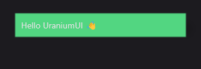

# ButtonView
ButtonView is a plain control that allows you place your content inside it. It is a simple wrapper around the [StatefulContentView](../../../en/infrastructure/StatefulContentView.md) control. 

ButtonView included in **Material Theme**.

## Usage

`ButtonView` is defined in `UraniumUI.Material.Controls` namespace. You can add it to your XAML like this:

```xml
xmlns:material="http://schemas.enisn-projects.io/dotnet/maui/uraniumui/material"
```

Then you can use it like this:

```xml
<material:ButtonView>
    <Label Text="Hello UraniumUI 👋" />
</material:ButtonView>
```




## Customizations
You can customize the `ButtonView` by using the style properties. You can use the following template to create your own style:

```xml
<Style TargetType="material:ButtonView" ApplyToDerivedTypes="True" CanCascade="True" BaseResourceKey="UraniumUI.Material.Controls.ButtonView.Base">
    <Setter Property="BackgroundColor" Value="{StaticResource Primary}" />
    <Setter Property="Padding" Value="10" />
    <Setter Property="StrokeShape" Value="{RoundRectangle CornerRadius=20}"/>
    <Setter Property="VisualStateManager.VisualStateGroups">
        <VisualStateGroupList>
            <VisualStateGroup x:Name="CommonStates">
                <VisualState x:Name="PointerOver">
                    <VisualState.Setters>
                        <Setter Property="uranium:DynamicTint.BackgroundColorOpacity" Value="0.9" />
                    </VisualState.Setters>
                </VisualState>
                <VisualState x:Name="Normal"/>
                <VisualState x:Name="Pressed">
                    <VisualState.Setters>
                        <Setter Property="uranium:DynamicTint.BackgroundColorOpacity" Value="0.8" />
                    </VisualState.Setters>
                </VisualState>
            </VisualStateGroup>
        </VisualStateGroupList>
    </Setter>
</Style>
```

> **Note**: Make sure the following namespaces exist in your XAML file:
> - `xmlns:material="http://schemas.enisn-projects.io/dotnet/maui/uraniumui/material"`
> - `xmlns:uranium="http://schemas.enisn-projects.io/dotnet/maui/uraniumui"`