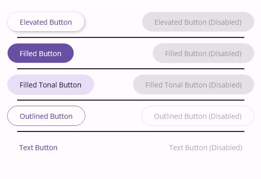
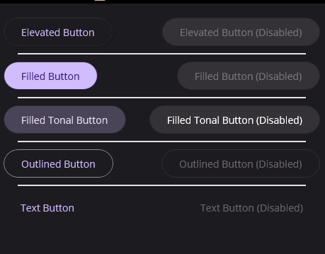
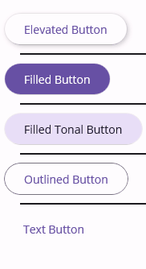

# Buttons
There are five types of common buttons: elevated, filled, filled tonal, outlined, and text.
You can visit the [Material Design Buttons Guideline](https://m3.material.io/components/buttons/overview) for more information.


## Usage
Regular MAUI buttons can be converted to Material buttons by setting the `StyleClass` property to one of the following values:
- `ElevatedButton`
- `FilledButton`
- `FilledTonalButton`
- `OutlinedButton`
- `TextButton`

```xml
<Button StyleClass="FilledButton" Text="Filled Button" />
```

List of all available style classes:

```xml
     <VerticalStackLayout Padding="20" Spacing="10">
            <FlexLayout JustifyContent="SpaceBetween" Wrap="Wrap">
                <Button StyleClass="ElevatedButton" Text="Elevated Button" />
                <Button StyleClass="ElevatedButton" IsEnabled="False" Text="Elevated Button (Disabled)" />
            </FlexLayout>
            <BoxView Margin="20,0"/>
            <FlexLayout JustifyContent="SpaceBetween" Wrap="Wrap">
                <Button StyleClass="FilledButton" Text="Filled Button" />
                <Button StyleClass="FilledButton" IsEnabled="False" Text="Filled Button (Disabled)" />
            </FlexLayout>
            <BoxView Margin="20,0"/>
            <FlexLayout JustifyContent="SpaceBetween" Wrap="Wrap">
                <Button StyleClass="FilledTonalButton" Text="Filled Tonal Button" />
                <Button StyleClass="FilledTonalButton" IsEnabled="False" Text="Filled Tonal Button (Disabled)" />
            </FlexLayout>
            <BoxView Margin="20,0"/>
            <FlexLayout JustifyContent="SpaceBetween" Wrap="Wrap">
                <Button StyleClass="OutlinedButton" Text="Outlined Button" />
                <Button StyleClass="OutlinedButton" IsEnabled="False" Text="Outlined Button (Disabled)" />
            </FlexLayout>
            <BoxView Margin="20,0"/>
            <FlexLayout JustifyContent="SpaceBetween" Wrap="Wrap">
                <Button StyleClass="TextButton" Text="Text Button" />
                <Button StyleClass="TextButton" IsEnabled="False" Text="Text Button (Disabled)" />
            </FlexLayout>
        </VerticalStackLayout>
```
| Light | Dark |
| --- | --- |
| |  |


All the buttons are implemented by following [Material Design Button Guidelines](https://m3.material.io/components/buttons/overview). So each state works well like Hover on Windows.




## Customization

You can always customize buttons in `Resources/Styles.xaml` file by writing a style that targets to buttons.

```xml
<Style TargetType="Button"  BaseResourceKey="BaseButtonStyle">
    <Setter Property="BorderWidth" Value="2" />
</Style>
```

### States

Uranium UI Material supports the following states for buttons:

- `Normal`
- `Disabled`
- `Hover`
- `Focused`
- `Pressed`

You can write state specific setter in your custom style.

```xml
<Style TargetType="Button" Class="YourClass" BaseResourceKey="BaseButtonStyle">
    <Setter Property="VisualStateManager.VisualStateGroups">
        <VisualStateGroupList>
            <VisualStateGroup x:Name="CommonStates">
                <VisualState x:Name="Normal">
                    <VisualState.Setters>
                        <Setter Property="BackgroundColor" Value="Red" />
                    </VisualState.Setters>
                </VisualState>
                <VisualState x:Name="Disabled">
                    <VisualState.Setters>
                        <Setter Property="BackgroundColor" Value="Gray"/>
                    </VisualState.Setters>
                </VisualState>
                <VisualState x:Name="Hover">
                    <VisualState.Setters>
                        <Setter Property="Shadow" Value="{StaticResource ShadowElevation1}" />
                    </VisualState.Setters>
                </VisualState>
                <VisualState x:Name="Focused">
                    <VisualState.Setters>
                        <Setter Property="BorderColor" Value="Gray" />
                    </VisualState.Setters>
                </VisualState>
                <VisualState x:Name="Pressed">
                    <VisualState.Setters>
                        <Setter Property="BackgroundColor" Value="Purple"/>
                        <Setter Property="Shadow" Value="{StaticResource ShadowElevation0}"/>
                    </VisualState.Setters>
                </VisualState>
            </VisualStateGroup>
        </VisualStateGroupList>
    </Setter>
</Style>
```
