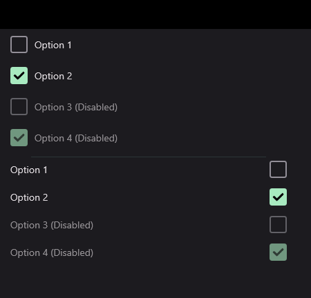
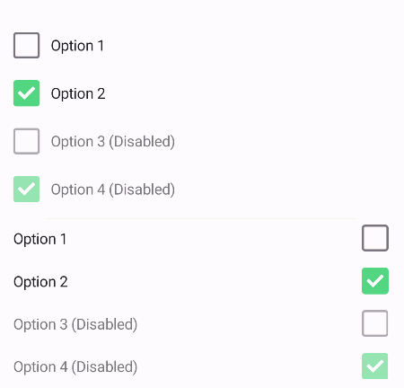

# CheckBox
CheckBox is a control that allows the user to choose a boolean value. UraniumU UI uses [InputKit CheckBox](https://enisn-projects.io/docs/en/inputkit/latest/components/controls/CheckBox) instead of MAUI one. It is because InputKit CheckBox is more customizable and already has a Material theme.


## Features

You can visit [InputKit CheckBox Documentation](https://enisn-projects.io/docs/en/inputkit/latest/components/controls/CheckBox) to see features. UraniumUI applies only visual changes on it.


## Usage

RadioButtons should be grouped together in a RadioButtonGroupView. Otherwise, they will not work properly and each one will be independent.

RadioButton is defined in `UraniumUI.Material.Controls` namespace. You can use it like this:

```xml
xmlns:material="clr-namespace:UraniumUI.Material.Controls;assembly=UraniumUI.Material"
```

```xml
<StackLayout MaximumWidthRequest="400">
    <material:CheckBox Text="Option 1" />
    <material:CheckBox Text="Option 2" IsChecked="True" />
    <material:CheckBox Text="Option 3 (Disabled)" IsDisabled="True" />
    <material:CheckBox Text="Option 4 (Disabled)" IsDisabled="True" IsChecked="True" />

    <BoxView />

    <material:CheckBox Text="Option 1" LabelPosition="Before" />
    <material:CheckBox Text="Option 2" LabelPosition="Before" IsChecked="True" />
    <material:CheckBox Text="Option 3 (Disabled)" IsDisabled="True" LabelPosition="Before" />
    <material:CheckBox Text="Option 4 (Disabled)" IsDisabled="True" IsChecked="True" LabelPosition="Before" />
</StackLayout>
```

And result will be like this:

| Dark - Desktop | Light - Mobile |
| --- | --- |
|  |   |
