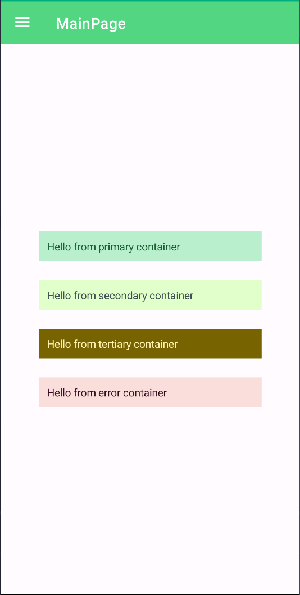

# Containers
Uranium UI provies a set of style classes to help you style your application. You can use these classes to style your application in a consistent way.
Containers are layouts that has a specific background and they modifies elements inside them. If background of a container is a dark color, texts inside it will be a light color and vice versa.

Container classes can be defined any type of View, but they are mostly used with `*Layout` and `Frame`.

## Usage
You should pass a proper container class as `StyleClass` property of a View. 

Valid container classes are:

- `PrimaryContainer`
- `SecondaryContainer`
- `TertiaryContainer`
- `ErrorContainer`


```xml
<Frame StyleClass="PrimaryContainer">
    <Label Text="Hello, World!" />
</Frame>
```


---

List of all containers:

```xml
<StackLayout StyleClass="PrimaryContainer" Padding="10">
    <Label Text="Hello from primary container" />
</StackLayout>

<StackLayout StyleClass="SecondaryContainer" Padding="10">
    <Label Text="Hello from secondary container" />
</StackLayout>

<StackLayout StyleClass="TertiaryContainer" Padding="10">
    <Label Text="Hello from tertiary container" />
</StackLayout>

<StackLayout StyleClass="ErrorContainer" Padding="10">
    <Label Text="Hello from error container" />
</StackLayout>
```


| Light | Dark |
| --- | --- |
|  |  |