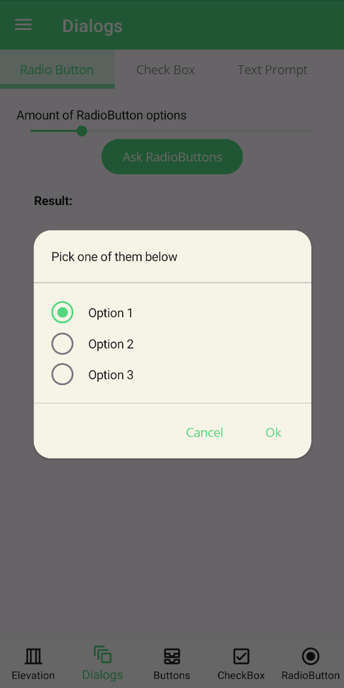
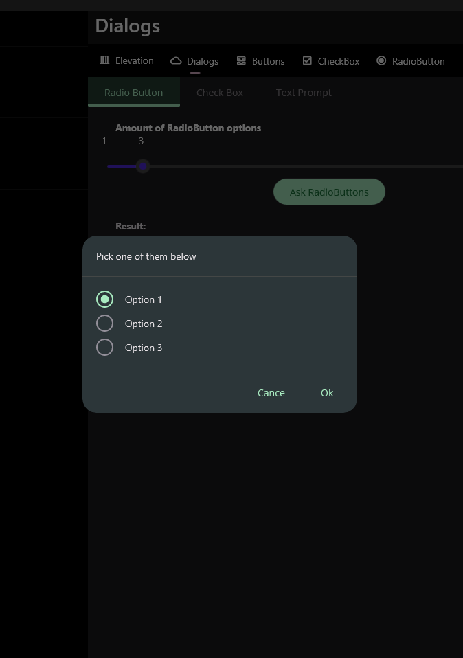
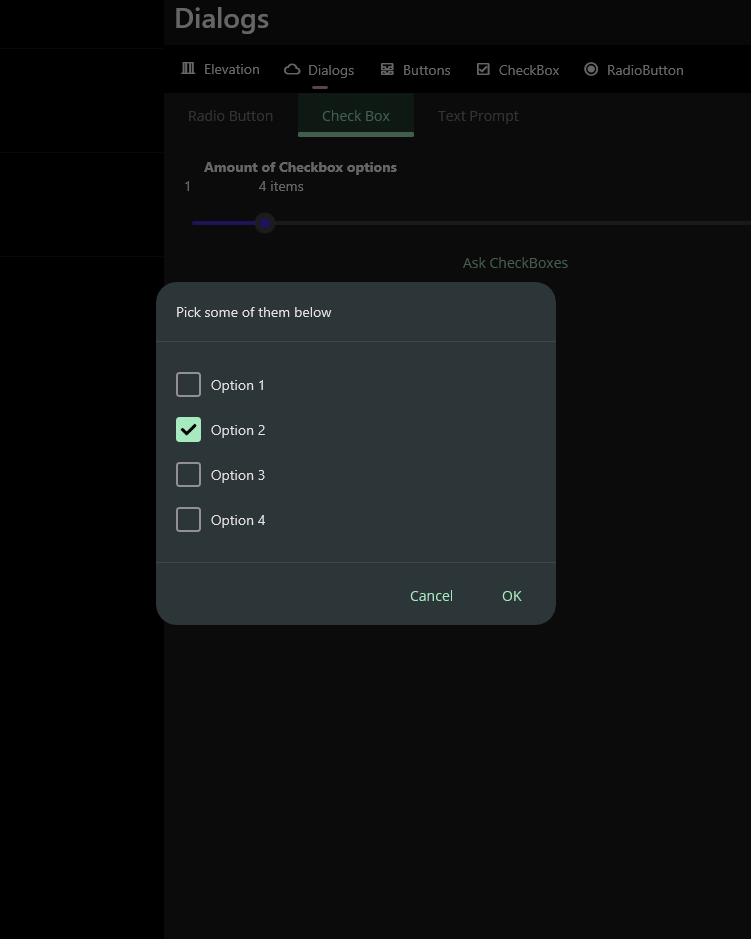

# Dialogs
Dialogs are a great way to get the user to make a decision or enter some information. They are also a great way to display information to the user. Popup implementation is implemented in [Community ToolKit](https://github.com/CommunityToolkit/Maui) and dialogs feature uses it to show dialogs in MAUI Application. Also, dialogs are implemented in [UraniumUI](https://github.com/enisn/UraniumUI/tree/master/src/UraniumUI) package and Material theme only customizes it. You can use dialogs in your application by adding [UraniumUI](https://www.nuget.org/packages/UraniumUI) package to your project.

_You may visit [Material Design Guideline](https://m3.material.io/components/dialogs/overview) to learn more about dialogs._


<center>

</center>

## Types
There are 3 types of dialogs in UraniumUI package. They are: `CheckBox Prompt`, `RadioButton Prompt` and `Text Prompt`. They are implemented in `UraniumUI.Extensions` namespace. You can use them by adding `using UraniumUI.Extensions;` to your code. All the methods can be called from a Page like built-in methods such as `DisplaAlert`

```csharp
public partial class MainPage : ContentPage
{
    public MainPage()
    {
        InitializeComponent();
    }

    private async void Button_Clicked(object sender, EventArgs e)
    {
        var result = await this.DisplayCheckBoxPromptAsync("Title", new []{ "Option 1", "Option 2", "Option 3"});
    }
}
```


### RadioButton Prompt
RadioButton prompt can be used to get a single selection input from user. It returns the selected option. It can be used with strings or objects. If you use objects, you can use `DisplayMember` parameter to specify the property of the object to be displayed or your object should override `ToString()` method.


#### Usage
The easiest way to use RadioButton prompt is to pass a string array to it. It will return the selected option as a string.

```csharp
private async void Button_Clicked(object sender, EventArgs e)
{
    var result = await this..DisplayCheckBoxPromptAsync(
            "Pick some of them below",
            new [] {"Option 1", "Option 2", "Option 3"});
}
```

| Light | Dark |
| --- | --- |
|  |  |


#### Parameters

`DisplayRadioButtonPromptAsync` method has 6 parameters. They are:

- `message`: Message of the dialog. It'll be rendered top of the dialog.
- `selectionSource`: Selection source of the dialog. It can be a string collection or an object collection. If you use objects, you can use `displayMember` parameter to specify the property of the object to be displayed or your object should override `ToString()` method.
- `selected`: Selected item of the dialog. It'll be automatically selected when dialog is shown.
- `accept`: Accept button text of the dialog. It'll be rendered as the accept button text.
- `cancel`: Cancel button text of the dialog. It'll be rendered as the cancel button text.
- `displayMember`: Display member of the object. It'll be used to specify the property of the object to be displayed or your object should override `ToString()` method.


```csharp
private async void Button_Clicked(object sender, EventArgs e)
{
    var options = new List<MyOption>()
    {
        new MyOption() { Name = "Option 1", Description = "Description 1" },
        new MyOption() { Name = "Option 2", Description = "Description 2" },
        new MyOption() { Name = "Option 3", Description = "Description 3" },
    };
    var result = await this.DisplayRadioButtonPromptAsync(
            "Pick some of them below",
            options,
            options[1],
            "OK",
            "Cancel",
            "Name");

    await this.DisplayAlert("Result", result.Name, "OK");
}
```

### CheckBox Prompt
CheckBox prompt can be used to get a multiple selection input from user. It returns the selected options. It can be used with strings or objects. If you use objects, you can use `DisplayMember` parameter to specify the property of the object to be displayed or your object should override `ToString()` method.


| Light | Dark |
| --- | --- |
|  |  |

#### Usage
The easiest way to use CheckBox prompt is to pass a string array to it. It will return the selected options as a string array.

```csharp
private async void Button_Clicked(object sender, EventArgs e)
{
    var result = await this..DisplayCheckBoxPromptAsync(
            "Pick some of them below",
            new [] {"Option 1", "Option 2", "Option 3", "Option 4",});
}
```

#### Parameters

`DisplayCheckBoxPromptAsync` method has 6 parameters. They are:
- `message`: Message of the dialog. It'll be rendered top of the dialog.
- `selectionSource`: Selection source of the dialog. It can be a string collection or an object collection. If you use objects, you can use `displayMember` parameter to specify the property of the object to be displayed or your object should override `ToString()` method.
- `selectedItems`: Selected items of the dialog. They'll be automatically selected when dialog is shown.
- `accept`: Accept button text of the dialog. It'll be rendered as the accept button text.
- `cancel`: Cancel button text of the dialog. It'll be rendered as the cancel button text.
- `displayMember`: Display member of the object. It'll be used to specify the property of the object to be displayed or your object should override `ToString()` method.


```csharp
private async void Button_Clicked(object sender, EventArgs e)
{
    var options = new List<MyOption>()
    {
        new MyOption() { Name = "Option 1", Description = "Description 1" },
        new MyOption() { Name = "Option 2", Description = "Description 2" },
        new MyOption() { Name = "Option 3", Description = "Description 3" },
        new MyOption() { Name = "Option 3", Description = "Description 4" },
    };

    var result = await this.DisplayCheckBoxPromptAsync(
            "Pick some of them below",
            options,
            new [] { options[1] },
            "OK",
            "Cancel",
            "Name");

    await this.DisplayAlert("Result", string.Join(", ", result.Select(x => x.Name)), "OK");
}
```

### Text Prompt
Text prompt can be used to get a text input from user. It returns the entered text. All parameters are same with MAUI default `DisplayPromptAsync` method.

| Light | Dark |
| --- | --- |
|  |  |

```csharp
private async void Button_Clicked(object sender, EventArgs e)
{
    var result = await this.DisplayTextPromptAsync("Your Name", "What is your name?", placeholder: "Uvuvwevwevwe...Osas");

    await DisplayAlert("Result:", result, "OK");
}
```

