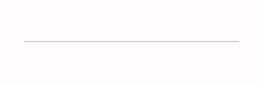
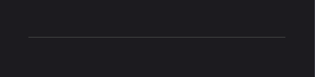

# Divider
Divider is a simple separator for your content. It's not a standalone component. You can achieve it by using a `BoxView` with `Divider` class.

```xml
<BoxView StyleClass="Divider" />
```

| Light | Dark |
| --- | --- |
|  |  |