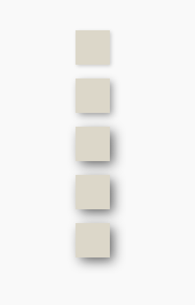

# Elevation

Elevation is a visual effect that can be applied to a component to make it appear to be raised above the surface of the page. It is used to indicate the relative importance of an element on the page.

_You can visit original [Material Design Elevation Guideline]_

## Configuration
Elevation styles come from `StyleResource` from `UraniumUI.Material.Resources` namespace. It should be added to `App.xaml` as a merged dictionary to use it.

> _You can check the [Colors & Styles Documentation](ColorsAndStyles.md) to see howit should be configured._

## Usage

Elevation can be applied any type of `View` by using Elevation style classes.
- `Elevation0`
- `Elevation1`
- `Elevation2`
- `Elevation3`
- `Elevation4`
- `Elevation5`

```xml
<StackLayout>
    <BoxView StyleClass="Elevation1" Margin="30" />
</StackLayout>
```


All elevation levels are listed below.

```xml
<VerticalStackLayout Padding="50" Spacing="20">
    <BoxView StyleClass="Elevation1" />
    <BoxView StyleClass="Elevation2" />
    <BoxView StyleClass="Elevation3" />
    <BoxView StyleClass="Elevation4" />
    <BoxView StyleClass="Elevation5" />
</VerticalStackLayout>
```



