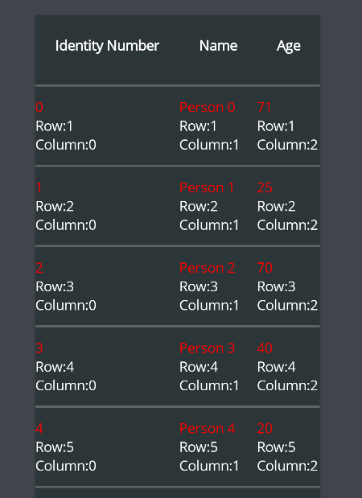

# DataGrid
DataGrid displays sets of data across rows and columns.

## Getting Started
DataGrid is included in the `UraniumUI.Material.Controls` namespace. You can add it to your XAML like this:

```
xmlns:controls="clr-namespace:UraniumUI.Material.Controls;assembly=UraniumUI.Material"
```

DataGrid can't be used standalone without csharp code. You need to bind some data to `ItemsSource` property.

```csharp
public class MainPageViewModel : BindableObject
{
	static Random random = new();
	public ObservableCollection<Student> Items { get; } = new();
	public MainPageViewModel()
	{
		for (int i = 0; i < 10; i++)
		{
			Items.Add(new Student
			{
				Id = i,
				Name = "Person " + i,
				Age = random.Next(14, 85),
			});
		}
    }
	public class Student
	{
		public int Id { get; set; }
		public string Name { get; set; }
		public int Age { get; set; }
	}
}
```

Then use it in XAML like this:

```xml
 <controls:DataGrid ItemsSource="{Binding Items}" UseAutoColumns="True" Margin="30" />
```
|Light - Desktop | Dark - Mobile|
| :---: | :---: |
|  |  |


## Customizations

### CellItemTemplate

You can customize the cell item template by using `CellItemTemplate` property. It is a `DataTemplate` that is used to render each cell item. You can use `DataGridCellItem` as the root element of the template. It has a `DataContext` of the cell item. You can use `Binding` to bind the properties of the cell item.

You can use any property of [CellBindingContext](#cellbindingcontext) object inside DataTemplate.

```xml
<material:DataGrid ItemsSource="{Binding Items}" UseAutoColumns="True" HorizontalOptions="Center">
	<material:DataGrid.CellItemTemplate>
		<DataTemplate>
			<VerticalStackLayout VerticalOptions="Center">
				<Label Text="{Binding Value}" TextColor="Red" />
				<Label Text="{Binding Row,StringFormat='Row:{0}'}" />
				<Label Text="{Binding Column,StringFormat='Column:{0}'}" />                                
			</VerticalStackLayout>
		</DataTemplate>
	</material:DataGrid.CellItemTemplate>
</material:DataGrid>
```



### Columns


#### Auto Columns
Columns are automatically detected by **DataGrid** when `UseAutoColumns` property is set as `True`. It uses reflection to get properties of the data source. You can use DataAnnosations attributes to define Title of column in auto mode. Adding `[DisplayName]` attribute to the property will define the title of the column.

```csharp
[DisplayName("Identity Number")]
public int Id { get; set; }
```


#### Custom Columns
You can also define columns manually by adding `DataGridColumn` to `Columns` property of **DataGrid**.
`UseAutoColumns` must be false. You can remove it from XAML. Its default value is `false`.


```xml
<material:DataGrid ItemsSource="{Binding Items}" HorizontalOptions="Center" Margin="30">
	<material:DataGrid.Columns>
		<material:DataGridColumn PropertyName="Name" Title="Student Name"/>

		<material:DataGridColumn PropertyName="Age" Title="Student Age"/>

		<material:DataGridColumn PropertyName="Id" Title="Identity" />
	</material:DataGrid.Columns>
</material:DataGrid>
```

An ItemTemplate can be defined for each column via using `CellItemTemplate` property of `DataGridColumn` class.

```xml
<material:DataGrid ItemsSource="{Binding Items}" HorizontalOptions="Center" Margin="30">
	<material:DataGrid.Columns>
		<material:DataGridColumn PropertyName="Name" Title="Student Name"/>

		<material:DataGridColumn PropertyName="Age" Title="Student Age">
			<material:DataGridColumn.CellItemTemplate>
				<DataTemplate>
					<Frame BorderColor="Blue" BackgroundColor="Transparent" Padding="5" >
						<Label Text="{Binding Value}" TextColor="Blue" />
					</Frame>
				</DataTemplate>
			</material:DataGridColumn.CellItemTemplate>
		</material:DataGridColumn>

		<material:DataGridColumn PropertyName="Id" Title="Identity" />

	</material:DataGrid.Columns>
</material:DataGrid>
```


Columns are not limited to the properties of the data source. You can also use custom columns without any property mapping. You can use `CellItemTemplate` to define the content of the column. That column will be rendered and [CellBindingContext](#cellbindingcontext) will be passed to the template. You can use `Data` property of `CellBindingContext` to get the data of current row.


```xml
<material:DataGrid ItemsSource="{Binding Items}" HorizontalOptions="Center" Margin="30">
	<material:DataGrid.Columns>
		<material:DataGridColumn PropertyName="Name" Title="Student Name"/>

		<!-- This is a custom column without a property. -->
		<material:DataGridColumn Title="Actions" >
			<material:DataGridColumn.CellItemTemplate>
				<DataTemplate>
					<Button Text="Remove"
							Command="{Binding Source={x:Reference page}, Path=BindingContext.RemoveItemCommand}"
							CommandParameter="{Binding Data}"/>
				</DataTemplate>
			</material:DataGridColumn.CellItemTemplate>
		</material:DataGridColumn>

	</material:DataGrid.Columns>
</material:DataGrid>
```


#### Column Width
Column width can be defined by using `Width` property of `DataGridColumn` class. It can be set as `Auto`, `Star` or a custom value. Its type is `GridLength` and it'll be passed as parameter to [ColumnDefinition](https://docs.microsoft.com/en-us/dotnet/maui/user-interface/layouts/grid#simplify-row-and-column-definitions). `Auto` is the default value. It will be calculated automatically. `Star` will take the remaining space of the grid. You can also set a custom value. It can be a `double` or a `GridLength`.

```xml
<material:DataGrid ItemsSource="{Binding Items}" HorizontalOptions="Center" Margin="30">
	<material:DataGrid.Columns>

		<material:DataGridColumn PropertyName="Name" Title="Student Name" Width="Auto"/>

		<material:DataGridColumn PropertyName="Age" Title="Student Age" Width="Star"/>

		<material:DataGridColumn PropertyName="Id" Title="Identity" Width="100"/>

	</material:DataGrid.Columns>
</material:DataGrid>
```


## Selection
DataGrid supports multiple row selection. You can add `DataGridSelectionColumn` column to enable selection. Selected Items can be accessed via `SelectedItems` property of **DataGrid**. You can bind it to a property of your ViewModel.

```xml
<material:DataGrid ItemsSource="{Binding Items}" SelectedItems="{Binding SelectedItems}">
	<material:DataGrid.Columns>
		<material:DataGridSelectionColumn />
		<material:DataGridColumn PropertyName="Id" Title="Identity" />
		<material:DataGridColumn PropertyName="Name" Title="Name" />
		<material:DataGridColumn PropertyName="Age" Title="Age" />
	</material:DataGrid.Columns>
</material:DataGrid>
```

| Dark - Desktop | Light - Mobile |
| :---: | :---: |
|  | 


**SelectedItems** can be handled with `ObservableCollection` over `IList` interface. So you can use `INotifyCollectionChanged` to handle changes in selection. The bound list will be automatically updated. _You don't need to register to `CollectionChanged` event of `SelectedItems` property._
	

```csharp
public class MainViewModel
{
    public ObservableCollection<Student> Items { get; set; }
    public ObservableCollection<Student> SelectedItems { get; set; } = new ObservableCollection<Student>();
    public ICommand RemoveSelectedCommand { get; set; }
    
    public MainViewModel()
    {
        Items = new ObservableCollection<Student>(GetStudents());
        
        RemoveSelectedCommand = new Command(() =>
        {
            foreach (var item in SelectedItems)
            {
                Items.Remove(item);
            }
        });
    }
}
```

```xml
<StackLayout>
	<Button Text="Delete Selected" Command="{Binding RemoveSelectedCommand}" />
	<material:DataGrid ItemsSource="{Binding Items}" SelectedItems="{Binding SelectedItems}">
		<material:DataGrid.Columns>
			<material:DataGridSelectionColumn />
			<material:DataGridColumn PropertyName="Id" Title="Identity" />
			<material:DataGridColumn PropertyName="Name" Title="Name" />
			<material:DataGridColumn PropertyName="Age" Title="Age" />
		</material:DataGrid.Columns>
	</material:DataGrid>
</StackLayout>
```


## Tips

You can place an activity indicator inside the DataGrid to show loading state if you make a network call to get data.

```xml
<material:DataGrid ItemsSource="{Binding Items}" HorizontalOptions="Center">
	<ActivityIndicator IsRunning="{Binding IsBusy}" Margin="40" />
</material:DataGrid>
```


## Data

### CellBindingContext
`CellBindingContext` is an object that is used as the `DataContext` of the `CellItemTemplate`. It has the following properties:

| Property | Description |
| :--- | :--- |
| `Data` | The data of the cell item. |
| `Column` | The column number of the cell item. |
| `Row` | The row number of the cell item. |
| `Value` | The value of the cell item. _(You can bind it to the label directly)_ |

### DataGridColumn
`DataGridColumn` is a class that is used to define a column of **DataGrid**. It has the following properties:

- `Title`: It's used in header of the column.
- `CellItemTemplate`: It's used to define the template of the cell item of the column.
- `PropertyName`: It's used to define the property of the data source that is used to get the value of the cell item. You can leave it empty if you want to use a custom column.