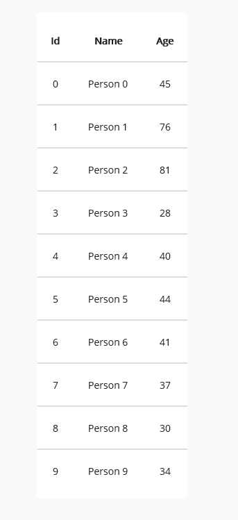
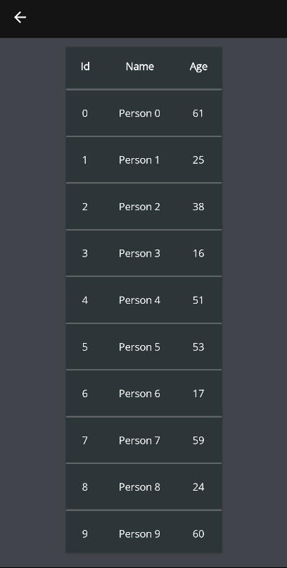
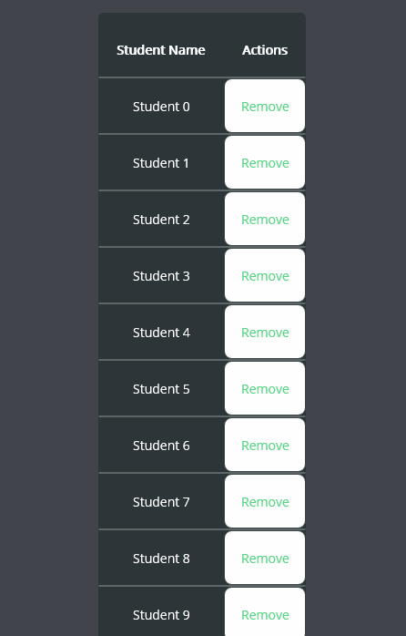
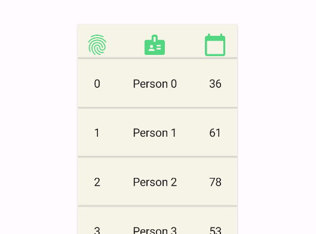
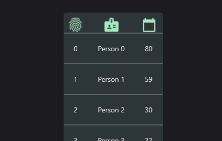
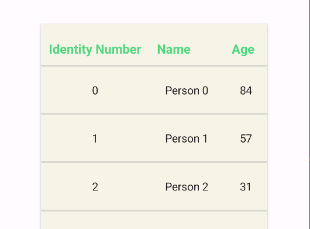
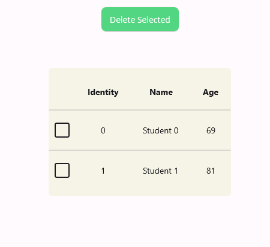
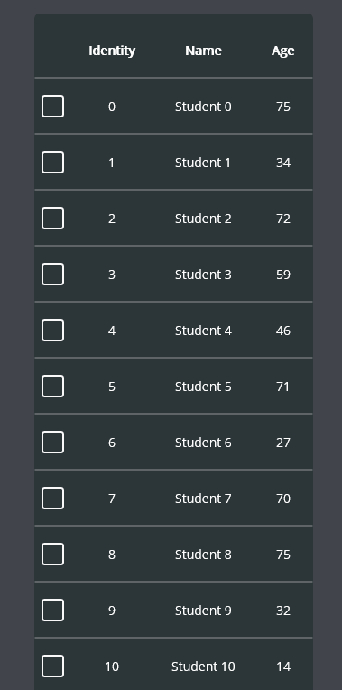
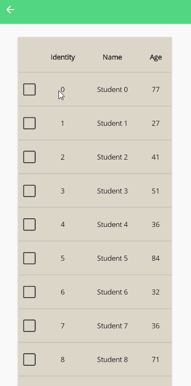

# DataGrid
DataGrid displays sets of data across rows and columns.

## Getting Started
DataGrid is included in the `UraniumUI.Material.Controls` namespace. You can add it to your XAML like this:

```
xmlns:controls="clr-namespace:UraniumUI.Material.Controls;assembly=UraniumUI.Material"
```

DataGrid can't be used standalone without csharp code. You need to bind some data to `ItemsSource` property.

```csharp
public class MainPageViewModel : BindableObject
{
	static Random random = new();
	public ObservableCollection<Student> Items { get; } = new();
	public MainPageViewModel()
	{
		for (int i = 0; i < 10; i++)
		{
			Items.Add(new Student
			{
				Id = i,
				Name = "Person " + i,
				Age = random.Next(14, 85),
			});
		}
    }
	public class Student
	{
		public int Id { get; set; }
		public string Name { get; set; }
		public int Age { get; set; }
	}
}
```

Then use it in XAML like this:

```xml
 <controls:DataGrid ItemsSource="{Binding Items}" UseAutoColumns="True" Margin="30" />
```
|Light - Desktop | Dark - Android | Light - iOS |
| :---: | :---: | :---: |
|  |  |  |


## Customizations

### CellItemTemplate

You can customize the cell item template by using `CellItemTemplate` property. It is a `DataTemplate` that is used to render each cell item. You can use `DataGridCellItem` as the root element of the template. It has a `DataContext` of the cell item. You can use `Binding` to bind the properties of the cell item.


```xml
<material:DataGrid ItemsSource="{Binding Items}" UseAutoColumns="True" HorizontalOptions="Center">
	<material:DataGrid.CellItemTemplate>
		<DataTemplate>
			<Editor Margin="10" Text="{Binding Value}" />
		</DataTemplate>
	</material:DataGrid.CellItemTemplate>
</material:DataGrid>
```


### Columns

#### Auto Columns
Columns are automatically detected by **DataGrid** when `UseAutoColumns` property is set as `True`. It uses reflection to get properties of the data source. You can use DataAnnosations attributes to define Title of column in auto mode. Adding `[DisplayName]` attribute to the property will define the title of the column.

```csharp
[DisplayName("Identity Number")]
public int Id { get; set; }
```


#### Custom Columns
You can also define columns manually by adding `DataGridColumn` to `Columns` property of **DataGrid**.
`UseAutoColumns` must be false. You can remove it from XAML. Its default value is `false`.


```xml
<material:DataGrid ItemsSource="{Binding Items}" HorizontalOptions="Center" Margin="30">
	<material:DataGrid.Columns>
		<material:DataGridColumn Binding="{Binding Name}" Title="Student Name"/>

		<material:DataGridColumn Binding="{Binding Age}" Title="Student Age"/>

		<material:DataGridColumn Binding="{Binding Id}" Title="Identity" />
	</material:DataGrid.Columns>
</material:DataGrid>
```

An ItemTemplate can be defined for each column via using `CellItemTemplate` property of `DataGridColumn` class.

```xml
<material:DataGrid ItemsSource="{Binding Items}" HorizontalOptions="Center" Margin="30">
	<material:DataGrid.Columns>
		<material:DataGridColumn Binding="{Binding Name}" Title="Student Name"/>

		<material:DataGridColumn Title="Student Age">
			<material:DataGridColumn.CellItemTemplate>
				<DataTemplate>
					<Frame BorderColor="Blue" BackgroundColor="Transparent" Padding="5" >
						<Label Text="{Binding Age}" TextColor="Blue" />
					</Frame>
				</DataTemplate>
			</material:DataGridColumn.CellItemTemplate>
		</material:DataGridColumn>

		<material:DataGridColumn Binding="{Binding Id}" Title="Identity" />

	</material:DataGrid.Columns>
</material:DataGrid>
```


Columns are not limited to the properties of the data source. You can also use custom columns without any property mapping. You can use `CellItemTemplate` to define the content of the column. That column will be rendered with your custom template. You can use any property of row for current binding.


```xml
<material:DataGrid ItemsSource="{Binding Items}" HorizontalOptions="Center" Margin="30">
	<material:DataGrid.Columns>
		<material:DataGridColumn PropertyName="Name" Title="Student Name"/>

		<!-- This is a custom column without a property. -->
		<material:DataGridColumn Title="Actions" >
			<material:DataGridColumn.CellItemTemplate>
				<DataTemplate>
					<Button Text="Remove"
							Command="{Binding Source={x:Reference page}, Path=BindingContext.RemoveItemCommand}"
							CommandParameter="{Binding .}"/>
				</DataTemplate>
			</material:DataGridColumn.CellItemTemplate>
		</material:DataGridColumn>

	</material:DataGrid.Columns>
</material:DataGrid>
```



#### Column Width
Column width can be defined by using `Width` property of `DataGridColumn` class. It can be set as `Auto`, `Star` or a custom value. Its type is `GridLength` and it'll be passed as parameter to [ColumnDefinition](https://docs.microsoft.com/en-us/dotnet/maui/user-interface/layouts/grid#simplify-row-and-column-definitions). `Auto` is the default value. It will be calculated automatically. `Star` will take the remaining space of the grid. You can also set a custom value. It can be a `double` or a `GridLength`.

```xml
<material:DataGrid ItemsSource="{Binding Items}" HorizontalOptions="Center" Margin="30">
	<material:DataGrid.Columns>

		<material:DataGridColumn Binding="{Binding Name}" Title="Student Name" Width="Auto"/>

		<material:DataGridColumn Binding="{Binding Age}" Title="Student Age" Width="*"/>

		<material:DataGridColumn Binding="{Binding Id}" Title="Identity" Width="100"/>

	</material:DataGrid.Columns>
</material:DataGrid>
```


#### TitleView
You can define a custom view for the header of the column by using `TitleView` property of `DataGridColumn` class. It is a `View` that will be rendered as the header of the column. You can use `Binding` to bind the properties of the column. 

```xml
 <material:DataGrid ItemsSource="{Binding Items}">
	<material:DataGrid.Columns>
		<material:DataGridColumn Binding="{Binding Id}">
			<material:DataGridColumn.TitleView>
				<Image Source="{FontImageSource FontFamily=MaterialRegular, Glyph={x:Static m:MaterialRegular.Fingerprint}, Color={StaticResource Primary}}" />
			</material:DataGridColumn.TitleView>
		</material:DataGridColumn>

		<material:DataGridColumn Binding="{Binding Name}">
			<material:DataGridColumn.TitleView>
				<Image Source="{FontImageSource FontFamily=MaterialRegular, Glyph={x:Static m:MaterialRegular.Badge}, Color={StaticResource Primary}}" />
			</material:DataGridColumn.TitleView>
		</material:DataGridColumn>

		<material:DataGridColumn Binding="{Binding Age}">
			<material:DataGridColumn.TitleView>
				<Image Source="{FontImageSource FontFamily=MaterialRegular, Glyph={x:Static m:MaterialRegular.Calendar_today}, Color={StaticResource Primary}}" />
			</material:DataGridColumn.TitleView>
		</material:DataGridColumn>
	</material:DataGrid.Columns>
</material:DataGrid>
```

| Light | Dark |
| --- | --- |
|  |  |

---

### TitleTemplate
You can define a custom template for the title of the **DataGrid** by using `TitleTemplate` property. You can use `Value` property for binding title name of the column.

```xml
<material:DataGrid ItemsSource="{Binding Items}" HorizontalOptions="Center" Margin="30">
	<material:DataGrid.TitleTemplate>
		<DataTemplate>
			<Label Text="{Binding Value}" FontSize="Big" TextColor="{AppThemeBinding Light={StaticResource Primary}, Dark={StaticResource PrimaryDark}}" />
		</DataTemplate>
	</material:DataGrid.TitleTemplate>
</material:DataGrid>
```

| Light | Dark |
| --- | --- |
|  |  |

### EmptyView

You can define a view to be shown when the data source is empty. It can be defined by using `EmptyView` property of **DataGrid**.

```xml
<material:DataGrid ItemsSource="{Binding Items}">
	<material:DataGrid.EmptyView>
		<VerticalStackLayout Margin="80,20">
			<Image
				WidthRequest="40"
				HeightRequest="40"
				HorizontalOptions="Center"
				VerticalOptions="Center"
				Source="{FontImageSource FontFamily=MaterialOutlined, Glyph={x:Static m:MaterialOutlined.Backup_table}, Color={AppThemeBinding Light={StaticResource OnSurface}, Dark={StaticResource OnSurfaceDark}}}"/>
			<Label Text="No data available..." HorizontalOptions="Center"/>
		</VerticalStackLayout>
	</material:DataGrid.EmptyView>
</material:DataGrid>
```



## Selection
DataGrid supports multiple row selection. You can add `DataGridSelectionColumn` column to enable selection. Selected Items can be accessed via `SelectedItems` property of **DataGrid**. You can bind it to a property of your ViewModel.

```xml
<material:DataGrid ItemsSource="{Binding Items}" SelectedItems="{Binding SelectedItems}">
	<material:DataGrid.Columns>
		<material:DataGridSelectionColumn />
		<material:DataGridColumn Binding="{Binding Id}" Title="Identity" />
		<material:DataGridColumn Binding="{Binding Name}" Title="Name" />
		<material:DataGridColumn Binding="{Binding Age}" Title="Age" />
	</material:DataGrid.Columns>
</material:DataGrid>
```

| Dark - Desktop | Light - Mobile |
| :---: | :---: |
|  | 


**SelectedItems** can be handled with `ObservableCollection` over `IList` interface. So you can use `INotifyCollectionChanged` to handle changes in selection. The bound list will be automatically updated. _You don't need to register to `CollectionChanged` event of `SelectedItems` property._
	

```csharp
public class MainViewModel
{
    public ObservableCollection<Student> Items { get; set; }
    public ObservableCollection<Student> SelectedItems { get; set; } = new ObservableCollection<Student>();
    public ICommand RemoveSelectedCommand { get; set; }
    
    public MainViewModel()
    {
        Items = new ObservableCollection<Student>(GetStudents());
        
        RemoveSelectedCommand = new Command(() =>
        {
            foreach (var item in SelectedItems)
            {
                Items.Remove(item);
            }
        });
    }
}
```

```xml
<StackLayout>
	<Button Text="Delete Selected" Command="{Binding RemoveSelectedCommand}" />
	<material:DataGrid ItemsSource="{Binding Items}" SelectedItems="{Binding SelectedItems}">
		<material:DataGrid.Columns>
			<material:DataGridSelectionColumn />
			<material:DataGridColumn Binding="{Binding Id}" Title="Identity" />
			<material:DataGridColumn Binding="{Binding Name}" Title="Name" />
			<material:DataGridColumn Binding="{Binding Age}" Title="Age" />
		</material:DataGrid.Columns>
	</material:DataGrid>
</StackLayout>
```


## Tips

You can place an activity indicator inside the DataGrid to show loading state if you make a network call to get data.

```xml
<material:DataGrid ItemsSource="{Binding Items}" HorizontalOptions="Center">
	<ActivityIndicator IsRunning="{Binding IsBusy}" Margin="40" />
</material:DataGrid>
```


### DataGridColumn
`DataGridColumn` is a class that is used to define a column of **DataGrid**. It has the following properties:

- `Title`: It's used in header of the column.
- `CellItemTemplate`: It's used to define the template of the cell item of the column.
- `Binding`: It's used to define the binding of the cell item of the column.