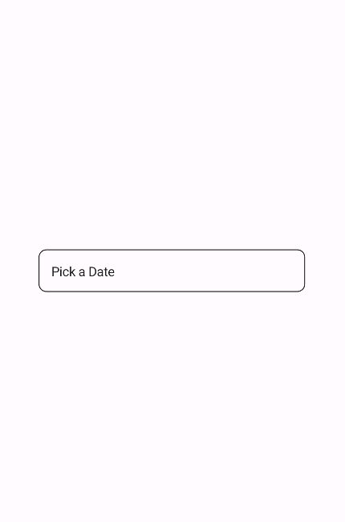
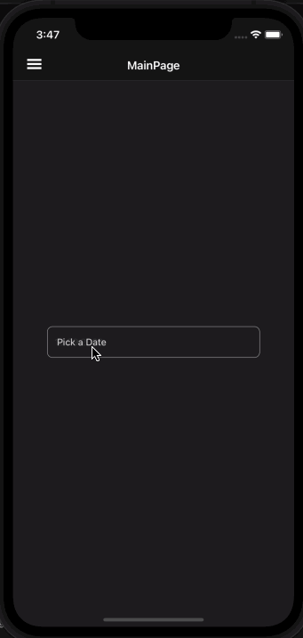
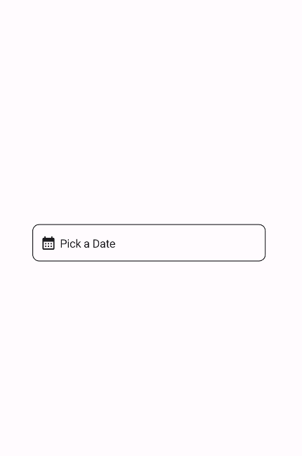
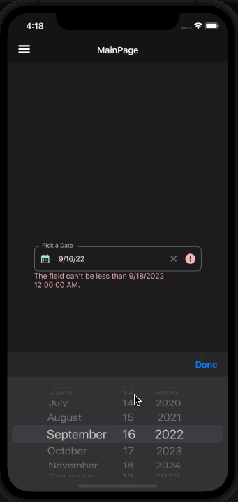

# DatePickerField
DatePickerField is a control that allows users to select a date. It is a wrapper around the DatePicker control and makes it in line with the material design guidelines.

- [Material Design Date Pickers](https://material.io/components/date-pickers)

## Usage

DatePickerField is included in the `UraniumUI.Material.Controls` namespace. You should add it to your XAML like this:

```xml
xmlns:material="clr-namespace:UraniumUI.Material.Controls;assembly=UraniumUI.Material"
```

Then you can use it like this:

```xml
<material:DatePickerField Title="Pick a Date" />
```

| Light | Dark |
| --- | --- |
|  |  |


## Icon
DatePickerFields support setting an icon on the left side of the control. You can set the icon by setting the `Icon` property. The icon can be any `ImageSource` object. FontImageSource is recommended as Icon since its color can be changed when focused.

```xml
<material:DatePickerField Title="Pick a Date" Icon="{FontImageSource FontFamily=MaterialRegular, Glyph={x:Static m:MaterialRegular.Calendar_month}}"  />
```

| Light | Dark |
| --- | --- |
|  |  |


## Validation
DatePickerField supports validation rules such as `MinValueValidation` and `MaxValueValidation`. You can use them like this:

```xml
<material:DatePickerField Title="Pick a date" Icon="{FontImageSource FontFamily=MaterialRegular, Glyph={x:Static m:MaterialRegular.Alarm}}">
    <validation:MinValueValidation MinValue="9/18/2022" />
    <validation:MaxValueValidation MaxValue="12/31/2022" />
</material:DatePickerField>
```

| Light | Dark |
| --- | --- |
|  |  |


### FormView Compatibility
DatePickerField is fully compatible with [FormView](https://enisn-projects.io/docs/en/inputkit/latest/components/controls/FormView). You can use it inside a FormView and it will work as expected.

```xml
 <input:FormView Spacing="20">
    <material:DatePickerField Title="Pick a time" Icon="{FontImageSource FontFamily=MaterialRegular, Glyph={x:Static m:MaterialRegular.Alarm}}">
        <validation:MinValueValidation MinValue="9/18/2022"  />
        <validation:MaxValueValidation MaxValue="12/31/2022" />
    </material:DatePickerField>

    <Button StyleClass="TextButton"
            Text="Submit"
            input:FormView.IsSubmitButton="True"/>

</input:FormView>
```