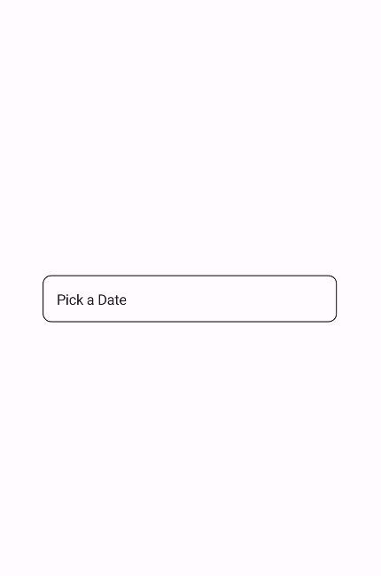
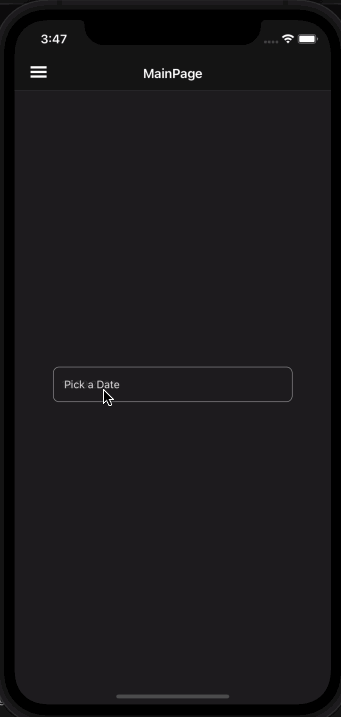
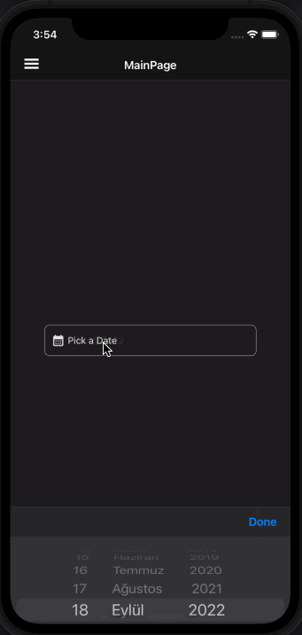
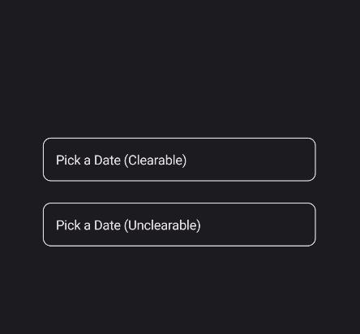
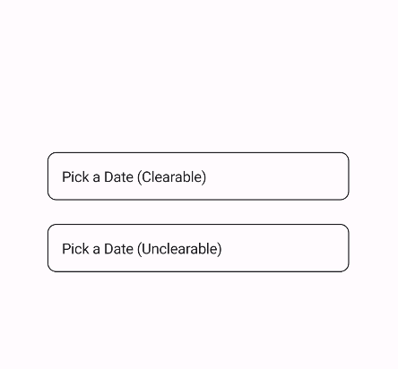
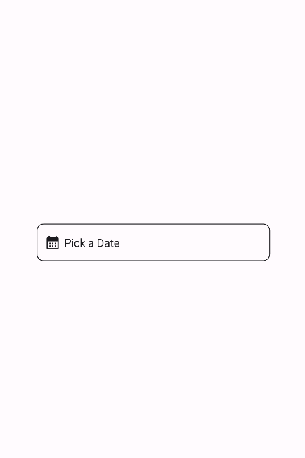
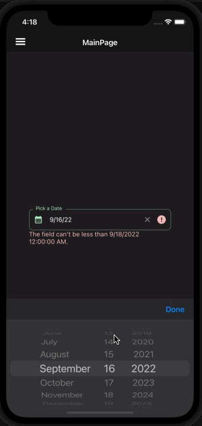

# DatePickerField
DatePickerField is a control that allows users to select a date. It opens the UraniumUI date prompt backed by the custom `CalendarView`, so nullable dates, clear, and same-date reselection behave consistently across platforms.

- [Material Design Date Pickers](https://material.io/components/date-pickers)

## Usage

DatePickerField is included in the `UraniumUI.Material.Controls` namespace. You should add it to your XAML like this:

```xml
xmlns:material="http://schemas.enisn-projects.io/dotnet/maui/uraniumui/material"
xmlns:m="clr-namespace:UraniumUI.Icons.MaterialSymbols;assembly=UraniumUI.Icons.MaterialSymbols"
```

Then you can use it like this:

```xml
<material:DatePickerField Title="Pick a Date" />
```

| Light | Dark |
| --- | --- |
|  |  |


## Icon
DatePickerFields support setting an icon on the left side of the control. You can set the icon by setting the `Icon` property. The icon can be any `ImageSource` object. FontImageSource is recommended as Icon since its color can be changed when focused.

```xml
<material:DatePickerField Title="Pick a Date" Icon="{FontImageSource FontFamily=MaterialOutlined, Glyph={x:Static m:MaterialOutlined.Calendar_month}}"  />
```

| Light | Dark |
| --- | --- |
|  |  |

## AllowClear
DatePickerFields support clearing the selected date by setting the `AllowClear` property to `true`. Default value is `true`. You can make it `false` to disable clearing.

Clearing the field sets `Date` to `null`. `Date`, `MinimumDate`, and `MaximumDate` support nullable `DateTime` values, so they can be bound to `DateTime?` view-model properties.

`MinimumDate` and `MaximumDate` are passed to the calendar prompt and disable dates outside the allowed range. Cancelling the prompt leaves `Date` unchanged, while selecting Clear returns `null`.

```xml
<material:DatePickerField 
    Title="Pick a Date (Clearable)"
    AllowClear="True" />

<material:DatePickerField 
    Title="Pick a Date (Unclearable)"
    AllowClear="False" />
```

| Dark | Light|
| --- | --- |
|  |  |

## Validation
DatePickerField supports validation rules such as `MinValueValidation` and `MaxValueValidation`. You can use them like this:

```xml
<material:DatePickerField Title="Pick a date" Icon="{FontImageSource FontFamily=MaterialOutlined, Glyph={x:Static m:MaterialOutlined.Alarm}}">
    <validation:MinValueValidation MinValue="9/18/2022" />
    <validation:MaxValueValidation MaxValue="12/31/2022" />
</material:DatePickerField>
```

| Light | Dark |
| --- | --- |
|  |  |


### FormView Compatibility
DatePickerField is fully compatible with [FormView](https://enisn-projects.io/docs/en/inputkit/latest/components/controls/FormView). You can use it inside a FormView and it will work as expected.

```xml
 <input:FormView Spacing="20">
    <material:DatePickerField Title="Pick a date" Icon="{FontImageSource FontFamily=MaterialOutlined, Glyph={x:Static m:MaterialOutlined.Calendar_month}}">
        <validation:MinValueValidation MinValue="9/18/2022"  />
        <validation:MaxValueValidation MaxValue="12/31/2022" />
    </material:DatePickerField>

    <Button StyleClass="TextButton"
            Text="Submit"
            input:FormView.IsSubmitButton="True"/>

</input:FormView>
```
