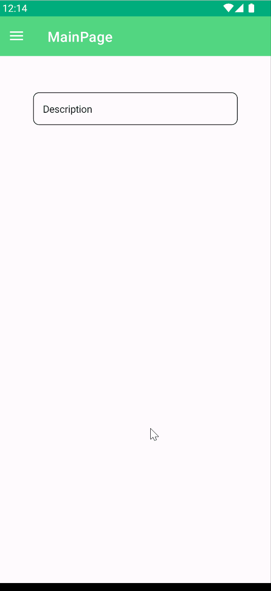
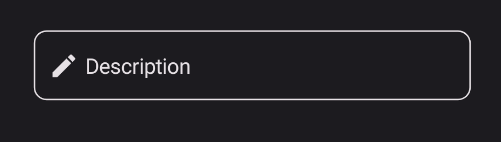

# EditorField
EditorField is a component that allows you to edit multiple lines of text.

## Usage
EditorField is included in the `UraniumUI.Material.Controls` namespace. You should add it to your XAML like this:

```xml
xmlns:material="http://schemas.enisn-projects.io/dotnet/maui/uraniumui/material"
```

Then you can use it like this:

```xml
<material:EditorField Title="Description" />
```

| Light | Dark |
| --- | --- |
|  |  |


## Icon
TextFields support setting an icon on the left side of the control. You can set the icon by setting the `Icon` property. The icon can be any `ImageSource` object. FontImageSource is recommended as Icon since its color can be changed when focused.

```xml
 <material:EditorField
    Title="Description"
    Icon="{FontImageSource FontFamily=MaterialRegular, Glyph={x:Static m:MaterialRegular.Edit}}"/>
```



## AccentColor
The color that is used to fill border and icon of control when it's focused. You can change it by setting `AccentColor` property of the control.

```xml
 <material:EditorField
    Title="Description"
    Icon="{FontImageSource FontFamily=MaterialRegular, Glyph={x:Static m:MaterialRegular.Edit}}"
    AccentColor="DeepSkyBlue"/>
```


## Validation

Validation logic is exactly same with [InputKit Validations](https://enisn-projects.io/docs/en/inputkit/latest/components/controls/FormView#validations).

You can define validations by using `Validations` property. It is a collection of `Validation` objects. Each `Validation` object has a `Message` property that is a string and will be displayed when the validation fails.

UraniumUI provides an easier way than InputKit and allows defining validations without using `Validations` property. Validations can be placed inside `EditorField` tags.

```xml
<material:EditorField Title="E-mail" Icon="{FontImageSource FontFamily=MaterialRegular, Glyph={x:Static m:MaterialRegular.Email}}">
    <validation:RequiredValidation />
    <validation:RegexValidation Pattern="{x:Static input:AdvancedEntry.REGEX_EMAIL}" Message="Invalid email address" />
</material:EditorField>
```

### FormView Compatibility
EditorField is fully compatible with [FormView](https://enisn-projects.io/docs/en/inputkit/latest/components/controls/FormView). You can use it inside a FormView and it will work as expected.