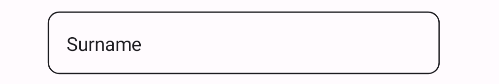

# InputField
InputField is an abstraction on MAUI Level for material inputs such as Entry, Editor, Picker, DatePicker, TimePicker, SearchBar, and more. It is a wrapper around the input controls and makes them in line with the material design guidelines.


## Existing Controls


## Creating a Custom Control
There are two ways to use InputField for custom controls. You can inherit from InputField or you can use it as a wrapper around your control.

### Using InputField as a Wrapper
InputField can be used in XAML like any other control. You can pass an existing control to the InputField and it will wrap it. The control will be placed inside the InputField and the InputField will be styled according to the material design guidelines. When that control is focused, the InputField will be focused as well. This is useful for custom controls that are not part of the UraniumUI MAUI library.

```xml
<controls:InputField Title="Pick a Time" HasValue="True">
    <TimePicker BackgroundColor="Transparent"/>
</controls:InputField>
```


### Inherit from InputField

To create a custom control, you need to inherit from the InputField class and override the `Content` property. Thar property is responsible for creating the control content and returning it. The following example shows how to create a custom control for the Entry control. 


```csharp
public class TimePickerField : InputField
{
    public override View Content { get; set; } = new Editor
    {
        BackgroundColor = Colors.Transparent,
        Margin = 5,
    };

    public override HasValue => !string.IsNullOrEmpty(Editor.Text);

    // ...
    // Your custom code
}
```

`HasValue` property should be overriden. That property is responsible for determining if the control has a value or not. If the control has a value, the title will be moved up. If the control does not have a value, the title will be moved down when unfocused. The following example shows how to implement the `HasValue` property for the Editor control.

