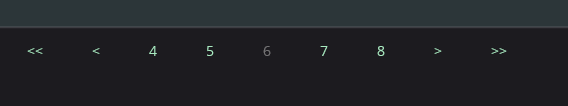

# Paginator

The paginator component is used to navigate through a list of paged items. It's not a standalone component, but a directive that can be used with other components such as DataGrid, ListView, CollectionView, etc.

## Usage

Paginator is included in the `UraniumUI.Material.Controls` namespace. To use it, add the following namespace to your XAML file:

```xml
xmlns:material="http://schemas.enisn-projects.io/dotnet/maui/uraniumui/material"
```

Then, you can use the paginator in your XAML file like this:

```xml
<material:Paginator 
        ChangePageCommand="{Binding SetPageCommand}"
        CurrentPage="{Binding CurrentPage}"
        TotalPageCount="{Binding TotalPages}"
        HorizontalOptions="Center"/>
```



## Visual Elements

The Paginator consists of five main elements:
- First page button (`<<`)
- Previous page button (`<`)
- Page number buttons (showing current page and surrounding pages)
- Next page button (`>`)
- Last page button (`>>`)

## Properties

| Property | Type | Description |
|----------|------|-------------|
| ChangePageCommand | ICommand | The command that will be executed when the page is changed. The command parameter will be the target page number. |
| CurrentPage | int | The current page number. Must be between 1 and TotalPageCount. |
| TotalPageCount | int | The total number of pages. Must be greater than 0. |
| PageStepCount | int | The number of pages to show on each side of the current page. Default is 2. For example, if current page is 5 and PageStepCount is 2, it will show pages 3, 4, 5, 6, 7. |
| FirstPageButtonText | string | The text to display on the first page button. Default is "<<". |
| PreviousPageButtonText | string | The text to display on the previous page button. Default is "<". |
| NextPageButtonText | string | The text to display on the next page button. Default is ">". |
| LastPageButtonText | string | The text to display on the last page button. Default is ">>". |
| FirstPageButtonImage | ImageSource | The image to display on the first page button. Default is null. |
| PreviousPageButtonImage | ImageSource | The image to display on the previous page button. Default is null. |
| NextPageButtonImage | ImageSource | The image to display on the next page button. Default is null. |
| LastPageButtonImage | ImageSource | The image to display on the last page button. Default is null. |

## Behavior

- The paginator automatically disables the current page button to indicate the active page
- Previous and first page buttons are disabled when on the first page
- Next and last page buttons are disabled when on the last page
- The page numbers shown are dynamically calculated based on the current page and PageStepCount
- The component automatically updates its state when CurrentPage or TotalPageCount changes

## Styling

The paginator uses the "TextButton" style class for all its buttons. You can customize the appearance by modifying this style in your application's resources.

## Example

Here's a complete example showing how to use the Paginator with a ViewModel:

```csharp
public class MyViewModel : BindableObject
{
    private int currentPage = 1;
    private int totalPages = 10;

    public int CurrentPage
    {
        get => currentPage;
        set
        {
            if (currentPage != value)
            {
                currentPage = value;
                OnPropertyChanged();
            }
        }
    }

    public int TotalPages
    {
        get => totalPages;
        set
        {
            if (totalPages != value)
            {
                totalPages = value;
                OnPropertyChanged();
            }
        }
    }

    public ICommand SetPageCommand => new Command<int>(page =>
    {
        CurrentPage = page;
        // Load data for the new page
    });
}
```

### Customizing Button Text and Images

You can customize both the text and images of navigation buttons using the following properties:

```xml
<material:Paginator 
    FirstPageButtonText="First"
    FirstPageButtonImage="first_page_icon.png"
    PreviousPageButtonText="Prev"
    PreviousPageButtonImage="prev_page_icon.png"
    NextPageButtonText="Next"
    NextPageButtonImage="next_page_icon.png"
    LastPageButtonText="Last"
    LastPageButtonImage="last_page_icon.png"
    ... />
```

Or in code:

```csharp
paginator.FirstPageButtonText = "First";
paginator.FirstPageButtonImage = "first_page_icon.png";
paginator.PreviousPageButtonText = "Prev";
paginator.PreviousPageButtonImage = "prev_page_icon.png";
paginator.NextPageButtonText = "Next";
paginator.NextPageButtonImage = "next_page_icon.png";
paginator.LastPageButtonText = "Last";
paginator.LastPageButtonImage = "last_page_icon.png";
```

You can use either text, image, or both for each button. If not specified:
- Text buttons will use their default values ("<<", "<", ">", ">>")
- Image buttons will not display any image (null)

Note: When using both text and image, the button will display both elements according to the MAUI Button's default layout.

