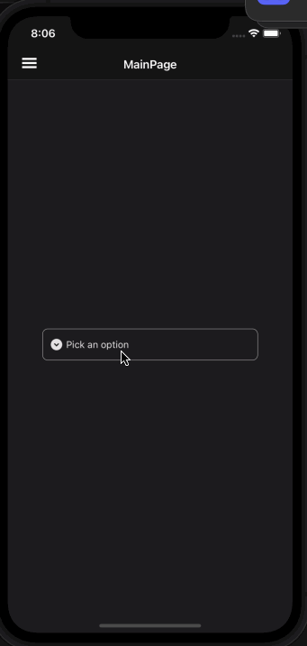
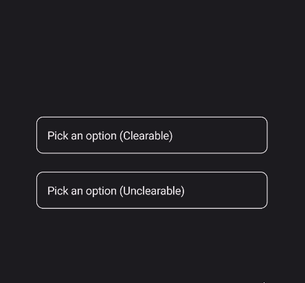

# PickerField
PickerField is a control that allows user to select a value from a list of options. It is a wrapper around the Picker control and makes it in line with the material design guidelines.

## Usage
PickerField is included in the `UraniumUI.Material.Controls` namespace. You should add it to your XAML like this:

```xml
xmlns:material="clr-namespace:UraniumUI.Material.Controls;assembly=UraniumUI.Material"
```

Then you can use it like this:

```xml
<material:PickerField Title="Pick an option" ItemsSource="{Binding Items}" />
```

| Light | Dark |
| --- | --- |
|  |  |


## Icon
PickerFields support setting an icon on the left side of the control. You can set the icon by setting the `Icon` property. The icon can be any `ImageSource` object. FontImageSource is recommended as Icon since its color can be changed when focused.


```xml
<material:PickerField 
    Title="Pick an option"
    ItemsSource="{Binding Items}"
    Icon="{FontImageSource FontFamily=MaterialRegular, Glyph={x:Static m:MaterialRegular.Expand_circle_down}}"
    />
```

| Light | Dark |
| --- | --- |
|  |  |

## AllowClear
PickerFields support clearing the selected item by setting the `AllowClear` property to `true`. Default value is `true`. You can make it `false` to disable clearing.

```xml
<material:PickerField 
    Title="Pick an option (Clearable)"
    ItemsSource="{Binding Items}"
    AllowClear="True" />

<material:PickerField 
    Title="Pick an option (Unclearable)"
    ItemsSource="{Binding Items}"
    AllowClear="False" />
```

| Dark | Light|
| --- | --- |
|  |  |

## Validation
PickerField supports validation rules since it uses `object` as its **SelectedItem**. You can use any validation rule that supports your type. For example, if you are using List of `int` as **ItemsSource**, you can use `MinValueValidation` and `MaxValueValidation` rules. Still `RequiredValidation` is supported with any type of ItemsSource.

```xml
<material:PickerField 
    Title="Pick an option"
    ItemsSource="{Binding Items}"
    Icon="{FontImageSource FontFamily=MaterialRegular, Glyph={x:Static m:MaterialRegular.Expand_circle_down}}">
    <validation:RequiredValidation />
</material:PickerField  

```

