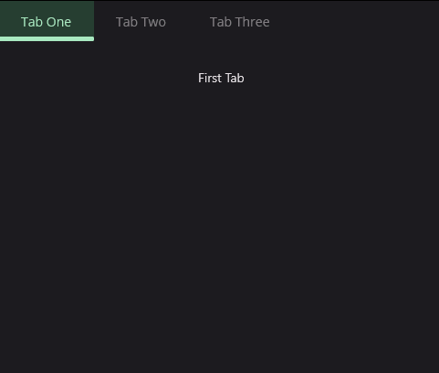
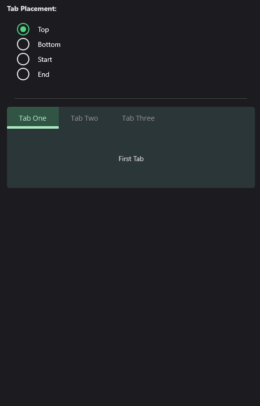

# TabView
TabView is a component that allows you to switch between different views by selecting a tab. Tabs and tab contents can be difined as **DataTemplate**.


## Usage
**TabView** is a **Control** that takes a **TabViewItems** collection to render tabs and tab contents. The **TabViewItems** collection is a collection of **TabViewItem** objects. Each **TabViewItem** object has  `Title`, `Data`, `Content` and `ContentTemplate` properties. The **Title** property is a string that is used to render the tab. The **Data** property is an object that can be used to bind data to the tab header view. Both `Content` and `ContentTemplate` is used to render content of the tab. The `ContentTemplate` property is a **DataTemplate** that is used to render the tab content lazy. It's performance friendly when you have a lot of tabs. The content isn't created until user hit the tab. `Content` property is opposite of `ContentTempalte`. You can directly create and set the content of the tab. The `Content` property is a **View** that is used to render the tab content immediately. The `Content` property is not lazy. It's created when the **TabView** is created. The `Content` property is useful when you have a small number of tabs or your tab content is too complex and creating when hitting the tab is not a good idea.

`TabView` is defined in `UraniumUI.Material.Controls` namespace. You can add it to your XAML like this:

```xml
clr-namespace:UraniumUI.Material.Controls;assembly=UraniumUI.Material
```

Then you can use it like this:


```xml
<material:TabView>
    
    <material:TabItem Title="Tab One">
        <material:TabItem.ContentTemplate>
            <DataTemplate>
                    <Label Text="First Tab" />
            </DataTemplate>
        </material:TabItem.ContentTemplate>
    </material:TabItem>


    <material:TabItem Title="Tab Two">
        <material:TabItem.ContentTemplate>
            <DataTemplate>
                    <Label Text="Second Tab" />
            </DataTemplate>
        </material:TabItem.ContentTemplate>
    </material:TabItem>

    <material:TabItem Title="Tab Three">
        <material:TabItem.ContentTemplate>
            <DataTemplate>
                    <Label Text="Third Tab" />
            </DataTemplate>
        </material:TabItem.ContentTemplate>
    </material:TabItem>
</material:TabView>
```

| Light - Mobile | Dark - Desktop |
| --- | --- |
|  |   |


### TabHeader Placement
Table tabs can be placed at the top, bottom, start or left of the tab view. You can set the `TabPlacement` property to `Top`, `Bottom`, `Start` or `End` to change the placement of the tabs. The default value is `Top`.

```xml
<material:TabView TabPlacement="Bottom">
   <!-- ... -->
</material:TabView>
```

| Light - Mobile | Dark - Desktop |
| --- | --- |
|  |   |

### Custom Tab Header
