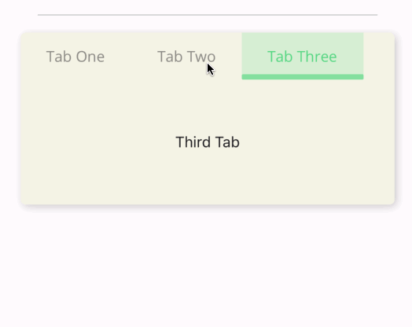
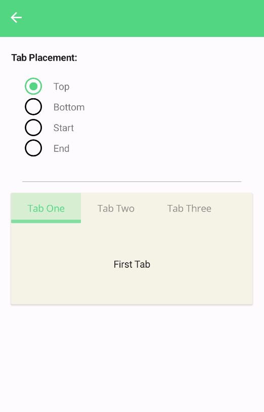
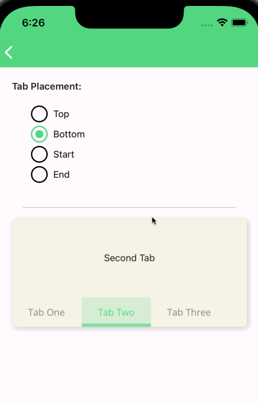
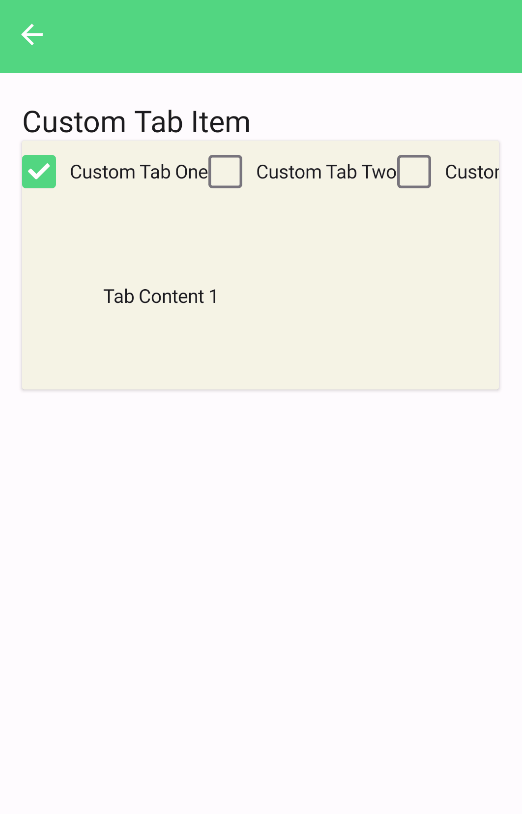
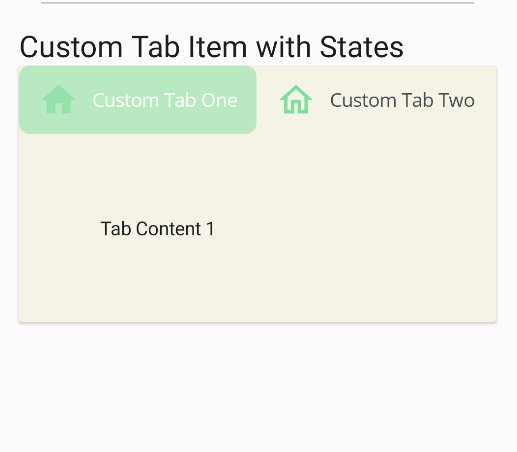
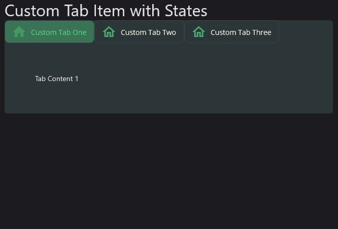
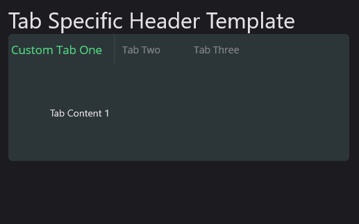

# TabView
TabView is a component that allows you to switch between different views by selecting a tab on MAUI. Tabs and tab contents can be difined as **DataTemplate**.


## Usage
**TabView** is a **Control** that takes a **TabViewItems** collection to render tabs and tab contents. The **TabViewItems** collection is a collection of **TabViewItem** objects. Each **TabViewItem** object has  `Title`, `Data`, `Content` and `ContentTemplate` properties. The **Title** property is a string that is used to render the tab. The **Data** property is an object that can be used to bind data to the tab header view. Both `Content` and `ContentTemplate` is used to render content of the tab. The `ContentTemplate` property is a **DataTemplate** that is used to render the tab content lazy. It's performance friendly when you have a lot of tabs. The content isn't created until user hit the tab. `Content` property is opposite of `ContentTempalte`. You can directly create and set the content of the tab. The `Content` property is a **View** that is used to render the tab content immediately. The `Content` property is not lazy. It's created when the **TabView** is created. The `Content` property is useful when you have a small number of tabs or your tab content is too complex and creating when hitting the tab is not a good idea.

`TabView` is defined in `UraniumUI.Material.Controls` namespace. You can add it to your XAML like this:

```xml
xmlns:material="http://schemas.enisn-projects.io/dotnet/maui/uraniumui/material"
```

Then you can use it like this:


```xml
<material:TabView>
    
    <material:TabItem Title="Tab One">
        <material:TabItem.ContentTemplate>
            <DataTemplate>
                    <Label Text="First Tab" />
            </DataTemplate>
        </material:TabItem.ContentTemplate>
    </material:TabItem>


    <material:TabItem Title="Tab Two">
        <material:TabItem.ContentTemplate>
            <DataTemplate>
                    <Label Text="Second Tab" />
            </DataTemplate>
        </material:TabItem.ContentTemplate>
    </material:TabItem>

    <material:TabItem Title="Tab Three">
        <material:TabItem.ContentTemplate>
            <DataTemplate>
                    <Label Text="Third Tab" />
            </DataTemplate>
        </material:TabItem.ContentTemplate>
    </material:TabItem>
</material:TabView>
```

| Light - Mobile | Dark - Desktop | Light - iOS |
| --- | --- | --- |
|  |   |  |


### TabHeader Placement
Table tabs can be placed at the top, bottom, start or left of the tab view. You can set the `TabPlacement` property to `Top`, `Bottom`, `Start` or `End` to change the placement of the tabs. The default value is `Top`.

```xml
<material:TabView TabPlacement="Bottom">
   <!-- ... -->
</material:TabView>
```

| Light - Android | Dark - Desktop | Light - iOS |
| --- | --- | --- |
| |   |  |

### Custom Tab Header
You can customize the tab header by setting the `TabHeaderItemTemplate` property. The `TabHeaderItemTemplate` property is a **DataTemplate** that is used to render the tab header. The `TabHeaderItemTemplate` property is useful when you want to customize the tab header. In the datatemplate `Command` must be used in binding. That Command must be triggered when use tapped in the custom tab header.

Following parameters can be used in DataTemplate for binding:
- `Command`: Command that is triggered when user tapped in the tab header.**Must be used** for functionality of tab view.
- `Title`: Title of tab.
- `Data`: It's used to bind custom data to tab header. You can pass this while defining `TabItem`.

```xml
<material:TabView>
    <material:TabView.TabHeaderItemTemplate>
        <DataTemplate>
            <material:CheckBox 
                Text="{Binding Title}" 
                IsChecked="{Binding IsSelected}"
                CheckChangedCommand="{Binding Command}"/>
        </DataTemplate>
    </material:TabView.TabHeaderItemTemplate>
    <!-- ... -->
</material:TabView>
```

| Light - Mobile | Dark - Desktop |
| --- | --- |
|  |   |


Also, tabs can be customized using [Triggers](https://docs.microsoft.com/en-us/dotnet/maui/fundamentals/triggers) according to the state of tab. `DataTrigger` can be used for styling tab item according to the state of tab. `IsSelected` property of `TabItem` can be used in DataTrigger.

```xml
<material:TabView>
    <material:TabView.TabHeaderItemTemplate>
        <DataTemplate>
            <Button 
                Text="{Binding Title}"
                Command="{Binding Command}">
                <Button.Triggers>
                    <DataTrigger TargetType="Button" Binding="{Binding IsSelected}" Value="True">
                        <Setter Property="BackgroundColor" Value="{StaticResource SurfaceTint1}" />
                        <Setter Property="TextColor" Value="{StaticResource SurfaceTint3}" />
                        <Setter Property="ImageSource" Value="{FontImageSource FontFamily=MaterialRegular, Glyph={x:Static m:MaterialRegular.Home}, Color={StaticResource SurfaceTint1}}" />
                    </DataTrigger>
                    <DataTrigger TargetType="Button" Binding="{Binding IsSelected}" Value="False">
                        <Setter Property="BackgroundColor" Value="Transparent" />
                        <Setter Property="TextColor" Value="{AppThemeBinding Light={StaticResource OnSurface}, Dark={StaticResource OnSurfaceDark}}" />
                        <Setter Property="ImageSource" Value="{FontImageSource FontFamily=MaterialOutlined, Glyph={x:Static m:MaterialOutlined.Home}, Color={StaticResource SurfaceTint3}}" />
                    </DataTrigger>
                </Button.Triggers>
            </Button>
        </DataTemplate>
    </material:TabView.TabHeaderItemTemplate>
    <material:TabItem Title="Custom Tab One">
        <material:TabItem.Content>
            <Label Text="Tab Content 1" Margin="60" />
        </material:TabItem.Content>
    </material:TabItem>

    <material:TabItem Title="Custom Tab Two">
        <material:TabItem.Content>
            <Label Text="Tab Content 2" Margin="60" />
        </material:TabItem.Content>
    </material:TabItem>

    <material:TabItem Title="Custom Tab Three">
        <material:TabItem.Content>
            <Label Text="Tab Content 3" Margin="60" />
        </material:TabItem.Content>
    </material:TabItem>
</material:TabView>
```

| Light - Mobile | Dark - Desktop |
| --- | --- |
|  |   |


---

Tabs can be styles separately using `HeaderTemplate` property of `TabItem`. Use `TabItem.HeaderTemplate` property while defining `TabItem` in `TabView`.

When both of `TabView.TabHeaderItemTemplate` and `TabItem.HeaderTemplate` are defined, `TabItem.HeaderTemplate` will be used for that particular tab.


Even you can define DataTemplate tab by tab separetely. 

```xml
<material:TabView>
    <material:TabItem Title="Custom Tab One">
        <material:TabItem.HeaderTemplate>
            <DataTemplate>
                <Button Text="{Binding Title}" Command="{Binding Command}">
                    <Button.Triggers>
                        <DataTrigger TargetType="Button" Binding="{Binding IsSelected}" Value="True">
                            <Setter Property="TextColor" Value="{StaticResource Primary}"/>
                            <Setter Property="Scale" Value="1.2"/>
                        </DataTrigger>
                        <DataTrigger TargetType="Button" Binding="{Binding IsSelected}" Value="False">
                            <Setter Property="TextColor" Value="Gray"/>
                            <Setter Property="Scale" Value="1"/>
                        </DataTrigger>
                    </Button.Triggers>
                </Button>
            </DataTemplate>
        </material:TabItem.HeaderTemplate>
        <material:TabItem.Content>
            <Label Text="Tab Content 1" Margin="60" />
        </material:TabItem.Content>
    </material:TabItem>

    <material:TabItem Title="Custom Tab Two">
        <material:TabItem.Content>
            <Label Text="Tab Content 2" Margin="60" />
        </material:TabItem.Content>
    </material:TabItem>

    <material:TabItem Title="Custom Tab Three">
        <material:TabItem.Content>
            <Label Text="Tab Content 3" Margin="60" />
        </material:TabItem.Content>
    </material:TabItem>
</material:TabView>
```

| Light - Mobile | Dark - Desktop |
| --- | --- |
|  |   |

### Dynamic Tabs
TabView supports dynamic tabs. You can add/remove tabs dynamically from a source. `ItemsSource` and `Itemtemplate` properties can be used for this purpose.

```xml
<material:TabView ItemsSource="{Binding TabItems}">
    <material:TabView.ItemTemplate>
        <DataTemplate>
            <WebView Source="{Binding Url, Mode=TwoWay}" />
        </DataTemplate>
    </material:TabView.ItemTemplate>
</material:TabView>
```

And view model should be like this.

```csharp
public class WebTabViewModel : UraniumBindableObject
{
    public ObservableCollection<WebTabItem> TabItems { get; set; } = new()
    {
        new WebTabItem("https://www.bing.com/"),
        new WebTabItem("https://google.com/"),
        new WebTabItem("https://microsoft.com/"),
        new WebTabItem("https://github.com/"),
    };
}

public class WebTabItem : UraniumBindableObject
{
    private string url;
    private string title;

    public WebTabItem(string url = null)
    {
        this.Url = url;
    }

    public string Url
    {
        get => url; set => SetProperty(ref url, value, doAfter: (_url) =>
        {
            if (Uri.TryCreate(_url, UriKind.RelativeOrAbsolute, out Uri uri))
            {
                Title = uri.Host;
            }
        });
    }

    public string Title { get => title; set => SetProperty(ref title, value); }

    public override string ToString()
    {
        return Title;
    }
}
```


## Customizations

You can customize the `TabView` by using the style properties. You can use the following example to create your own style:

```xml
<Style TargetType="Layout" Class="TabView.Header" ApplyToDerivedTypes="True">
    <Setter Property="BackgroundColor" Value="Black" />
</Style>
<Style TargetType="ContentView" Class="TabView.Content">
    <Setter Property="BackgroundColor" Value="DimGray" />
</Style>
```

