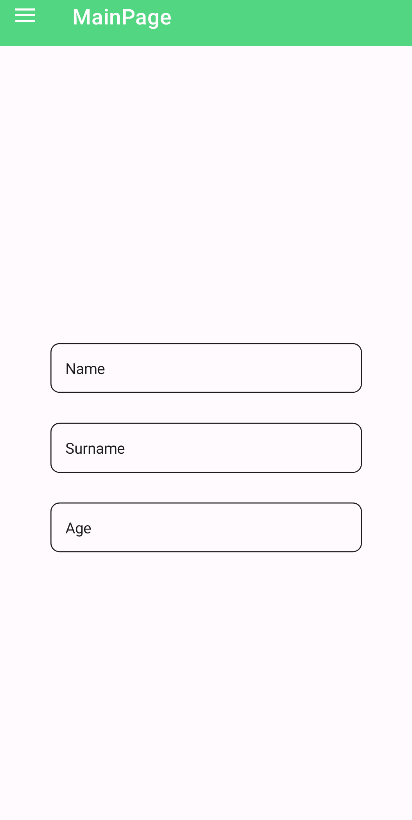
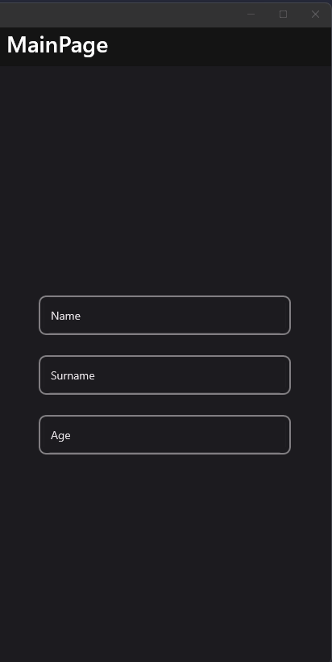
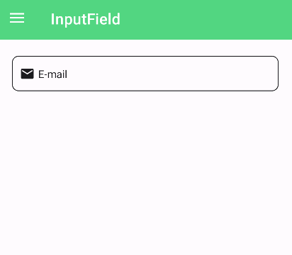
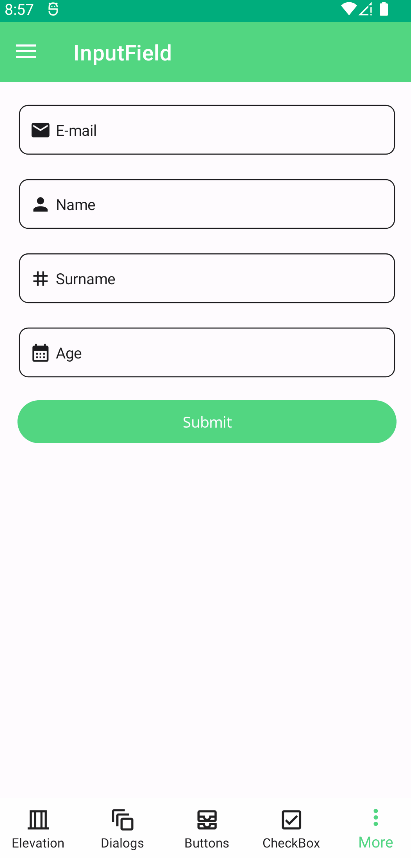
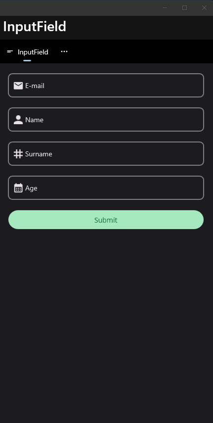

# TextField
Text fields let users enter and edit text. It is an abstraction on MAUI Level for material inputs.

## Usage

TextField is included in the `UraniumUI.Material.Controls` namespace. You should add it to your XAML like this:

```xml
xmlns:material="http://schemas.microsoft.com/dotnet/2022/maui/uraniumui/material"
```

Then you can use it like this:

```xml
<material:TextField Title="Name" />
<material:TextField Title="Surname" />
<material:TextField Title="Age" Keyboard="Numeric" />
```

| Light | Dark |
| --- | --- |
|  |  |


## Icon
TextFields support setting an icon on the left side of the control. You can set the icon by setting the `Icon` property. The icon can be any `ImageSource` object. FontImageSource is recommended as Icon since its color can be changed when focused.

```xml
 <material:TextField
    Title="E-mail"
    Icon="{FontImageSource FontFamily=MaterialRegular, Glyph={x:Static m:MaterialRegular.Email}}"/>
```

| Light | Dark |
| --- | --- |
|  |  |

## AllowClear
TextFields support clearing the text by setting the `AllowClear` property to `true`. Default value is `false`.

```xml
 <material:TextField
    Title="E-mail"
    AllowClear="True"/>
```

|Dark| Light|
| --- | --- |
|  |  |

## Validation

Validation logic is exactly same with [InputKit Validations](https://enisn-projects.io/docs/en/inputkit/latest/components/controls/FormView#validations).

You can define validations by using `Validations` property. It is a collection of `Validation` objects. Each `Validation` object has a `Message` property that is a string and will be displayed when the validation fails.

UraniumUI provides an easier way than InputKit and allows defining validations without using `Validations` property. Validations can be placed inside `TextField` tags.

```xml
<material:TextField Title="E-mail" Icon="{FontImageSource FontFamily=MaterialRegular, Glyph={x:Static m:MaterialRegular.Email}}">
    <validation:RequiredValidation />
    <validation:RegexValidation Pattern="{x:Static input:AdvancedEntry.REGEX_EMAIL}" Message="Invalid email address" />
</material:TextField>
```

### FormView Compatibility
TextField is fully compatible with [FormView](https://enisn-projects.io/docs/en/inputkit/latest/components/controls/FormView). You can use it inside a FormView and it will work as expected.

```xml
 <input:FormView Spacing="20">

    <material:TextField Title="E-mail" Icon="{FontImageSource FontFamily=MaterialRegular, Glyph={x:Static m:MaterialRegular.Email}}">
        <validation:RequiredValidation />
        <validation:RegexValidation Pattern="{x:Static input:AdvancedEntry.REGEX_EMAIL}" Message="Invalid email address" />
    </material:TextField>

    <material:TextField Title="Name" Icon="{FontImageSource FontFamily=MaterialRegular, Glyph={x:Static m:MaterialRegular.Person}}">
        <validation:LettersOnlyValidation AllowSpaces="True" />
        <validation:RequiredValidation />
        <validation:MinLengthValidation MinLength="5" />
    </material:TextField>

    <material:TextField Title="Surname" Icon="{FontImageSource FontFamily=MaterialRegular, Glyph={x:Static m:MaterialRegular.Tag}}" >
        <material:TextField.Validations>
            <validation:RequiredValidation />
            <validation:LettersOnlyValidation AllowSpaces="True" />
            <validation:MinLengthValidation MinLength="5" />
        </material:TextField.Validations>
    </material:TextField>

    <material:TextField Title="Age" Keyboard="Numeric" Icon="{FontImageSource FontFamily=MaterialRegular, Glyph={x:Static m:MaterialRegular.Calendar_month}}">
        <material:TextField.Validations>
            <validation:MinValueValidation MinValue="18" />
            <validation:DigitsOnlyValidation />
        </material:TextField.Validations>
    </material:TextField>

    <Button StyleClass="FilledButton"
            Text="Submit"
            input:FormView.IsSubmitButton="True"/>

</input:FormView>
```

| Light | Dark |
| --- | --- |
|  |  |