# TextField
Text fields let users enter and edit text. It is an abstraction on MAUI Level for material inputs.

## Usage

TextField is included in the `UraniumUI.Material.Controls` namespace. You should add it to your XAML like this:

```xml
xmlns:material="http://schemas.enisn-projects.io/dotnet/maui/uraniumui/material"
xmlns:m="clr-namespace:UraniumUI.Icons.MaterialSymbols;assembly=UraniumUI.Icons.MaterialSymbols"
```

Then you can use it like this:

```xml
<material:TextField Title="Name" />
<material:TextField Title="Surname" />
<material:TextField Title="Age" Keyboard="Numeric" />
```

| Light | Dark |
| --- | --- |
| 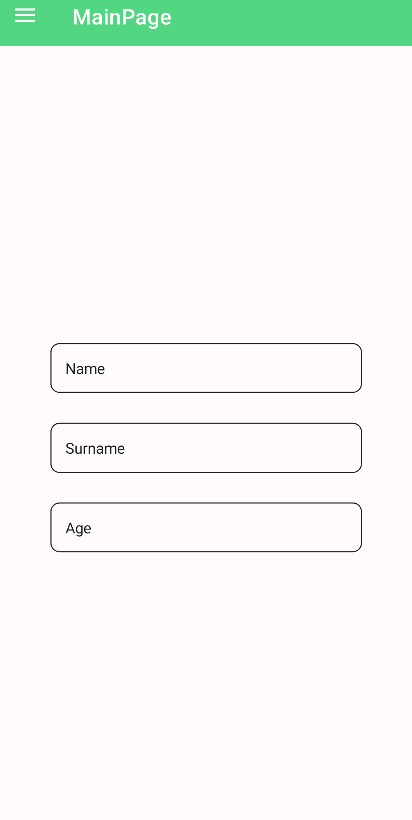 | 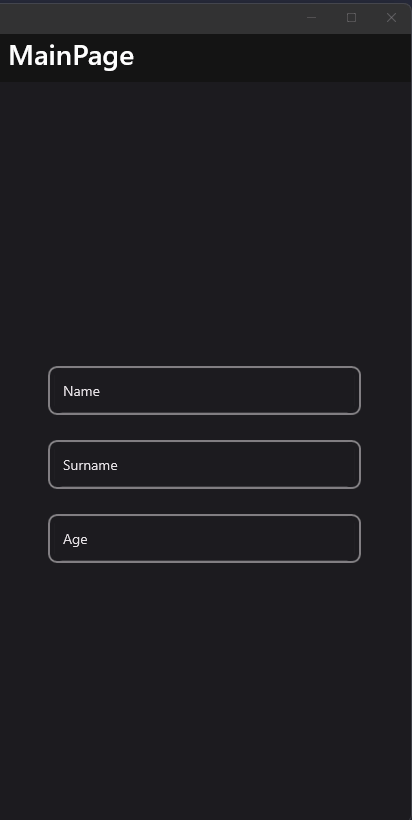 |

## Properties

### Text Input Properties
- `Text` - Gets or sets the text value of the TextField
- `TextColor` - Gets or sets the color of the text
- `Keyboard` - Gets or sets the keyboard type (e.g., Default, Numeric, Email)
- `IsPassword` - Gets or sets whether the TextField should mask its text
- `MaxLength` - Gets or sets the maximum length of text allowed
- `IsTextPredictionEnabled` - Gets or sets whether text prediction is enabled
- `CharacterSpacing` - Gets or sets the spacing between characters
- `HorizontalTextAlignment` - Gets or sets the horizontal alignment of the text

### Behavior Properties
- `AllowClear` - Gets or sets whether a clear button is shown to clear the text
- `ClearCommand` - Gets or sets the command to execute when the clear button is pressed
- `DisallowClearButtonFocus` - Gets or sets whether the clear button can receive focus
- `SelectAllTextOnFocus` - Gets or sets whether all text should be selected when the field receives focus
- `IsReadOnly` - Gets or sets whether the TextField is read-only
- `ReturnType` - Gets or sets the return key type
- `ReturnCommand` - Gets or sets the command to execute when the return key is pressed
- `ReturnCommandParameter` - Gets or sets the parameter for the return command

### Selection Properties
- `SelectionLength` - Gets or sets the length of the selected text
- `CursorPosition` - Gets or sets the position of the cursor
- `SelectionHighlightColor` - Gets or sets the color of the text selection highlight

## Events

- `TextChanged` - Occurs when the text value changes
- `Completed` - Occurs when the user completes the text input (e.g., presses return)

## Methods

- `ClearValue()` - Clears the text value of the TextField
- `SelectAllText()` - Selects all text in the TextField
- `DisplayValidation()` - Displays validation results
- `ResetValidation()` - Resets the validation state and clears the text

## Icon
TextFields support setting an icon on the left side of the control. You can set the icon by setting the `Icon` property. The icon can be any `ImageSource` object. FontImageSource is recommended as Icon since its color can be changed when focused.

```xml
 <material:TextField
    Title="E-mail"
    Icon="{FontImageSource FontFamily=MaterialOutlined, Glyph={x:Static m:MaterialOutlined.Mail}}"/>
```

| Light | Dark |
| --- | --- |
| 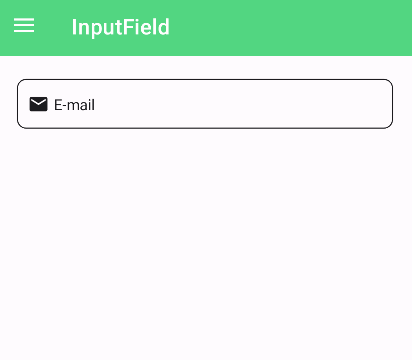 | 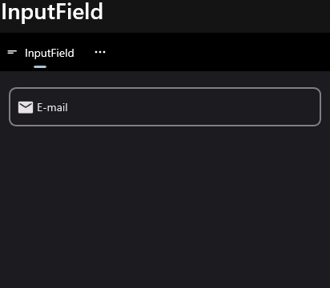 |

## AccentColor
The color that is used to fill border and icon of control when it's focused. You can change it by setting `AccentColor` property of the control.

```xml
 <material:TextField
    Title="Description"
    Icon="{FontImageSource FontFamily=MaterialOutlined, Glyph={x:Static m:MaterialOutlined.Edit}}"
    AccentColor="DeepSkyBlue"/>
```

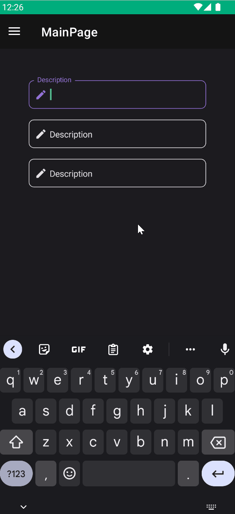

## AllowClear
TextFields support clearing the text by setting the `AllowClear` property to `true`. Default value is `false`.

```xml
 <material:TextField
    Title="E-mail"
    AllowClear="True"/>
```

|Dark| Light|
| --- | --- |
| 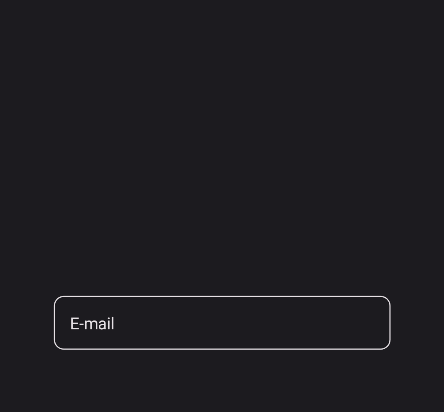 | 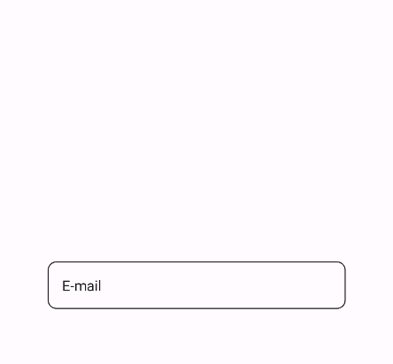 |

## Attachments
Attachments are additional controls that can be placed inside the control. They are placed on the end of the control (right-side on LTR). You can add attachments by using `Attachments` property. It is a collection of `View` objects.

```xml
<material:TextField Title="Message">
    <material:TextField.Attachments>
        <Button Text="Submit" />
    </material:TextField.Attachments>
</material:TextField>
```

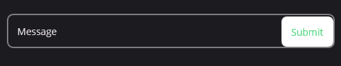

### Password Show/Hide
The `TextFieldPasswordShowHideAttachment` provides a toggle button to show/hide password text. It automatically updates its icon based on the password visibility state.

```xml
<material:TextField Title="Password" IsPassword="True">
    <material:TextField.Attachments>
        <material:TextFieldPasswordShowHideAttachment />
    </material:TextField.Attachments>
</material:TextField>
```

The attachment automatically:
- Toggles between show/hide icons
- Updates the TextField's `IsPassword` property
- Maintains proper styling and layout

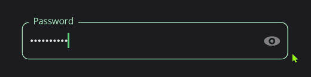

## Validation
It implements [InputKit Validations](https://enisn-projects.io/docs/en/inputkit/latest/components/
controls/FormView#validations) feature and supports validation through the `Validations` property. Validations can be added in two ways:

1. Using the `Validations` property:
```xml
<material:TextField Title="Email">
    <material:TextField.Validations>
        <validation:RequiredValidation />
        <validation:RegexValidation Pattern="{x:Static input:AdvancedEntry.REGEX_EMAIL}" Message="Invalid email address" />
    </material:TextField.Validations>
</material:TextField>
```

2. Directly as child elements:
```xml
<material:TextField Title="Email">
    <validation:RequiredValidation />
    <validation:RegexValidation Pattern="{x:Static input:AdvancedEntry.REGEX_EMAIL}" Message="Invalid email address" />
</material:TextField>
```

### FormView Compatibility
TextField is fully compatible with [FormView](https://enisn-projects.io/docs/en/inputkit/latest/components/controls/FormView). You can use it inside a FormView and it will work as expected.

```xml
 <input:FormView Spacing="20">

    <material:TextField Title="E-mail" Icon="{FontImageSource FontFamily=MaterialOutlined, Glyph={x:Static m:MaterialOutlined.Mail}}">
        <validation:RequiredValidation />
        <validation:RegexValidation Pattern="{x:Static input:AdvancedEntry.REGEX_EMAIL}" Message="Invalid email address" />
    </material:TextField>

    <material:TextField Title="Name" Icon="{FontImageSource FontFamily=MaterialOutlined, Glyph={x:Static m:MaterialOutlined.Person}}">
        <validation:LettersOnlyValidation AllowSpaces="True" />
        <validation:RequiredValidation />
        <validation:MinLengthValidation MinLength="5" />
    </material:TextField>

    <material:TextField Title="Surname" Icon="{FontImageSource FontFamily=MaterialOutlined, Glyph={x:Static m:MaterialOutlined.Tag}}" >
        <material:TextField.Validations>
            <validation:RequiredValidation />
            <validation:LettersOnlyValidation AllowSpaces="True" />
            <validation:MinLengthValidation MinLength="5" />
        </material:TextField.Validations>
    </material:TextField>

    <material:TextField Title="Age" Keyboard="Numeric" Icon="{FontImageSource FontFamily=MaterialOutlined, Glyph={x:Static m:MaterialOutlined.Calendar_month}}">
        <material:TextField.Validations>
            <validation:MinValueValidation MinValue="18" />
            <validation:DigitsOnlyValidation />
        </material:TextField.Validations>
    </material:TextField>

    <Button StyleClass="FilledButton"
            Text="Submit"
            input:FormView.IsSubmitButton="True"/>

</input:FormView>
```

| Light | Dark |
| --- | --- |
| 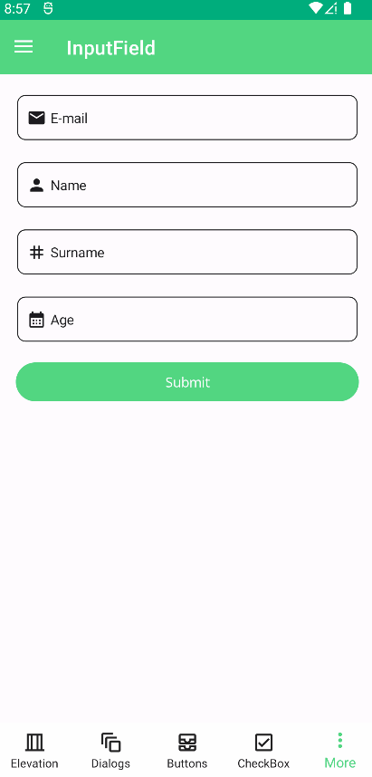 | 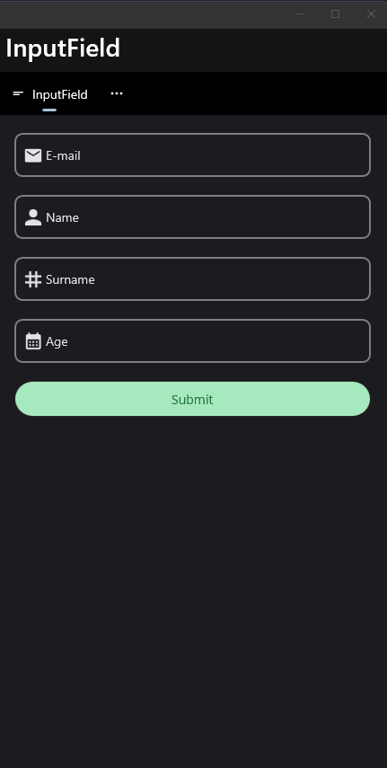 |

## Styling
TextField supports several style classes that can be used to customize its appearance:

```xml
<Style TargetType="Label" Class="InputField.Title">
    <Setter Property="FontAttributes" Value="Bold" />
    <!--...-->
</Style>

<Style TargetType="Border" Class="InputField.Border">
    <Setter Property="MaximumHeightRequest" Value="80" />
    <!--...-->
</Style>

<Style TargetType="Image" Class="InputField.Icon">
    <Setter Property="HeightRequest" Value="10" />
    <Setter Property="WidthRequest" Value="10" />
    <!--...-->
</Style>

<Style TargetType="HorizontalStackLayout" Class="InputField.Attachments">
    <Setter Property="Spacing" Value="8" />
    <!--...-->
</Style>
<Style TargetType="Path" Class="InputField.ValidationIcon">
    <Setter Property="Fill" Value="MediumVioletRed" />
    <Setter Property="Data" Value="M7 11V1H8V11H7ZM8 13V14.01H7V13H8Z" />
    <!--...-->
</Style>

<Style TargetType="Label" Class="InputField.ValidationLabel">
    <Setter Property="TextColor" Value="MediumVioletRed" />
    <!--...-->
</Style>

<Style TargetType="Path" Class="TextField.ClearIcon">
    <Setter Property="Fill" Value="LightGray" />
    <Setter Property="Data" Value="M1.5 1.5L13.5 13.5M1.5 13.5L13.5 1.5" />
    <!--...-->
</Style>
```

Each style class can be customized to match your application's theme:
- `InputField.Title` - Styles the floating label
- `InputField.Border` - Styles the border container
- `InputField.Icon` - Styles the icon (if present)
- `InputField.Attachments` - Styles the attachments container
- `InputField.ValidationIcon` - Styles the validation error icon
- `InputField.ValidationLabel` - Styles the validation error message
- `TextField.ClearIcon` - Styles the clear button icon
