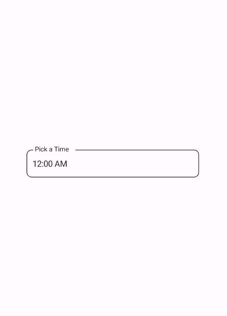
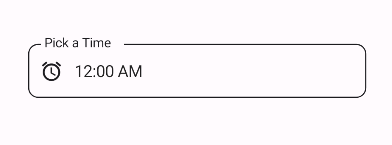
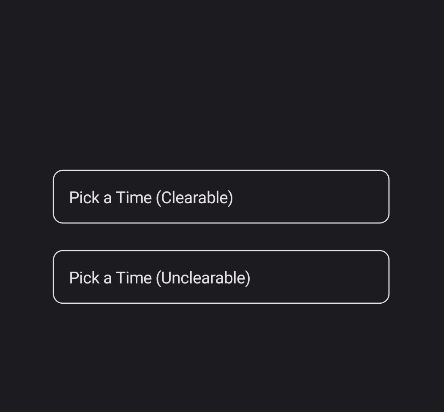
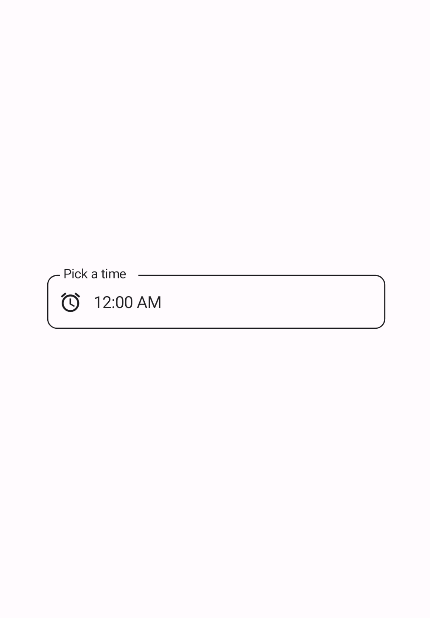
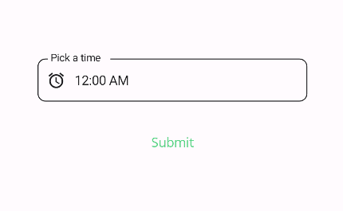

# TimePickerField
TimePickerField is a control that allows users to select a time. It is a wrapper around the TimePicker control and makes it in line with the material design guidelines.

- [Material Design Date Pickers](https://material.io/components/time-pickers)

## Usage

TimePickerField is included in the `UraniumUI.Material.Controls` namespace. You should add it to your XAML like this:

```xml
xmlns:material="http://schemas.microsoft.com/dotnet/2022/maui/uraniumui/material"
```

Then you can use it like this:

```xml
<material:TimePickerField Title="Pick a Time" />
```

| Light | Dark |
| --- | --- |
|  |  |

## Icon
TimePickerFields support setting an icon on the left side of the control. You can set the icon by setting the `Icon` property. The icon can be any `ImageSource` object. FontImageSource is recommended as Icon since its color can be changed when focused.

| Light | Dark |
| --- | --- |
|  |  |

## AllowClear
TimePickerFields support clearing the selected time by setting the `AllowClear` property to `true`. Default value is `true`. You can make it `false` to disable clearing.

```xml
<material:TimePickerField 
    Title="Pick a Time (Clearable)"
    AllowClear="True" />

<material:TimePickerField 
    Title="Pick a Time (Unclearable)"
    AllowClear="False" />
```

| Dark | Light|
| --- | --- |
|  |  |

## Validation
TimePickerField supports validation rules such as `MinValueValidation` and `MaxValueValidation`. You can use them like this:

```xml
<material:TimePickerField Title="Pick a time" Icon="{FontImageSource FontFamily=MaterialRegular, Glyph={x:Static m:MaterialRegular.Alarm}}">
    <validation:MinValueValidation MinValue="09:00" />
    <validation:MaxValueValidation MaxValue="12:00" />
</material:TimePickerField>
```

| Light | Dark |
| --- | --- |
|  |  |


### FormView Compatibility
TimePickerField is fully compatible with [FormView](https://enisn-projects.io/docs/en/inputkit/latest/components/controls/FormView). You can use it inside a FormView and it will work as expected.

```xml
 <input:FormView Spacing="20">
    <material:TimePickerField Title="Pick a time" Icon="{FontImageSource FontFamily=MaterialRegular, Glyph={x:Static m:MaterialRegular.Alarm}}">
        <validation:MinValueValidation MinValue="09:00" />
        <validation:MaxValueValidation MaxValue="12:00" />
    </material:TimePickerField>

    <Button StyleClass="TextButton"
            Text="Submit"
            input:FormView.IsSubmitButton="True"/>

</input:FormView>
```

