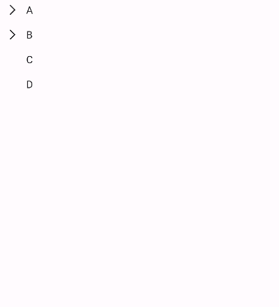
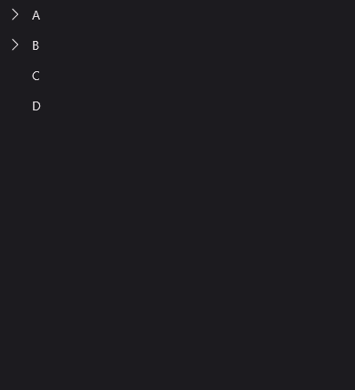
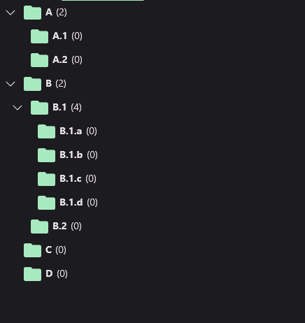
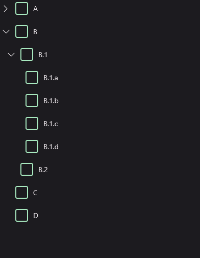
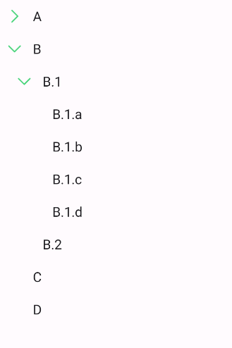
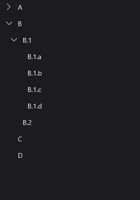
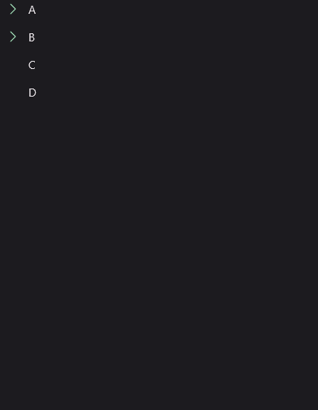

# TreeView
TreeView is a component that displays a hierarchical list of items. It's a MAUI layer control with complex logic. It also comes with some pre-built behaviors like hierarchical selection.

## Usage
TreeView is included in the `UraniumUI.Material.Controls` namespace. You should add it to your XAML like this:

```xml
xmlns:material="clr-namespace:UraniumUI.Material.Controls;assembly=UraniumUI.Material"
```

Then you can use it like this:

```xml
<material:TreeView ItemsSource="{Binding Nodes}" />
```

TreeView doesn't have any visual appearance without data. You should bind some data to see the control.

### Data Binding

Prepare a ViewModel that contain a list of a node object. Node means a single item in the tree. It can be a folder or a file. It can be a person or a company. It can be a country or a city. It can be anything. It's up to you. So there is no type limitation or no interface implementation required for your object. It can be a simple object that should have a `Children` property that includes list of same type of the object when hierarchical data is required.
A simple example of a node object:

```csharp
 public class MyItem
{
    public MyItem()
    {
    }

    public MyItem(string name) // For easy initialization (optional)
    {
        Name = name;
    }

    public virtual string Name { get; set; }
    public virtual IList<MyItem> Children { get; set; } = new ObservableCollection<MyItem>();
}
```

Initialize your ViewModel with some data:

```csharp
public class MyViewModel : BindableObject
{

    public ObservableCollection<MyItem> Nodes { get; set; } = new();

    public TreeViewPageViewModel()
    {
        Nodes.Add(new MyItem("A")
        {
            Children =
            {
                new MyItem("A.1"),
                new MyItem("A.2"),
            }
        });
        Nodes.Add(new MyItem("B")
        {
            Children =
            {
                new MyItem("B.1")
                {
                    Children =
                    {
                        new MyItem("B.1.a"),
                        new MyItem("B.1.b"),
                        new MyItem("B.1.c"),
                        new MyItem("B.1.d"),

                    }
                },
                new MyItem("B.2"),
            }
        });
        Nodes.Add(new MyItem("C"));
        Nodes.Add(new MyItem("D"));
    }
}
```

Now you can bind your ViewModel to the TreeView:

```xml
<material:TreeView ItemsSource="{Binding Nodes}" />
```

| Light | Dark |
| --- | --- |
|  |  |

### ItemTemplate
You can customize nodes with `ItemTemplate`. It's just like a `ListView` or `CollectionView`:

```xml
<material:TreeView ItemsSource="{Binding Nodes}">
    <material:TreeView.ItemTemplate>
        <DataTemplate>
            <HorizontalStackLayout Spacing="5">
                <Image Source="{FontImageSource FontFamily=MaterialRegular, Glyph={x:Static m:MaterialRegular.Folder}, Color={StaticResource Primary}}" />
                <Label Text="{Binding Name}" FontAttributes="Bold" />
                <Label Text="{Binding Children.Count, StringFormat='({0})'}" />
            </HorizontalStackLayout>
        </DataTemplate>
    </material:TreeView.ItemTemplate>
</material:TreeView>
```

| Light | Dark |
| --- | --- |
|   |  |


### IsExpandedPropertyName
You can bind expanding property to a property of your node object. It's useful when you want to save the state of the tree. For example, you can save the state of the tree in the local storage and restore it when the user opens the app again. To do this, you should set `IsExpandedPropertyName` property of the TreeView to the name of the property that contains the state of the node. For example, if you have a `IsExtended` property in your node object, you should set `IsExpandedPropertyName` to `IsExtended`:

```xml
 <material:TreeView ItemsSource="{Binding Nodes}" IsExpandedPropertyName="IsExtended">
```

```csharp
public TreeViewPageViewModel()
{
    // ...

    Nodes[1].IsExtended = true;
    Nodes[1].Children[0].IsExtended = true;
}
```

They will be rendered as expanded when treeview is initialized.


### ChildrenBinding
If the node object contain its children in a different property, you can set `ChildrenBinding` property of the TreeView to the name of the property that contains the children. For example, if you have a `SubItems` property in your node object, you should set `ChildrenBinding` to `SubItems`:

```xml
 <material:TreeView ItemsSource="{Binding Nodes}" ChildrenBinding="{Binding SubItems}" />
```

---

## Selection

TreeView has a special behavior for CheckBoxes. TreeView supports hierarchical selection. It means that when you select a parent node, all of its children will be selected. When you deselect a parent node, all of its children will be deselected. When some of children is selected, CheckBox will enter semi-selected state. It's useful when you want to select a group of items. For example, you can select all files in a folder.

TreeView provides `TreeViewHierarchicalSelectBehavior` that can be used only with `CheckBox` when it's directly ItemTemplate of the TreeView.

```xml
<material:TreeView ItemsSource="{Binding Nodes}">
    <material:TreeView.ItemTemplate>
        <DataTemplate>
            <material:CheckBox Text="{Binding Name}">
                <material:CheckBox.Behaviors>
                    <material:TreeViewHierarchicalSelectBehavior />
                </material:CheckBox.Behaviors>
            </material:CheckBox>
        </DataTemplate>
    </material:TreeView.ItemTemplate>
</material:TreeView>
```

| Light | Dark |
| --- | --- |
|  |  |


## Customizations
TreeView allows you to customize its appearance in a couple of ways.

### ArrowColor
You can change the color of the arrow icon with `ArrowColor` property:

```xml
<material:TreeView ItemsSource="{Binding Nodes}" ArrowColor="{StaticResource Primary}"/>
```

| Light | Dark |
| --- | --- |
|  |  |


### UseAnimation
Determines whether to use animations when expanding and collapsing nodes. Default value is `true`. You may want to disable animations if you want to improve performance while working with huge amount of tree nodes.

```xml
<material:TreeView ItemsSource="{Binding Nodes}" UseAnimation="False"/>
```

| Enabled | Disabled |
| --- | --- |
|  |  |