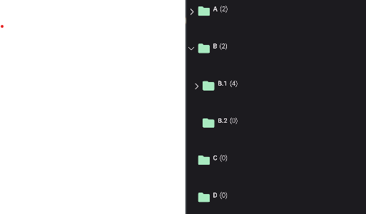

# TreeView
TreeView is a component that displays a hierarchical list of items. It's a MAUI layer control with complex logic. It also comes with some pre-built behaviors like hierarchical selection.

## Usage
TreeView is included in the `UraniumUI.Material.Controls` namespace. You should add it to your XAML like this:

```xml
xmlns:material="http://schemas.enisn-projects.io/dotnet/maui/uraniumui/material"
```

Then you can use it like this:

```xml
<material:TreeView ItemsSource="{Binding Nodes}" />
```

TreeView doesn't have any visual appearance without data. You should bind some data to see the control.

### Data Binding

Prepare a ViewModel that contain a list of a node object. Node means a single item in the tree. It can be a folder or a file. It can be a person or a company. It can be a country or a city. It can be anything. It's up to you. So there is no type limitation or no interface implementation required for your object. It can be a simple object that should have a `Children` property that includes list of same type of the object when hierarchical data is required.
A simple example of a node object:

```csharp
 public class MyItem
{
    public MyItem()
    {
    }

    public MyItem(string name) // For easy initialization (optional)
    {
        Name = name;
    }

    public virtual string Name { get; set; }
    public virtual IList<MyItem> Children { get; set; } = new ObservableCollection<MyItem>();
}
```

Initialize your ViewModel with some data:

```csharp
public class TreeViewPageViewModel : BindableObject
{

    public ObservableCollection<MyItem> Nodes { get; set; } = new();

    public TreeViewPageViewModel()
    {
        Nodes.Add(new MyItem("A")
        {
            Children =
            {
                new MyItem("A.1"),
                new MyItem("A.2"),
            }
        });
        Nodes.Add(new MyItem("B")
        {
            Children =
            {
                new MyItem("B.1")
                {
                    Children =
                    {
                        new MyItem("B.1.a"),
                        new MyItem("B.1.b"),
                        new MyItem("B.1.c"),
                        new MyItem("B.1.d"),

                    }
                },
                new MyItem("B.2"),
            }
        });
        Nodes.Add(new MyItem("C"));
        Nodes.Add(new MyItem("D"));
    }
}
```

Now you can bind your ViewModel to the TreeView:

```xml
<material:TreeView ItemsSource="{Binding Nodes}" />
```

| Light | Dark |
| --- | --- |
|  |  |

### ItemTemplate
You can customize nodes with `ItemTemplate`. It's just like a `ListView` or `CollectionView`:

```xml
<material:TreeView ItemsSource="{Binding Nodes}">
    <material:TreeView.ItemTemplate>
        <DataTemplate>
            <HorizontalStackLayout Spacing="5">
                <Image Source="{FontImageSource FontFamily=MaterialRegular, Glyph={x:Static m:MaterialRegular.Folder}, Color={StaticResource Primary}}" />
                <Label Text="{Binding Name}" FontAttributes="Bold" />
                <Label Text="{Binding Children.Count, StringFormat='({0})'}" />
            </HorizontalStackLayout>
        </DataTemplate>
    </material:TreeView.ItemTemplate>
</material:TreeView>
```

| Light | Dark |
| --- | --- |
|   |  |


### IsExpandedPropertyName
You can bind expanding property to a property of your node object. It's useful when you want to save the state of the tree. For example, you can save the state of the tree in the local storage and restore it when the user opens the app again. To do this, you should set `IsExpandedPropertyName` property of the TreeView to the name of the property that contains the state of the node. For example, if you have a `IsExtended` property in your node object, you should set `IsExpandedPropertyName` to `IsExtended`:

```xml
 <material:TreeView ItemsSource="{Binding Nodes}" IsExpandedPropertyName="IsExtended">
```

```csharp
public TreeViewPageViewModel()
{
    // ...

    Nodes[1].IsExtended = true;
    Nodes[1].Children[0].IsExtended = true;
}
```

They will be rendered as expanded when treeview is initialized.

### IsLeafPropertyName
If the node object contain its children in a different property, you can set `IsLeafPropertyName` property of the TreeView to the name of the property that contains the state of the node. Default value is `IsLeaf`. If you have a `IsLeaf` property in your node object, it'll be automatically binded. If your property that declares leaf state has a different name, you should consider to set `IsLeafPropertyName`.

```xml
 <material:TreeView ItemsSource="{Binding Nodes}" IsLeafPropertyName="IsLeaf" />
```

> Note: **Leaf** status is already managed by the TreeView. But when lazy-loading is used, TreeView can't know if the node is a leaf or not. So you should set `IsLeafPropertyName` to the name of the property that contains the state of the node.

### ChildrenBinding
If the node object contain its children in a different property, you can set `ChildrenBinding` property of the TreeView to the name of the property that contains the children. For example, if you have a `SubItems` property in your node object, you should set `ChildrenBinding` to `SubItems`:

```xml
 <material:TreeView ItemsSource="{Binding Nodes}" ChildrenBinding="{Binding SubItems}" />
```

## Selection
TreeView supports single selection and multiple selection. You can set `SelectionMode` property of the TreeView to `Single` or `Multiple` to enable selection. Default value is `None`. You can bind `SelectedItem` or `SelectedItems` property of the TreeView to a property in your ViewModel to get the selected item or items.

### Single Selection
```xml
<material:TreeView ItemsSource="{Binding Nodes}" SelectionMode="Single" SelectedItem="{Binding SelectedNode}" />
```

| Light | Dark |
| --- | --- |
|  |  |

### Multiple Selection

```xml
<material:TreeView ItemsSource="{Binding Nodes}" SelectionMode="Multiple" SelectedItems="{Binding SelectedNodes}" />
```

| Light | Dark |
| --- | --- |
|  |  |


---

## Customizations
TreeView allows you to customize its appearance in a couple of ways.

### ArrowColor
You can change the color of the arrow icon with `ArrowColor` property:

```xml
<material:TreeView ItemsSource="{Binding Nodes}" ArrowColor="{StaticResource Primary}"/>
```

| Light | Dark |
| --- | --- |
|  |  |

### Spacing
You can change the spacing between the arrow icon and the content with `Spacing` property. Default value is `10`.

```xml
<material:TreeView ItemsSource="{Binding Nodes}" Spacing="25"/>
```


### ExpanderTemplate
You can completely customize the expander with `ExpanderTemplate` property. It's an arrow by default. You can use any view as an expander. For example, you can use a `Switch` to expand and collapse nodes.

You can use following binding properties in the `ExpanderTemplate`:
- `IsExpanded` - `true` if the node is expanded, otherwise `false`.
- `IsLeaf` - `true` if the node is a leaf, otherwise `false`. You can use it to manage visibility of the control.

```xml
<material:TreeView ItemsSource="{Binding Nodes}">
    <material:TreeView.ExpanderTemplate>
        <DataTemplate>
            <Switch IsToggled="{Binding IsExpanded}" />
        </DataTemplate>
    </material:TreeView.ExpanderTemplate>
</material:TreeView>
```


### UseAnimation
Determines whether to use animations when expanding and collapsing nodes. Default value is `true`. You may want to disable animations if you want to improve performance while working with huge amount of tree nodes.

```xml
<material:TreeView ItemsSource="{Binding Nodes}" UseAnimation="False"/>
```

| Enabled | Disabled |
| --- | --- |
|  |  |

---

## Selection

TreeView has a special behavior for CheckBoxes. TreeView supports hierarchical selection. It means that when you select a parent node, all of its children will be selected. When you deselect a parent node, all of its children will be deselected. When some of children is selected, CheckBox will enter semi-selected state. It's useful when you want to select a group of items. For example, you can select all files in a folder.

TreeView provides `TreeViewHierarchicalSelectBehavior` that can be used only with `CheckBox` when it's directly ItemTemplate of the TreeView.

```xml
<material:TreeView ItemsSource="{Binding Nodes}">
    <material:TreeView.ItemTemplate>
        <DataTemplate>
            <material:CheckBox Text="{Binding Name}">
                <material:CheckBox.Behaviors>
                    <material:TreeViewHierarchicalSelectBehavior />
                </material:CheckBox.Behaviors>
            </material:CheckBox>
        </DataTemplate>
    </material:TreeView.ItemTemplate>
</material:TreeView>
```

| Light | Dark |
| --- | --- |
|  |  |

---

## Lazy-Loading
TreeView supports lazy-loading of children. It means that children will be loaded only when the node is expanded. TreeView executes `LoadChildrenCommand` command with node item that is expanded as parameter when the node is expanded. You can set `LoadChildrenCommand` property of the TreeView to the command that will be executed when the node is expanded. For example, you can load children from the database when the node is expanded.

Following properies can be used to define a propert lazy-loading behavior:
- `IsLeafPropertyName` - The name of the property that contains the state of the node. Default value is `IsLeaf`.
- `LoadChildrenCommand` - The command that will be executed when the node is expanded.

### Example
A file system is a good example of lazy-loading. When you open a folder, you don't want to load all of its children. You want to load children only when the folder is expanded. You can use `LoadChildrenCommand` to load children from the database when the folder is expanded.

```csharp
public class TreeViewFileSystemViewModel : UraniumBindableObject
{
    public ObservableCollection<NodeItem> Nodes { get; private set; }

    public ICommand LoadChildrenCommand { get; set; }

    public TreeViewFileSystemViewModel()
    {
        InitializeNodes();
        LoadChildrenCommand = new Command<NodeItem>((node) =>
        {
            foreach (var item in GetContent(node.Path))
            {
                node.Children.Add(item);
            }

            if (node.Children.Count == 0)
            {
                node.IsLeaf = true;
            }
        });
    }

    void InitializeNodes()
    {
        var path = Environment.GetFolderPath(Environment.SpecialFolder.UserProfile);

        if (DeviceInfo.Platform == DevicePlatform.WinUI)
        {
            path = "C:\\";
        }

        Nodes = new ObservableCollection<NodeItem>(
            GetContent(path));
    }

    IEnumerable<NodeItem> GetContent(string dir)
    {
        var directories = Directory.GetDirectories(dir);
        foreach (string d in directories)
        {
            yield return new NodeItem
            {
                Name = d.Split(Path.DirectorySeparatorChar).LastOrDefault(),
                Path = d,
                IsDirectory = true,
                IsLeaf = false,
            };
        }
        var files = Directory.GetFiles(dir);

        foreach (string f in files)
        {
            var node = new NodeItem
            {
                Name = f.Split(Path.DirectorySeparatorChar).LastOrDefault(),
                Path = f,
                IsDirectory = false,
                IsLeaf = true,
            };
            yield return node;
        }
    }

    public class NodeItem : UraniumBindableObject
    {
        private bool isLeaf;

        public string Name { get; set; }
        public string Path { get; set; }
        public bool IsDirectory { get; set; }
        public bool IsLeaf { get => isLeaf; set => SetProperty(ref isLeaf, value); }
        public ObservableCollection<NodeItem> Children { get; } = new();
    }
}
```

```xml
<material:TreeView 
        ItemsSource="{Binding Nodes}" 
        LoadChildrenCommand="{Binding LoadChildrenCommand}">
    <material:TreeView.ItemTemplate>
        <DataTemplate>
            <HorizontalStackLayout Spacing="5" VerticalOptions="Center">
                <Image>
                    <Image.Triggers>
                        <DataTrigger TargetType="Image" Binding="{Binding IsDirectory}" Value="True">
                            <Setter Property="Source" Value="{FontImageSource FontFamily=MaterialRegular, Glyph={x:Static m:MaterialRegular.Folder}, Color={AppThemeBinding Light={StaticResource Primary}, Dark={StaticResource PrimaryDark}}}" />
                        </DataTrigger>
                        <DataTrigger TargetType="Image" Binding="{Binding IsDirectory}" Value="False">
                            <Setter Property="Source" Value="{FontImageSource FontFamily=MaterialRegular, Glyph={x:Static m:MaterialRegular.Insert_drive_file}, Color={AppThemeBinding Light={StaticResource Primary}, Dark={StaticResource PrimaryDark}}}" />
                        </DataTrigger>
                    </Image.Triggers>
                </Image>
                <Label Text="{Binding Name}" FontAttributes="Bold" />
            </HorizontalStackLayout>
        </DataTemplate>
    </material:TreeView.ItemTemplate>
</material:TreeView>
```

| Dark |
| --- |
|  |
