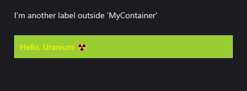

# Cascading Styling
Cascading stying brings cascading styling feature to the MAUI. It allows define styles in different scopes separately. Uranium UI provides defining a background for a view and defining color to text colors of all labels in that view.

## Usage

To define sub styles in a view scope, you can use the `CascadingStyle` attached property. It allows to bind a style into a view resources. The style will be applied to all children of the view.

### Simple Usage

Firstly, the namespace should be added to file:

```xml
xmlns:t="clr-namespace:UraniumUI.Theming;assembly=UraniumUI"
```

It can be used in a style XAML like that:

```xml
<Style TargetType="StackLayout" Class="MyContainer">
    <Setter Property="BackgroundColor" Value="YellowGreen" />

    <!-- 👇 Following styles will be applied only in this 'MyContainer' class  -->
    <Setter Property="t:CascadingStyle.Resources">
        <ResourceDictionary>
            <Style TargetType="Label">
                <Setter Property="TextColor"  Value="Yellow" />
            </Style>
        </ResourceDictionary>
    </Setter>
</Style>
```


Now you can use your container in a XAML page like the following example. The `Label` will have the `Yellow` color in  your container. But remaining Labels will stay with the default color.

```xml
<Label Text="I'm another label outside 'MyContainer'" />

<StackLayout StyleClass="MyContainer">
    <Label Text="Hello, Uranium ☢️" />
</StackLayout>
```




### Nested usage
You can even use in multiple levels. The example below shows that all the frames will have the `Yellow` color under `MyContainer` and all the labels will be black under that frame which is under MyContainer.

```xml
<Style TargetType="StackLayout" Class="MyContainer">
    <Setter Property="Padding" Value="10" />
    <Setter Property="BackgroundColor" Value="YellowGreen" />
    <Setter Property="t:CascadingStyle.Resources">
        <ResourceDictionary>
            <Style TargetType="Frame">
                <Setter Property="BackgroundColor"  Value="Yellow" />
                <Setter Property="t:CascadingStyle.Resources">
                    <ResourceDictionary>
                        <Style TargetType="Label">
                            <Setter Property="TextColor" Value="Black" />
                        </Style>
                    </ResourceDictionary>
                </Setter>
            </Style>
        </ResourceDictionary>
    </Setter>
</Style>
```

When you run run the following XAML, you will see the following result:

```xml
<Label Text="I'm another label outside 'MyContainer'" />

<StackLayout StyleClass="MyContainer">
    <Frame>
        <Label Text="Hello, Uranium ☢️" />
    </Frame>
</StackLayout>
```


### Referencing Existing Styles

You can also reference existing styles in the `CascadingStyle.Resources` property. The following example shows that using a style that is already defined and how to prevent re-writing it.

```xml
<!--This is a common style-->
<Style TargetType="Frame" x:Key="YellowFrame">
    <Setter Property="BackgroundColor"  Value="Yellow" />
    <Setter Property="t:CascadingStyle.Resources">
        <ResourceDictionary>
            <Style TargetType="Label">
                <Setter Property="TextColor" Value="Black" />
            </Style>
        </ResourceDictionary>
    </Setter>
</Style>

<!--This style uses YellowStyle under itself-->
<Style TargetType="StackLayout" Class="MyContainer">
    <Setter Property="Padding" Value="10" />
    <Setter Property="BackgroundColor" Value="YellowGreen" />
    <Setter Property="t:CascadingStyle.Resources">
        <ResourceDictionary>
            <!-- All the styles from YellowFrame will be applied here 👇-->
            <Style TargetType="Frame" BaseResourceKey="YellowFrame"/>
        </ResourceDictionary>
    </Setter>
</Style>
```

## Setting StyleClass
By default `StyleClass` property is not a bindable property and you can't set it in a style XAML. `CascadeStyle.StyleClass` allows you set StyleClasses for other views in a style XAML. It can be used like the following example:

```xml
<!-- Already defined style -->
<Style TargetType="Button" Class="YellowButton">
    <Setter Property="BackgroundColor" Value="Yellow" />
    <Setter Property="TextColor" Value="DarkSlateGray" />
</Style>

<Style TargetType="View" Class="MyContainer" ApplyToDerivedTypes="True" >
    <Setter Property="BackgroundColor" Value="YellowGreen" />
    <Setter Property="t:CascadingStyle.Resources">
        <ResourceDictionary>
            <!-- All the buttons under 'MyContainer' will has YellowButton as StyleClass -->
            <Style TargetType="Button">
                <Setter Property="t:CascadingStyle.StyleClass"  Value="YellowButton" />
            </Style>
        </ResourceDictionary>
    </Setter>
</Style>
```

The following usage is enough to apply the style to all buttons under `MyContainer`:

```xml
<StackLayout StyleClass="MyContainer" Padding="20">

    <Button Text="Hello, Uranium ☢️" />
    
</StackLayout>
```


