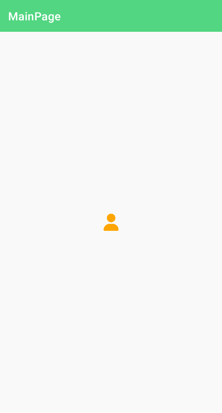

# Uranium UI: Icons

Uranium UI uses font icons to render icons on all platforms. Uranium Core provides a set of icons that can be used in your application. Themes provide their own icon sets. You can also use your own icons.

## Using icons

Uranium Core provides [Font Awesome](https://fontawesome.com/) by default. Each theme can provide its own icon set. Visit the theme documentation to learn more about the icons it provides.

### Fontawesome
It's included and configured in [UraniumUI.Icons.FontAwesome](https://www.nuget.org/packages/UraniumUI.Icons.FontAwesome) package.

After adding the package, you have to configure fonts in `MauiProgram.cs` file.

```csharp
builder
	.UseMauiApp<App>()
	.ConfigureFonts(fonts =>
	{
		fonts.AddFont("OpenSans-Regular.ttf", "OpenSansRegular");
		fonts.AddFont("OpenSans-Semibold.ttf", "OpenSansSemibold");
		fonts.AddFontAwesomeIconFonts(); // 👈 Add this line
	})
```

#### Font Names
2 font names are provided by Font Awesome. They can be used as `FontFamily` parameter in `FontImageSource`.

- `FARegular`
- `FASolid`

#### Glyphs
Glyphs are provided with `FontAwesomeRegular` and `FontAwesomeSolid` classes. They can be accessed like `FontAwesomeRegular.Filter`. This class is included in `UraniumUI` namespace. You should include the following xml namespace to use it.

```xml
xmlns:fa="clr-namespace:UraniumUI.Icons.FontAwesome;assembly=UraniumUI.Icons.FontAwesome"
```

#### Usage
MAUI supports font icons by using `FontImageSource` class. You can use it in `Image`, `Button` and any control that has a `ImageSource` typed property.

```xml
<Image>
    <Image.Source>
        <FontImageSource FontFamily="FASolid" Glyph="{x:Static fa:Solid.User}" Color="Orange" />
    </Image.Source>
</Image>
```



---

### Material Symbols
Material symbols are included in [UraniumUI.Icons.MaterialSymbols](https://www.nuget.org/packages/UraniumUI.Icons.MaterialSymbols) package. After adding the package, you have to configure fonts in `MauiProgram.cs` file.

```csharp
builder
	.UseMauiApp<App>()
	.ConfigureFonts(fonts =>
	{
		fonts.AddFont("OpenSans-Regular.ttf", "OpenSansRegular");
		fonts.AddFont("OpenSans-Semibold.ttf", "OpenSansSemibold");
		fonts.AddMaterialSymbolsFonts(); // 👈 Add this line
	})
```

#### Font Names
6 font names are provided by Material Symbols. They can be used as `FontFamily` parameter in `FontImageSource`.

- `MaterialOutlined`
- `MaterialOutlinedFilled`
- `MaterialRound`
- `MaterialRoundFilled`
- `MaterialSharp`
- `MaterialSharpFilled`

#### Glyphs
Glyphs are provided with `MaterialOutlined`, `MaterialRound` and `MaterialSharp` classes. They can be accessed like `MaterialSharp.Account_circle`. This class is included in `UraniumUI` namespace. You should include the following xml namespace to use it.

```xml
xmlns:m="clr-namespace:UraniumUI.Icons.MaterialSymbols;assembly=UraniumUI.Icons.MaterialSymbols"
```

#### Usage
MAUI supports font icons by using `FontImageSource` class. You can use it in `Image`, `Button` and any control that has a `ImageSource` typed property.

```xml
<Image>
    <Image.Source>
		<!-- Use FontFamily="MaterialSharpFilled" to get the filled variant of the selected glyph -->
        <FontImageSource FontFamily="MaterialSharp" Glyph="{x:Static m:MaterialSharp.Warning}" Color="Red" />
    </Image.Source>
</Image>
```

#### Migrating from MaterialIcons
With UraniumUI 2.8.0 the MaterialIcons became deprecated, since Google is recommending to switch over to MaterialSymbols instead.
The two-tone (MaterialTwoTone) style is not available in MaterialSymbols.
You will have to choose between "Outlined", "Rounded" and "Sharp".
Looks can be compared on [Google Fonts](https://fonts.google.com/icons?icon.set=Material+Symbols).

Once a style is chosen, remove the MaterialIcons nuget package and install MaterialSymbols.
Make sure to follow the instructions above on how to setup the MaterialSymbols package.
Then adjust your `xmlns:` and `using`s.

If you were using a style that became unavailable, replace all occurences of e.g. `MaterialRegular.Star` with `MaterialOutlined.Star`.

---

### Segoe Fluent Icons
Segoe Fluent Icons are included in [UraniumUI.Icons.SegoeFluent](https://www.nuget.org/packages/UraniumUI.Icons.SegoeFluent) package. After adding the package, you have to configure fonts in `MauiProgram.cs` file.

```csharp
builder
	.UseMauiApp<App>()
	.ConfigureFonts(fonts =>
	{
		fonts.AddFont("OpenSans-Regular.ttf", "OpenSansRegular");
		fonts.AddFont("OpenSans-Semibold.ttf", "OpenSansSemibold");
		fonts.AddFluentIconFonts(); // 👈 Add this line
	})
```

#### Font Names
A single font name is provided by the package. It can be used as `FontFamily` parameter in `FontImageSource`.

- `Fluent`

#### Glyphs
Glyphs are provided with `Fluent` class. They can be accessed like `Fluent.Accept`. This class is included in `UraniumUI.Icons.SegoeFluent` namespace. This namespace is exported to the default UraniumUI namespace.

```xml
xmlns:uranium="http://schemas.enisn-projects.io/dotnet/maui/uraniumui"
```

#### Usage
MAUI supports font icons by using `FontImageSource` class. You can use it in `Image`, `Button` and any control that has a `ImageSource` typed property.

```xml
<Image>
	<Image.Source>
		<FontImageSource FontFamily="Fluent" Glyph="{x:Static uranium:Fluent.Accept}" Color="Green" />
	</Image.Source>
</Image>
```

Or you can use the `FontImageSource` markup extension.

```xml
<Image Source="{FontImageSource Glyph={x:Static uranium:Fluent.Accept}, FontFamily=Fluent, Color=Blue}" />
```
