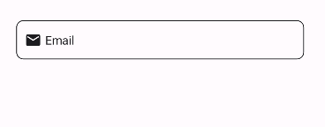

# Uranium UI Data Annotations
Uranium UI provides a wrapper for the DataAnnotations validation. It's a simple wrapper that allows you to use the DataAnnotations validation with the FormView. It allows you to define the validation rules in the view model class with `System.ComponentModel.DataAnnotations` attributes.

## Getting Started
DataAnnotations attributes aren't provided by default. To use the DataAnnotations validation, you need to install the `UraniumUI.Validations.DataAnnotations` NuGet package.

```bash
dotnet add package UraniumUI.Validations.DataAnnotations
```

## Usage
`DataAnnotationsBehavior` is a behavior that allows you to bind the validations from the ViewModel to the control. It's used with the `FormView` to validate the controls.

- Add xmlns for the `UraniumUI.Validations` namespace.

    ```xml
    xmlns:v="clr-namespace:UraniumUI.Validations;assembly=UraniumUI.Validations.DataAnnotations"
    ```

- Use the `DataAnnotationsBehavior ` method to bind the control with the validation rules.

    ```xml
    <input:FormView>
        <material:TextField Text="{Binding Email}">
            <material:TextField.Behaviors>
                <v:DataAnnotationsBehavior Binding="{Binding Email}" />
            </material:TextField.Behaviors>
        </material:TextField>
            <!-- ... -->
    </input:FormView>
    ```

    > If you're not familiar with the `FormView`, you can check the [FormView](https://enisn-projects.io/docs/en/inputkit/latest/components/controls/FormView) documentation first to get more information about it.

- Add the `System.ComponentModel.DataAnnotations` attributes to the view model class.

    ```csharp
    [Required]
    [EmailAddress]
    [MinLength(5)]
    public string Email { get; set; }
    ```

    > You can check the [DataAnnotations](https://docs.microsoft.com/en-us/dotnet/api/system.componentmodel.dataannotations?view=net-5.0) documentation to learn more about the attributes.

    